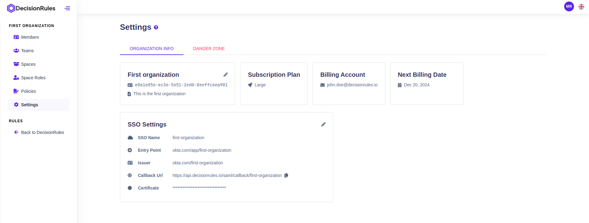
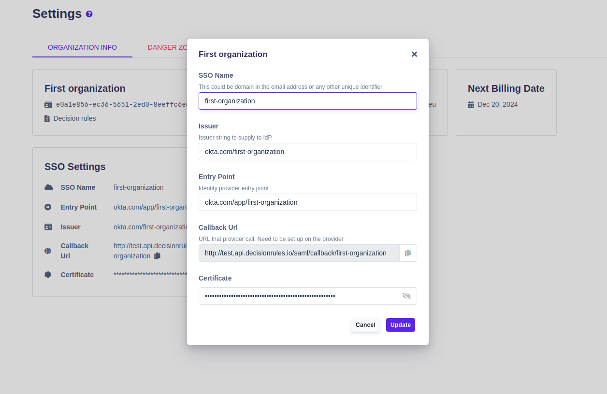
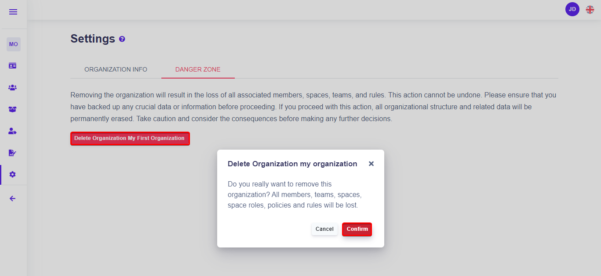

# Settings

The Settings module provides an interface for managing various aspects of your organization. It offers access to basic information, subscription and billing details, configuration options for Single Sign-On (SSO), and sensitive functionalities within the Danger Zone, including the ability to delete the organization.

<figure><figcaption>
Organization settings
</figcaption></figure>

## Organization Info

The Organization Info section of Settings displays important details about your organization. This includes:

* **Organization name** - The name of your organization.
* **Organization Id -** Unique organization identifier
* **Description -** optional field to describe organization

## Subscription & Billing

In the Subscription & Billing section, you can access information related to your organization's subscription and billing. This includes:

* **Subscription Plan -** Details of the current subscription plan.
* **Billing Account -** Email address of the account responsible for Organization limits
* **Next billing date:** Information about the next billing date.


**Payment Method** and **Invoice History** are only visible in the billing account detail.


## Single Sign-On (SSO)

Configure SSO for your organization. (More information how to set SSO up, you can find [here](../access/single-sign-on-sso.md#how-do-i-set-up-a-single-sign-on-access-for-my-organization).)

### Update SSO

By clicking on edit icon new dialog will be opened.

<figure><figcaption>
Update SSO
</figcaption></figure>

## AI Assistant Configuration

When running DecisionRules with Docker or on-premise, you have the option to configure your AI assistant. You’ll find setup details [here](../ai-assistant/assistant-setup/).

### Update AI Assistant Configuration

By clicking on edit icon new dialog will be opened.

<figure><figcaption></figcaption></figure>

## Danger Zone


The ability to permanently delete the organization. This action is irreversible and will result in the loss of all associated data. Exercise extreme caution when using this feature. Only billing account can delete organization.


<figure><figcaption>
Delete Organization
</figcaption></figure>
