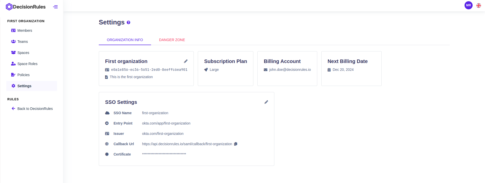
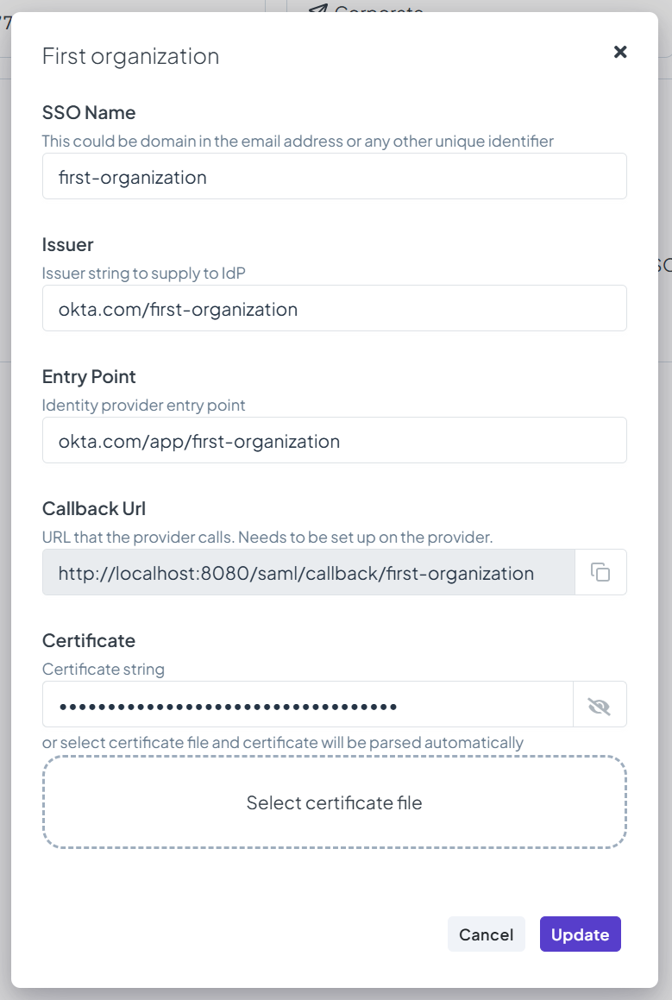
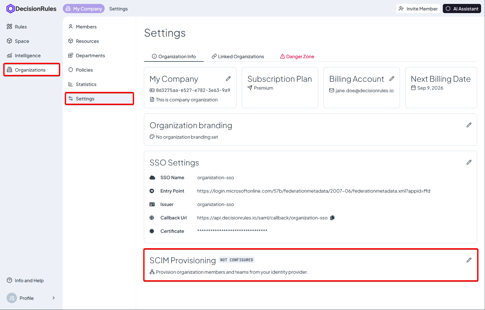
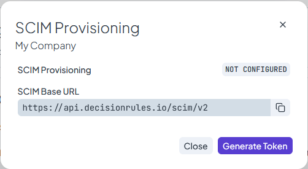
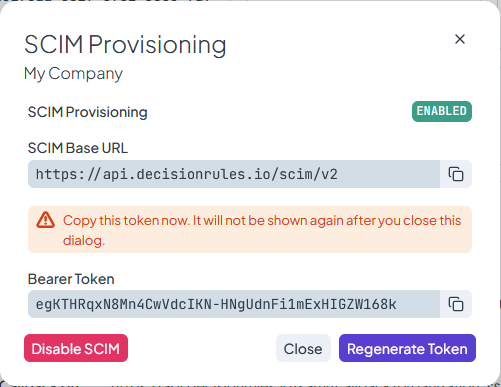
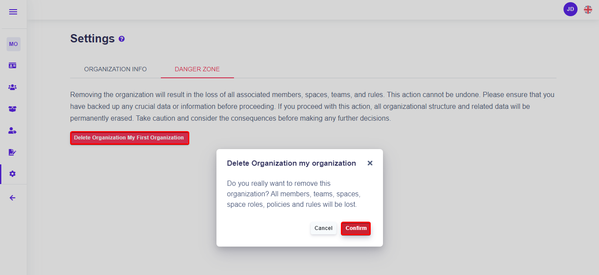

# Settings

The Settings module provides an interface for managing various aspects of your organization. It offers access to basic information, subscription and billing details, configuration options for Single Sign-On (SSO), and sensitive functionalities within the Danger Zone, including the ability to delete the organization.

<figure><figcaption>
Organization settings
</figcaption></figure>

## Organization Info

The Organization Info section of Settings displays important details about your organization. This includes:

* **Organization name** - The name of your organization.
* **Organization Id -** Unique organization identifier
* **Description -** optional field to describe organization

### Subscription & Billing

In the Subscription & Billing section, you can access information related to your organization's subscription and billing. This includes:

* **Subscription Plan -** Details of the current subscription plan.
* **Billing Account -** Email address of the account responsible for Organization limits
* **Next billing date:** Information about the next billing date.


**Payment Method** and **Invoice History** are only visible in the billing account detail.


### Single Sign-On (SSO)

Configure SSO for your organization. (More information how to set SSO up, you can find [here](../access/cloud/single-sign-on-sso/#how-do-i-set-up-a-single-sign-on-access-for-my-organization).)

#### Update SSO

By clicking on edit icon new dialog will be opened.

<figure><figcaption>
Update SSO
</figcaption></figure>

### SCIM Provisioning

DecisionRules supports **SCIM 2.0 (System for Cross-domain Identity Management)** for automatic user provisioning and management through your identity provider.

SCIM is configured at the **Organization level** and requires SSO to be configured first. It is available with the SSO providers supported by DecisionRules:

* Microsoft Entra ID
* Google
* Okta

<figure><figcaption>
SCIM provisioning in Organization Settings
</figcaption></figure>

#### Set up SCIM provisioning

Once SSO is configured for your Organization, you can set up SCIM provisioning:

1. Open the **SCIM Provisioning** settings.
2. The dialog displays the **SCIM Base URL** for your Organization. Copy this URL and use it as the SCIM endpoint in your identity provider.
3. Click **Generate Token** to enable SCIM provisioning.
4. Copy the generated **Bearer Token** and use it to authenticate the connection from your identity provider.

<figure><figcaption>
SCIM provisioning setup
</figcaption></figure>

After the token is generated, SCIM provisioning is marked as **Enabled** and the Bearer Token is displayed.

<figure><figcaption>
SCIM provisioning enabled
</figcaption></figure>


Copy and store the Bearer Token before closing the dialog. **The token is displayed only once and cannot be viewed again.**


After closing and reopening the dialog, the Bearer Token is no longer displayed. The **SCIM Base URL** remains available and can be copied at any time.

#### Managing SCIM provisioning

Once SCIM is enabled, you can:

* **Copy the SCIM Base URL** for use in your identity provider.
* **Regenerate Token** to create a new Bearer Token. The previously generated token becomes invalid.
* **Disable SCIM** to disable SCIM provisioning for the Organization.


After regenerating the token, update the Bearer Token in your identity provider. The previous token can no longer be used for provisioning.


#### Identity provider configuration

For provider-specific SCIM configuration, refer to the official documentation. Below are guides for some of the most commonly used identity providers:

* **Microsoft Entra ID:** [Configure SCIM provisioning](https://learn.microsoft.com/en-us/entra/identity/app-provisioning/use-scim-to-provision-users-and-groups)
* **Okta:** [Configure SCIM provisioning](https://help.okta.com/oie/en-us/content/topics/apps/apps_app_integration_wizard_scim.htm)

To use SCIM with DecisionRules, make sure your identity provider supports **SCIM 2.0**.

### AI Assistant Configuration

When running DecisionRules with Docker or on-premise, you have the option to configure your AI assistant. You’ll find setup details [here](../ai-assistant/assistant-setup/).

#### Update AI Assistant Configuration

By clicking on edit icon new dialog will be opened.

<figure><figcaption></figcaption></figure>

### Organization branding

Organization branding lets you customize how your organization appears in the DecisionRules application. Depending on your subscription plan or license, you can configure a custom logo, a custom color theme, or both.

Branding is configured on the organization level. After saving, the selected logo and custom theme are applied to all spaces that belong to the organization.

#### Logo

Use the **Logo** section to upload a custom organization logo.

The logo replaces the default DecisionRules logo in the application header for the organization. You can upload one image file, preview it before saving, and remove the current logo by using **Clear logo**.

To update the logo:

1. Open **Organization settings**.
2. Find **Organization branding** and select the edit icon.
3. Open the **Logo** tab.
4. Select or drag an image file into the upload area.
5. Check the preview.
6. Select **Update** to save the change.

If you clear the logo and save the change, the organization returns to the default logo.

<figure><figcaption></figcaption></figure>

#### Custom theme

Use the **Custom theme** section to customize organization theme colors. Empty color fields keep the default DecisionRules theme value, so you only need to configure the colors you want to override.

The theme is divided into these color palettes:

* Primary
* Accent
* Info
* Success
* Warning
* Danger

Each palette contains shade levels from **50** to **900**. Lighter shades are used for subtle backgrounds and highlights, while darker shades are used for stronger UI states.

You can configure colors in two ways:

* Enter a hex color manually.
* Use the color picker.

Valid values are 3-digit or 6-digit hex colors, with or without `#`, for example `#583ed1`, `583ed1`, or `#abc`.

The preview strip shows how the selected palette looks across all shade levels. Each shade can be edited individually or cleared to return that shade to the default value.

**Generate shades**

The **Generate shades** action helps create a complete palette from one base color.

Enter a base color, then select **Generate shades**. The system uses the base color as shade **500** and automatically fills the other shade levels. Generated shades remain editable, so you can adjust or clear individual values before saving.

Select **Update** to save the custom theme.

<figure><figcaption></figcaption></figure>

## Linked Organization

Organization Linking allows you to establish a hierarchy by categorizing organizations into managing (parent) and managed (child) entities. This feature streamlines management and provides centralized [statistics](statistics.md), including visibility into the spaces of child organizations.&#x20;

<figure><figcaption></figcaption></figure>

## Danger Zone


The ability to permanently delete the organization. This action is irreversible and will result in the loss of all associated data. Exercise extreme caution when using this feature. Only billing account can delete organization.


<figure><figcaption>
Delete Organization
</figcaption></figure>
