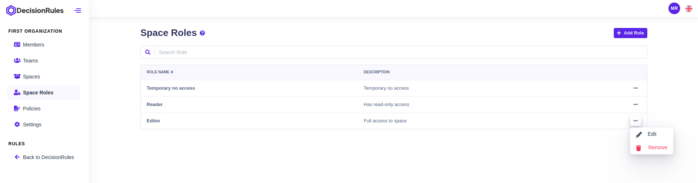

# Space Roles

Space Roles within organizations define the permissions and capabilities that users have within specific spaces. Each Space Role grants different levels of access, allowing users to perform various actions based on their role. Space Roles ensure efficient collaboration, security, and resource management within individual spaces by regulating user permissions. Such roles are assigned to members or teams for a specific space when a [policy](policies.md) is created.

<figure><figcaption>
List of space roles
</figcaption></figure>

## Space role permissions

* Rule Permissions
  * **Read** - Can read all kinds of rules (Scripting Rule, Decision Table, Rule Flow, Decision Tree). Automatically can read Folder structure.
  * **Update** - Can update, export, import all kinds of rules (Scripting Rule, Decision Table, Rule Flow, Decision Tree).
* API Keys Permissions
  * **Read** - Can read API keys.
  * **Update** - Can update API keys (create, delete).
* Audits Permissions
  * **Read** - To read audits, by default user will get permissions to read API keys.
  * **Update** - Can update audits (delete).
* Folder Permissions
  * **Update** - Can update folder structure, move rules and folders in folder structure.

## Default space roles

There are predefined roles in the organization that can be immediately assigned to users: Editor, Reader. Preset roles can be edited.

* **Editor** - is granted to users who require full access to the application for editing and managing content.

<figure><figcaption>
Editor permissions
</figcaption></figure>

* **Reader** - is designed for users who primarily require read-only access to the application

<figure><figcaption>
Reader permissions
</figcaption></figure>

## Create / Update space role

Using the "Add Role" button to create a new role, you need to enter its Role Name (required). It is also possible to add a description of the role and select its permissions (optional). Permissions can be divided into Read and Update. Read permission allows the user to access resources without being able to change them. The Update permission allows the resource user to access, change, delete, and save resources. Confirmation of filled fields is done by pressing the "Create" button.

<figure><figcaption>
Space Role Dialog
</figcaption></figure>

## Delete space role

In Table layout by clicking on action button followed by "Remove" button.


Deleting Space role means that members and teams with given role will loose access to a assigned space.


<figure><figcaption>
Delete Space role
</figcaption></figure>
