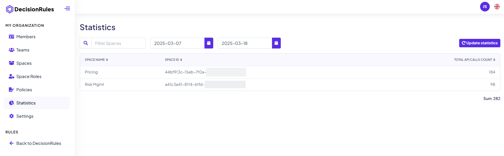

# Statistics

The **Statistics** section provides a comprehensive overview of API usage across all spaces within an organization. It displays a list of all spaces along with the total number of API calls made in each.

The list can be sorted by the number of API calls and filtered by space name for easier navigation. Additionally, a date picker enables users to select a specific date range, showing the number of API calls made within that period. This functionality you track API usage trends and gain insights into overall activity.

<figure><figcaption>
Organization spaces statistics
</figcaption></figure>
