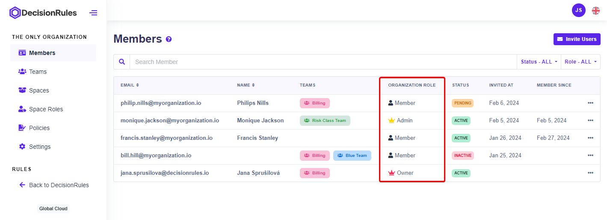

# Organization Roles

Roles within an organization are pivotal for granting users the necessary permissions to carry out tasks aligned with their responsibilities. Two types of roles exist: organization roles and [space roles](space-roles.md).&#x20;

Organization roles are assigned when a user is invited to join an organization. By default, the user who initiates the organization becomes the Owner. Each user within an organization holds only one organization role. Owners and Admins have the capability to manage organization roles from the Members tab within Organization settings. The three primary organization roles are as follows:

* **Owner** - can manage everything at the organization level. There must **always** be at least one owner in an organization.
* **Admin** - can manage everything at the organization level except billing.
* **Member** - can only access spaces they are added to.

<figure><figcaption>
List of Members - Organization Roles
</figcaption></figure>
