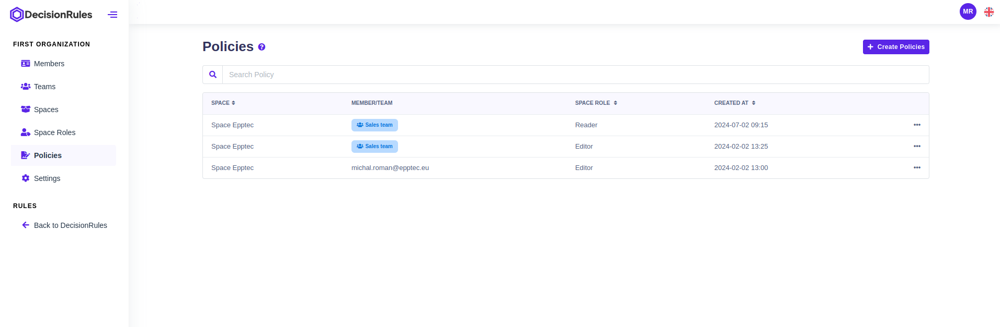
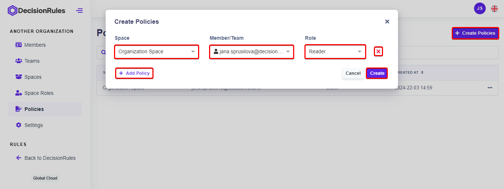
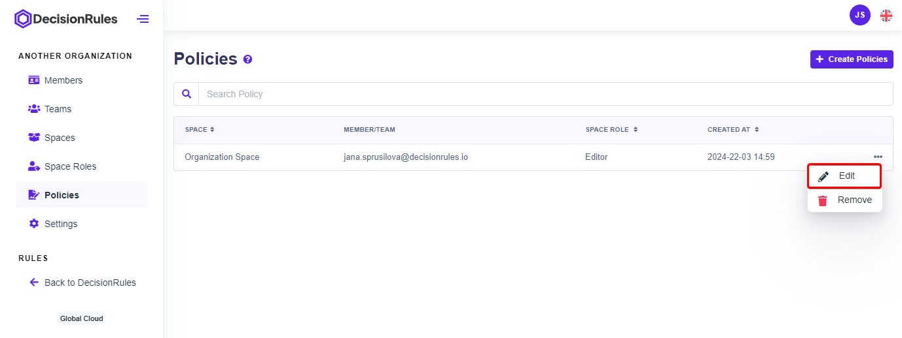
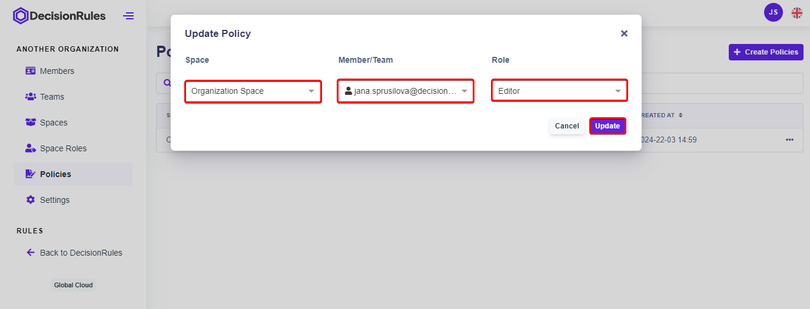
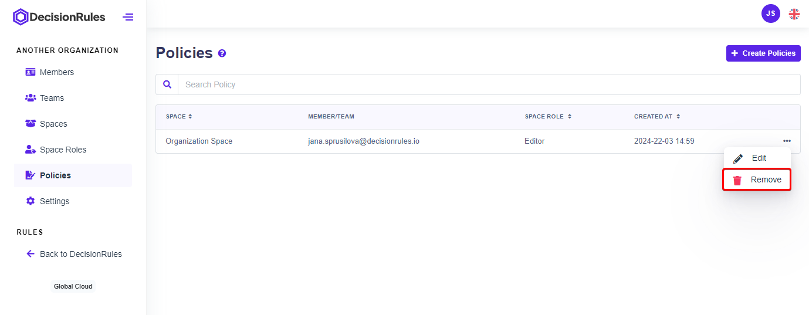

# Policies

Policies are set of rules of managing user permissions within a given space. These rules define who has access to what resources, what actions they can perform, and under what conditions access is granted or restricted. By establishing clear policies, organizations can ensure that user permissions are managed in a consistent, secure, and compliant manner.

## List of polices

This section outlines the permissions granted to members, teams, or space roles within the system. The table below provides a comprehensive overview of the permissions assigned to each entity within different spaces.

<figure><figcaption>
List of policies
</figcaption></figure>

### **Description of Columns**

* [**Space**](spaces.md) **-** Indicates the name of the space within the application.
* [**Member**](members.md)**/**[**Team**](teams.md) **-** Specifies the individual member or team.
* [**Space Role** ](space-roles.md)**-** Describes the role or level of access granted to the member or team within the specified space.
* **Created At -** Displays the date and time when the team was created.
* **Actions -** Provides options to edit or delete policy.

## Crete new policies

The user creates a new policy by clicking the "Create Policies" button. A new window will appear where the user selects the entity (mandatory) that he wants to assign to the policy; space (mandatory) in which the given policy applies and a certain role that the member will hold (what rights he has when accessing the space). Using the "Add Policy" button in the open dialog, allows adding multiple policies at once. The creation of the policy/ies is confirmed by clicking the “Create” button. Newly created policies are added to the policies table.

<figure><figcaption>
Create new policy
</figcaption></figure>

## Update policy

Each policy can be modified. By selecting the “Edit” option from the action menu on the right. The change is confirmed with the "Update" button.

<figure><figcaption>
Open policy editation
</figcaption></figure>

<figure><figcaption>
Edit policy and save
</figcaption></figure>

## Delete policy

Individual Policies can be deleted by selecting the “Remove” option from the action menu. The deletion is confirmed by pressing the "Remove" button. By deleting the Policy, it is removed from the table and the rights it provided are no longer valid.


Deleting policy means that members and teams with given role will loose access to a assigned space.


<figure><figcaption>
Delete a policy
</figcaption></figure>
