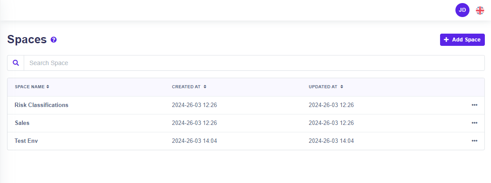
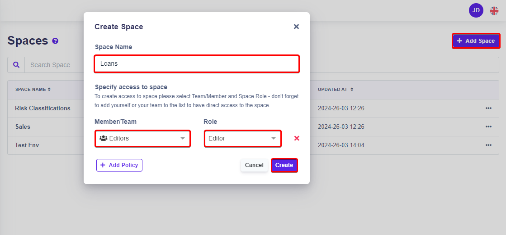
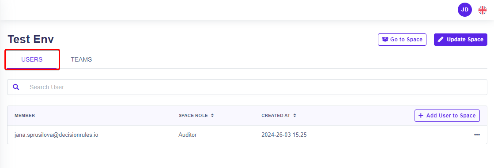
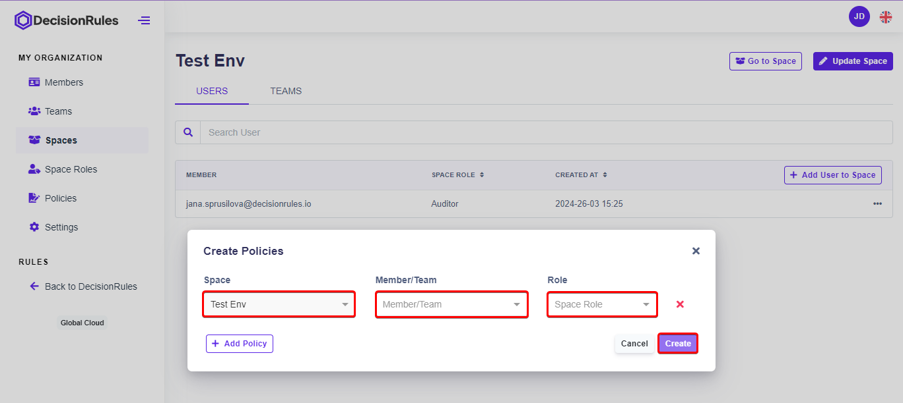
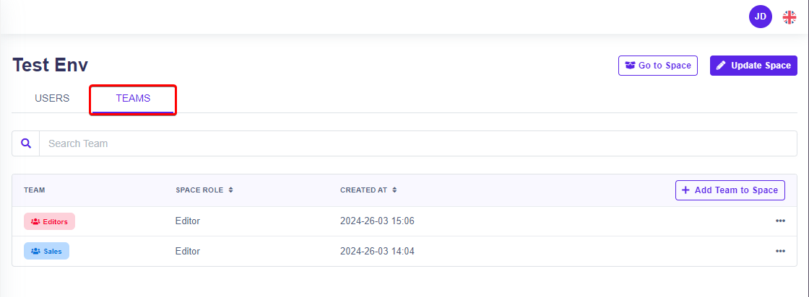

# Spaces

A list of all spaces that belong to the organization.

## List of Spaces

### **Description of Columns**

* **Space name -** Displays the name of each space within the organization.
* **Created At -** Displays the date and time when the space was created.
* **Updated At -** Indicates the date and time when the space was last updated.
* **Actions -** Provides options to delete, or view detailed information about each space.

<figure><figcaption>
List of spaces
</figcaption></figure>

## Add new Space

A new space can be added to the organization by pressing the "Add Space" button. A window for filling in the name of the new space will appear (required). [Policies](policies.md) can be added to the newly created space in one step and access to the new space can be created directly. The creation of the space is confirmed by pressing the "Create" button. The newly created space appears in the list of all spaces in the organization.

<figure><figcaption>
Add new spaces
</figcaption></figure>

## Update Space

The only think you can edit is a space name. All permissions in space are controlled via [policies](policies.md).

## Delete Space

In Table layout by clicking on action button followed by "Remove" button.


Deleting space means that all policies containing the space will be deleted as well as all rules in the given space will be deleted.


## Space detail

### Users tab

There is a list of all users who are allowed to access the given space.&#x20;

<figure><figcaption>
List of users that have access to the space
</figcaption></figure>

#### Add User to space

By clicking on Button add user to space

<figure><figcaption>
Add user to space
</figcaption></figure>

### Teams Tab

There is a list of all teams that have access to the given space.

<figure><figcaption>
List of teams that have access to the space
</figcaption></figure>

#### Add team to space

By clicking on "Add Team to Space" you can add existing organization team to selected space. In the window showed select a team and assign specific [space role](space-roles.md) to it.

<figure><figcaption>
Add team to space
</figcaption></figure>

