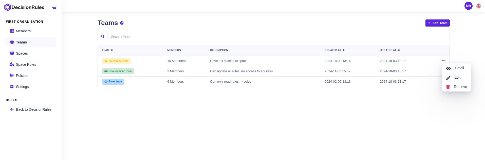
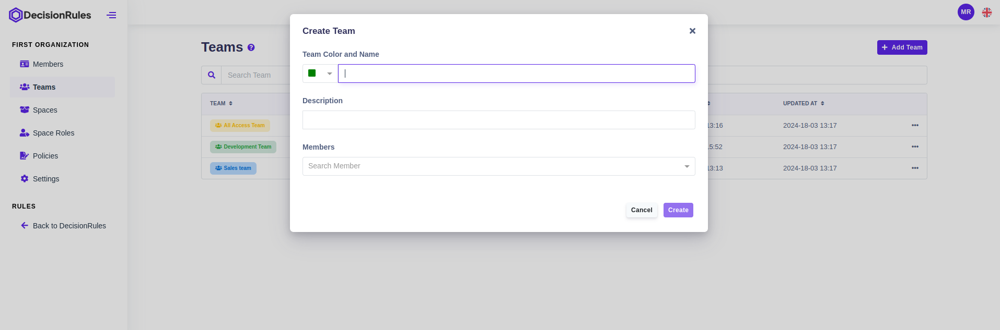
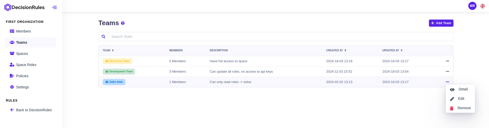
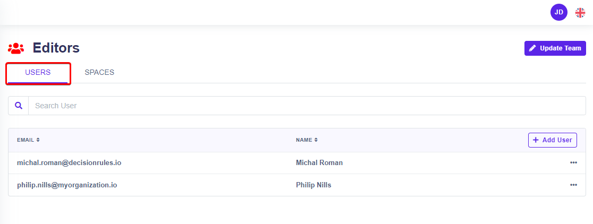
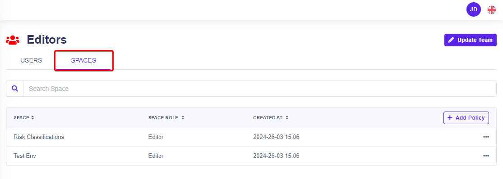

# Teams

Teams are groups within the organization that allow for streamlined user management and collaboration. The number of teams in the organization is given by the limit of the plan.

## List of teams

Teams section provides an overview of all teams within the organization, presented in a convenient table format. This documentation guides users through navigating the list, understanding the information displayed, and performing various actions on teams.

### **Description of Columns**

* **Team Name + Color Coding -** Displays the name of each team within the organization. Teams are visually differentiated by color, making it easy to distinguish between them at a glance.
* **Number of Members -** Indicates the total number of members currently assigned to each team.
* **Created At -** Displays the date and time when the team was created.
* **Updated At -** Indicates the date and time when the team was last updated.
* **Actions -** Provides options to edit, delete, or view detailed information about each team.

<figure><figcaption>
List of teams
</figcaption></figure>

## Create new team

Press the "Add Team" button to display a window to create new team. Simply choose color and name of the team to be easy recognizable from others. At the same time, you can assign members to the team.

<figure><figcaption>
Create new team - dialog
</figcaption></figure>

## Delete Team

In Table layout by clicking on action button followed by "Remove" button.

<figure><figcaption>
Delete team
</figcaption></figure>


Deleting team means that team and his all members will lose access to spaces. All corresponding policies will be deleted.


## Team Detail

### Users tab

The Users tab is the default when viewing team details and displays a table of all team members. The sheet shows the member's email address and name. From the table, you can open the "[Detail](members.md#detail-of-a-member-of-the-organization)" of an organization member by clicking on his email or selecting from the menu of actions at the end of the record line.

<figure><figcaption>
Users in the team
</figcaption></figure>

### Add user to team

By clicking on button "Add user" you can add user to team.

<figure><figcaption>
Add user to team
</figcaption></figure>

### Spaces Tab

Here you will see a list of all the spaces to which the given team is assigned. The table will display the name of the team and the role assigned to the team. By clicking on the "Add Policy" button, the given team will be  added to another space and assigned a predefined role (see the "[Policies](policies.md#crete-new-policies)" section).

<figure><figcaption>
Spaces the team has access to
</figcaption></figure>
