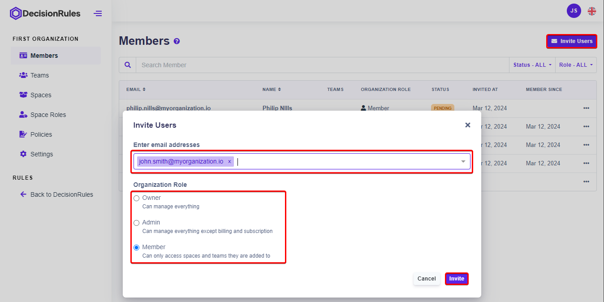

# Members

Manage all members of your organization in the Member section. Here you will find a list of all existing members, the option to add a new member and other tools to manage access for individual members.

## List of members

The list contains all members of your organization. Along with the email and name, the list includes the member's role in the organization, their status, and the date the member was invited to join. You can sort the list or search the member list using the search bar.


_The number of members that you are able to invite to join your spaces or organization is determined by your plan limit._


<figure><figcaption>
List of members
</figcaption></figure>

## Status of the member&#x20;

The organization allows several membership statuses:

* <mark style="color:green;background-color:green;">**ACTIVE**</mark> - An active user is one who has accepted an invitation to join the organization. Member sees the organization and its spaces and settings according to the role and permissions assigned to him. According to the assigned Policies members are allowed to work in the spaces to which they are assigned.
* <mark style="color:orange;background-color:orange;">**PENDING**</mark>**&#x20;-** The member was invited to join the organization and received an invitation in the mailbox.&#x20;
* <mark style="color:red;background-color:red;">**INACTIVE**</mark> - An active member can be deactivated by using the action menu on the right and selecting "<mark style="color:red;">Inactivate User</mark>". The member will not be removed from the organization, his status will change to <mark style="color:red;background-color:red;">**INACTIVE**</mark>. The inactive user has no access to the organization and/or their spaces. Spaces to which he has been assigned do not appear in his Spaces menu. Such action is reversible again from the action menu on the right and again the member's status in the sheet will be changed to <mark style="color:green;background-color:green;">**ACTIVE**</mark>.

<figure><figcaption>
Deactivate user
</figcaption></figure>

<figure><figcaption>
Activate user
</figcaption></figure>

## Adding a new member to the organization

Press the "Invite Users" button to display a window to add additional members. Simply enter the email addresses of those you wish to invite in the input box. At the same time, you can add a role in the organization for all invited members.&#x20;


_The default setting for the assigned role is Member. The role you select will be assigned to all invitations. You can change organization roles later in the detail of individual member._


&#x20;To confirm the addresses and role, press the "Invite" button. The users are added to the list of members and their status is <mark style="color:orange;background-color:orange;">**PENDING**</mark>. The invitation can be resent to the user by selecting the action "Resend Invitation" from the action menu. Once the invitation is accepted, the member's status in the organization changes to <mark style="color:green;background-color:green;">**ACTIVE**</mark>.

<figure><figcaption>
Add a new user to your organization
</figcaption></figure>

Invitation to organization can be accepted via email or directly in application in section "Organizations" by clicking on button "Accept Invitation".

<figure><figcaption>
Accept invitation to organization
</figcaption></figure>

## Detail of a member of the organization

Details of an organization member can be viewed by clicking on their email or by selecting the Detail action from the action menu. The member's details page will be opened. It includes a header and tabs for Teams and Spaces.

<figure><figcaption></figcaption></figure>

In the header, you can find the member's email, name, status, and role in the organization. As mentioned, here you can change organization role of the member. (More information about organization roles you can find in section [Organization Roles](organization-roles.md)). The Teams tab contains a list of all the teams the member is part of. The Spaces tab displays a list of all the spaces that the member has access to.

### Teams tab

Here you will see a list of all teams to which the member is assigned. You can search for a specific team(s) using the search bar. The list can be sorted by team name, in the header of the list. The list displays team details such as number of members and description (if set). The detail of the selected team can be viewed by clicking on its name or by selecting the Detail action from the action menu on the right. The Remove from Team action can be used to remove a member from the selected team.

<figure><figcaption>
Teams that user is assigned to
</figcaption></figure>

### Spaces tab

Here you will see a list of all spaces to which the member is assigned. The list will display the name of the space and the role assigned to the member. Use the search bar to search for a specific space(s) in the sheet. The list can be sorted by the name of the space, in the header of the list.  If there are no spaces to which the member has access, the message "_No Spaces found_" is displayed.

<figure><figcaption>
Spaces that user is assigned to
</figcaption></figure>

New access to a space can be created or existing access can be edited directly in the member's details. By clicking on the "Add Policy" button, the user can be added to another space and assigned a predefined role (For more information, see [Space Roles](space-roles.md) section).


_From the member detail, a policy can be edited only for that user._


After opening the window for adding a new policy, you can select from the menu the space of the organization (_required_) to which you want to assign the member access and also the role (_required_) and therefore the permissions with which the member can access the space. From the member's details, a new policy can be created only for that user. Multiple policies can be added at once, clicking the "Add Policy" button will create another row for the new policy. To confirm click the "Create" button.

Each policy in the sheet can be edited by selecting the "Edit" action. Changes are saved by clicking the "Update" button.

## Delete a member from organization

You can remove individual members from the organization. Compared to Deactivating a user (see [Inactive](members.md#status-of-the-member) status), this removes the user from the organization completely. If the user's role was Admin or Owner, the user will no longer be able to manage the organization and can not access to spaces member was assigned to (For more details about Space Roles, see dedicated [section](space-roles.md)).

Click on the side menu in the members list and select "Remove from organization". Click on the "Remove" button to confirm the deleting.

<figure><figcaption>
Remove member from organization
</figcaption></figure>

<figure><figcaption>
Confirm removing member from organization
</figcaption></figure>
