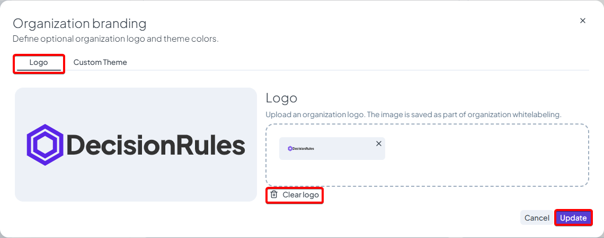
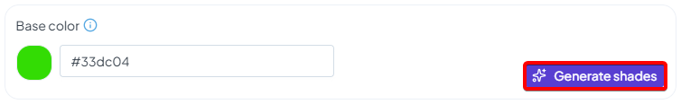
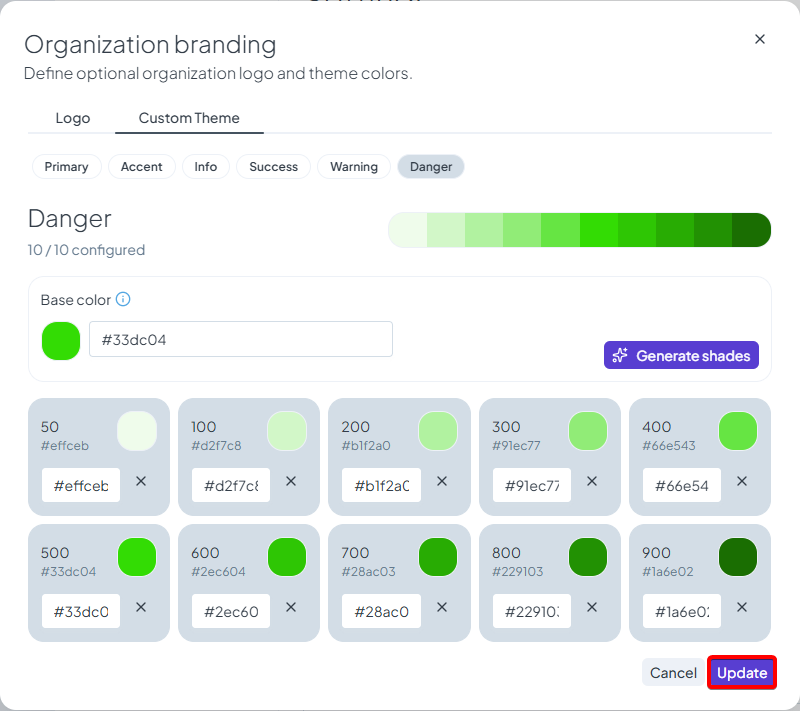

# White Labeling

## White Labeling

You can customize the DecisionRules interface for your organization by setting your own brand logo and custom theme colors.

Branding is configured in **Organization > Settings > Organization Branding**. The branding modal contains two separate tabs:

* **Logo**
* **Custom Theme**

The logo and custom theme colors are configured independently. Updating one does not affect the other.

### Custom Brand Logo

Use the **Logo** tab to set a custom organization logo.

The logo is displayed in the DecisionRules application header. For the best result, use an SVG logo with a transparent background.

The available logo area is approximately **160 × 35 px**. If your logo appears too large or too small, adjust its padding or scaling directly in the source image.


You can still set your own brand logo programmatically using the BRAND\_LOGO\_URL [environment variable](containers-environmental-variables.md#optional-server-environment-variables).&#x20;


<figure><figcaption></figcaption></figure>

### Custom Theme Colors

Use the **Custom Theme** tab to configure custom colors for the DecisionRules interface.

Custom theme colors are organized into color groups, such as **Primary**, **Accent**, **Info**, **Success**, **Warning**, and **Danger**. These groups are used across different UI elements, including buttons, labels, alerts, states, and other themed components.

Each color group contains a **Base color** and a generated set of shades. You can select the main color for the group and use **Generate shades** to automatically create the remaining shades, so you do not have to configure each shade manually.

<figure><figcaption>
Generate base color shades automatically
</figcaption></figure>

Individual shades can still be adjusted if needed. You can edit colors by entering a HEX value directly or by clicking a color swatch and selecting a color from the color picker.

Click **Update** to save the branding changes, or **Cancel** to close the modal without saving.


For the best visual result, choose colors with comfortable contrast across both light and dark mode. Since theme colors are used throughout the interface, a balanced color palette helps keep the experience clear and consistent.


<figure><figcaption></figcaption></figure>
