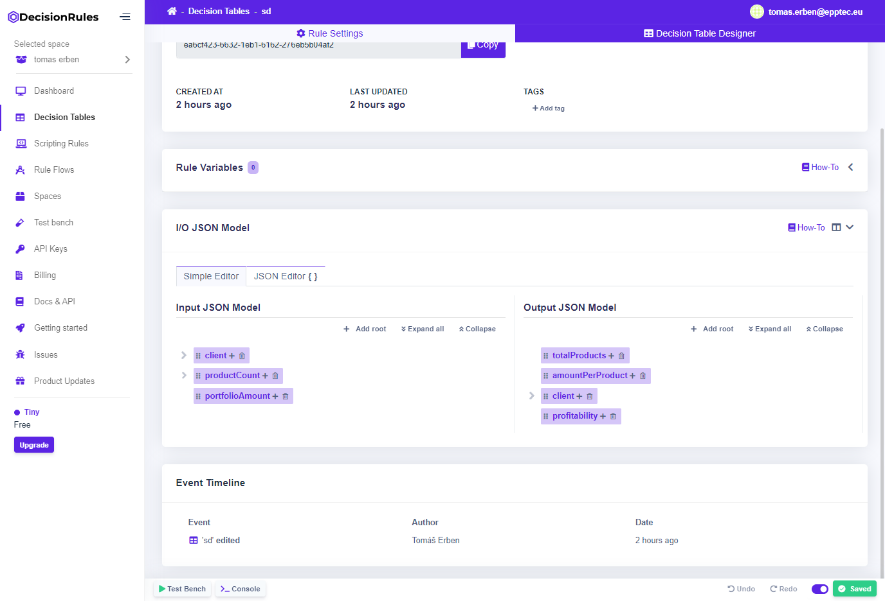

# Event timeline

#### The event timeline is a widget that enables users to see what was changed, when it was changed and who changed it.&#x20;

### On space

#### The event timeline widget can be found on the space.

### On rule

#### The event timeline widget is also available on a specific rule.


Some of the events are clickable. If you hover over the event text and the text gets underlined, it means that you can click on it and it will redirect you directly to what was changed.

