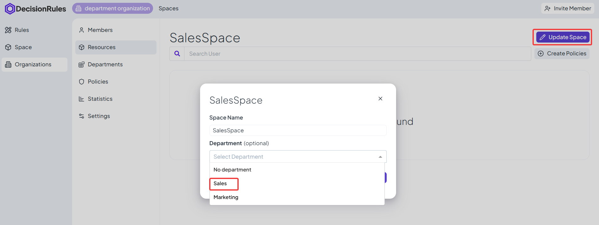

# Execution Strategy

Execution strategy allows you to change the outcome produced by the rule solver. There are several options for the execution strategy described below.

## List of execution strategies

* **Standard** strategy (default)
* **Array** strategy
* **First Match** strategy
* **Evaluate All** strategy - Available only in decision tables

You can easily set the execution strategy for solver API by adding the X-Strategy header. If the header is not specified, the system automatically chooses the STANDARD strategy.

| HTTP Header | Possible value |
| ----------- | -------------- |
| X-Strategy  | STANDARD       |
| X-Strategy  | ARRAY          |
| X-Strategy  | FIRST\_MATCH   |
| X-Strategy  | EVALUATE\_ALL  |



Execution strategy can be also chosen in Test bench.


<figure><figcaption></figcaption></figure>

The distinct types of execution strategies are described below.

### Standard

If 2 lines are matching the input, the output will be all the matching rows. The order will be the same as the order of rows in the rule.

**The output looks like this:**

```scheme
[
  {
    "client": {
      "segment": "affluent"
    },
    "profitability": 1
  },
  {
    "client": {
      "segment": "top affluent"
    },
    "profitability": 1.6
  }
]
```

### First match

If 2 lines are matching the input, the output is returning just the first matching line from the rule (table, script).

**The output looks like this:**

```scheme
[
  {
    "client": {
      "segment": "affluent"
    },
    "profitability": 1
  }
]
```

### Array

If 2 lines are matching the input, the outputs are returned in the array format.

**The output looks like this:**

```scheme
[
  {
    "client": {
      "segment": [
        "affluent",
        "top affluent"
      ]
    },
    "profitability": [
      1,
      1.6
    ]
  }
]
```

### Evaluate all

This execution strategy allows you to obtain satisfiability based on the input conditions of all rows in the decision table. If your decision table has N rows, the evaluation response will also be N objects. For each output, you will have an indication of whether the line was met or not.

**The output can looks like this:**

```scheme
[
  {
    "client": {
      "segment": "affluent"
    },
    "profitability": 1,
    "_match": true
  },
  {
    "client": {
      "segment": "top affluent"
    },
    "profitability": 1.6,
    "_match": false
  }
]
```
