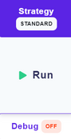

# Execution strategy

Execution strategy allows you to choose between 3 options based on how you want to get the result.



By clicking on Strategy in the test bench you can select the one that suits you.


## Example 

Example of the execution strategy on a rule.


### Standard - strategy

If 2 lines are matching the input, the outputs look like the following one:

```scheme
[
  {
    "client": {
      "segment": "affluent"
    },
    "profitability": 1
  },
  {
    "client": {
      "segment": "top affluent"
    },
    "profitability": 1.6
  }
]
```

### First match - strategy

If 2 lines are matching the input, the output is returning just the first matching line from the table, like the following example:

```scheme
[
  {
    "client": {
      "segment": "affluent"
    },
    "profitability": 1
  }
]
```

### Array - strategy

If 2 lines are matching the input, the outputs are returned in the array format as following:

```scheme
[
  {
    "client": {
      "segment": [
        "affluent",
        "top affluent"
      ]
    },
    "profitability": [
      1,
      1.6
    ]
  }
]
```

