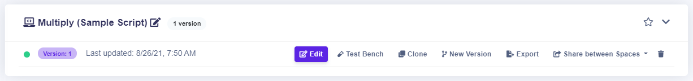
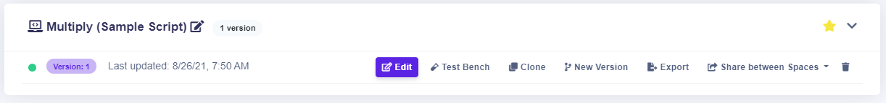

# Favorite Rules

## Mark rules as favorite

You can mark any of you rule as a favorite. Your favorite rules will appear on the top of a list.


The procedure is the same for **Decision Tables, Scripting Rules** and **Rule Flow.**


### How to mark the rule as favorite

Next to every rule is a  which you can click on to make your rule **Favorite**. The rules will be reorganized after page refresh. Favorite rules will be on the top.

### How to mark the rule as not favorite

If you want to undo **Favorite**, click on \*\*\*\*  and the rule won't be your favorite anymore. The rules will reorganize after therefresh.

