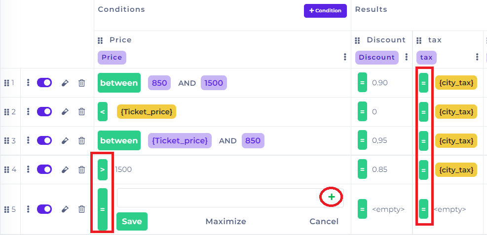

# Rule Variables

Rule variables are used to simplify the editing of a large amount of data.


In this guideline on how to create rule variables, you need to have knowledge of [Decision Tables](https://docs.decisionrules.io/doc/tutorials/create-simple-decison-table) and [Scripting Rule](../tutorials/code-editor.md).


## **Rule Variables in Decision Tables**

### **How to create Rule Variables**

Settings of Rule Variables could be found in the middle of the page of Rule Settings in DecisionTables.


Rule variables are bonded with the version of the Ruleset.


 (1) (1).png>)

When you want to create new variable, click to the button .png>) , so the Rule Variables table will show up. Then write a name of the variable, specify its value and hit the button .png>) . In case the variable is not useful, you can delete .png>)it or rewrite its value .png>).

 (1).png>)

#### Examples of Rule Variables

* Ticket\_price 350
* City Rome
* city\_tax 5


The created variables are locked for the changes. In order to change the value of the variable, click on the button .png>).


### Value of the Rule Variables

The name of the variable has to be always unique, otherwise, the variable cannot be saved. The format of the value could be TRUE/ FALSE, text or number. It is not possible to use the objects, for example, the empty set.


Each time save your changes – otherwise, the changed value of the rule variable will not be updated in Decision Table Designer.



The name of the variable has to be one word. If not, do not use spaces between word, or use – or \_ (examples of format: Ticketprice / Ticket\_price / Ticket-price)


### How to use Rule Variables

There are many ways how the rule variables could be used in the Decision Table Designer. The variables could be used in the input, the same as in the output.

* A single value in the condition
* Rule Variables in the functions
* Rule Variables in the text

#### Single value in Conditions

Go to the Decision Table Designer and start to create your conditions. When you want to use your predefined Rule Variable, first choose the type of operator, and then click on the button  (1).png>).



After clicking on the button, the window with predefined rule variables will show up. Select there the variable you want to you and save.

#### Rule variables in the functions

Rule Variables can be applied while using the function during counting as you can see in the column Final Price.


Need help during applying the variables inside the function? Press **CTRL+ Space** and the app will show you all the variables which are already specified in the Rule Settings


.png>)

#### Rule Variables in the text

Another possible manipulation with Rule variables is to display the name od Rule variables in the text/ message.

 (1).png>)

### Test of created rules

In the last step, a test created rules in Test Bench. Before testing the rule, we must change the status of the decision table to **"Published"** or have to **debug mode ON**. Debug mode allows you to test rules even when it is pending and at the same time writes data information to the debug mode console.


After creating an input or output model, we must always confirm the changes with the button.


#### Input model Example

 (1).png>)

#### Output model Example

 (1).png>)

#### Request body example

```
{
  "Price": 1550
}
```

#### Response body example

```
[
  {
    "Final Price": 1322.5,
    "Discount": 0.85,
    "tax": 5,
    "message": "The price for the way to Rome is 1322.5."
  }
]
```

## Rule Variables in Scripting Rules

### How to create Rule Variables

Settings of Rule Variables could be found in the middle of the page of Rule Settings in Scripting Rules.


Rule variables are bonded with the version of the Ruleset.



When you want to create new variable, click to the button .png>) , so the User Variable table will show up. Then write a name of the variable, specify its value and hit the button .png>) . In case the variable is not useful, you can delete .png>)it or rewrite its value .png>).

### How to use Rule Variables

In comparison with Desicion Table, the use of Rule Variables is more simplier and faster. No wonder! Instead of clicking on buttons you are specifiying the actions and functions in Java Script.


How to create rules in Scripting Rules is explained [here](../tutorials/code-editor.md#6.-creating-rules).


#### Steps to follow:

* Create an Input and Output model
* Create rules in Scripting Rule Designer
  * Rule Variables are used the same way as Input/Output variables. The only difference is that the value of Rule Variables is fixed, and can be collectively updated in whole your code.
* Test created scripting rule.
