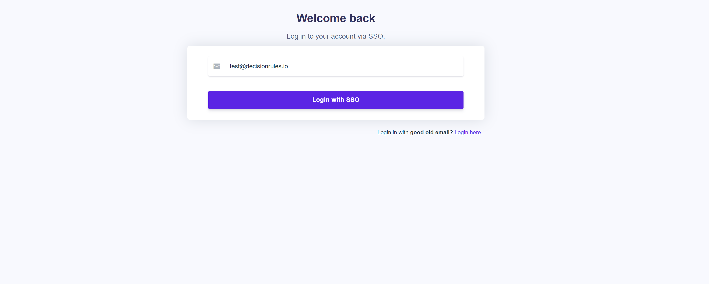

# Single Sign-On (SSO)

## Sign in with corporate credentials 

If your organization has the single sign-on (SSO) option enabled, on the Login page click on the “SSO” link at the bottom.

Next, provide your email address with the SSO of your organization.

Enter your corporate email. You will be redirected to your provider's webpage to enter your credentials - **Username** and **Password**. After you have successfully entered them and logged in, will be redirected back to DecisionRules on your **Dashboard**.


If you already have an account with corporate email, and the provider is in our database, there will be no change for you.


### Is the single sign-on feature available for all customers? 

The single sign-on feature (SSO) is available for **on-premise**, **private cloud** and **public cloud** (large and higher) also for the current plans. To enable SSO for your organization, please contact us at <mark style="color:red;">**sales@decisionrules.io**</mark> or <mark style="color:red;">**support@decisionrules.io**</mark>

### What Identity Providers (IdP) does DecisionRules support?

DecisionRules SSO works with all Identity Providers that support the SAML 2.0 protocol.

* Microsoft Azure AD
* Okta
* OneLogin
* Ping Identity

### How do I set up a single sign-on access for my organization?


The users can not set up the SSO by themselves, we need to add the underlying information into the database to make the SSO work.

For on-premise, you can refer to the [guide](../on-premise-docker/setting-up-sso.md).


| Variable    | Description                    |
| ----------- | ------------------------------ |
| domain      | domain in the email address    |
| entryPoint  | identity provider entry point  |
| issuer      | issuer string to supply to IdP |
| callBackUrl |                                |
| cert        | certificate                    |


For more information contact us at <mark style="color:red;">**sales@decisionrules.io**</mark> or <mark style="color:red;">**support@decisionrules.io**</mark>

