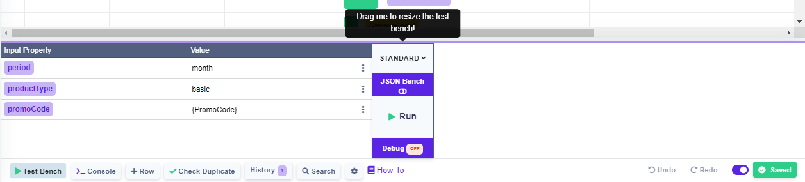

# Test Bench

### Used in Rule

To access the Test Bench, click the  button in the bottom bar.

<figure><figcaption></figcaption></figure>

<figure><figcaption>
Rendered Test Bench
</figcaption></figure>

<figure><figcaption>
JSON Bench
</figcaption></figure>

### Resizeable

Drag the purple line up to resize the test bench.

### Filling input


If you want to use comma inside the input field, please put the whole word in double quote marks.

E.g. "some,text"



The reason for having to put text with comma inside quote marks is that if you write 1,2,3 as input in the simple test bench, it will be interpreted as an array(list) on the backend.&#x20;

E.g. 1,2,3 would be converted to \[1,2,3]


### Date Input

You can input by clicking on the three dots .

Then click on the date icon .

A pop-up will be shown.

 (1) (2).png>)

Choose the date, time and time zone (only the time zone is required) and click save.

If you decide to change the date, you can simply click on the input that will change color on hover.


To clear the input simply click on the mentioned three dots  (1).png>) and then click on clear (1).png>).



If you're using the [Valid Values](../decision-tables/table-operations/valid-values.md) functionality in your Decision Table, it is also available in the Test Bench


### Switching between benches

Click on JSON Bench button to switch between the simple and JSON test bench.


When you switch between the benches, the data will be persisted.



One caveat being that if you input an array of objects inside the JSON bench, then switch to simple bench, it will show only the first object of that array.

Same applies for output.

However by switching back to the JSON bench, you will see that the array of data has been persisted and only the first object was changed (if you have made any changes inside the simple bench).


