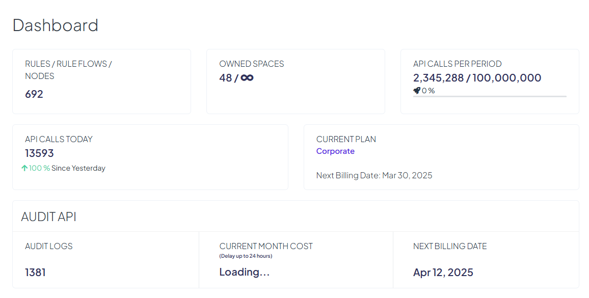

# Dashboard

The **Dashboard** page provides an overview of your account activity and key usage metrics, giving you quick insights into your profile and subscription details. This page includes numerical data, charts, and essential information about your current plan and billing.

### **Key Metrics**

The dashboard displays several important metrics related to your account:

* **Number of Rules** – The total count of rules you have created.
* **Spaces Owned** – The number of organization spaces you own.
* **API calls per period -** displays today's amount of API calls and percentage of usage against the billing plan.
* **API calls today -** displays today's amount of API calls and a percentage increase/decrease compared to yesterday.

<figure><figcaption></figcaption></figure>

* **Audit logs** - current number of stored Audit Logs compared to plan limit and total number of storage days calculated for current billing period, as well as estimate of the current cost when [Pay-as-you-Go](pay-as-you-go.md) functionality is switched on.

<figure><figcaption></figcaption></figure>

* **Jobs** - current number of seconds used for Jobs execution within current billing period compared to plan limit, as well as estimate of the current cost when [Pay-as-you-Go](pay-as-you-go.md) functionality is switched on.

<figure><figcaption></figcaption></figure>

### **Subscription Details**

Your **current plan** is displayed, along with the **next billing date**, ensuring you stay informed about your subscription status and upcoming charges.

### **API Call Usage Chart**

The **Dashboard** includes two charts that provide insights into your API usage:

* **Billing Period API Usage Chart** – This chart displays the number of API calls made in either the **current billing period** or the **previous billing period**. You can switch between these views to analyze usage trends. Additionally, a **date picker** allows you to select any specific date range to focus on API activity during that time.
* **Monthly API Usage Chart** – This chart visualizes the number of API calls made per month over the **last 12 months**, helping you track long-term usage patterns and identify trends.

<figure><figcaption></figcaption></figure>
