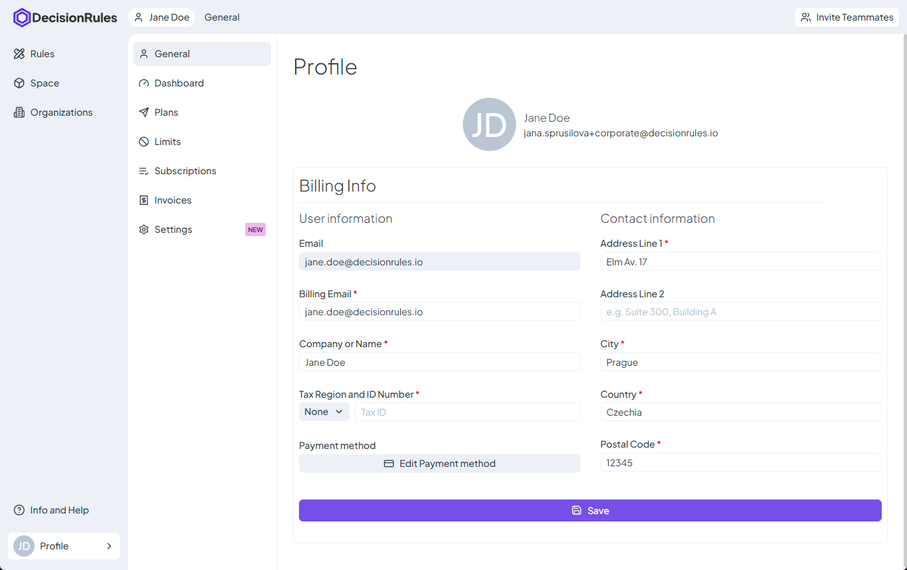

# General

The **General** page provides an overview of your profile details and billing information. Here, you can manage your personal and company-related information and configure language preferences.

### **Billing Information**

This section displays your **name** and **email**, along with your billing details. Certain fields in this section are **mandatory** for upgrading your plan and completing the billing process. These required fields are marked with an **asterisk (\*)**, indicating that they must be filled before saving changes.

#### User Information

* **Billing Email** – The email address used for invoices and payment-related communication.
* **Company or Name** – The registered business name or personal name for billing purposes.
* **Tax Region & Tax ID Number** – Used for tax compliance and invoicing.

#### Contact Information

In this section, you can enter your **address** and other essential contact details required for billing and communication purposes. The address form typically includes:

* **Address Line 1** – The primary street address.
* **Address Line 2** _(optional)_ – Additional details such as apartment, suite, or building number.
* **City** – The city or locality of your address.
* **Country** – The country of residence or company registration.
* **Postal/ZIP Code** – The postal code to ensure accurate location identification.

Providing accurate and complete contact information ensures proper invoicing and compliance with tax regulations. Some fields, such as **Address Line 1, City, Postal Code, and Country**, are mandatory and must be filled before saving changes.

<figure><figcaption></figcaption></figure>
