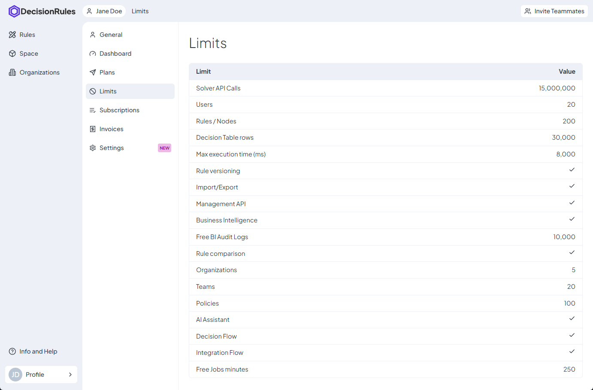

# Limits

The **Limits** page provides an overview of all restrictions and quotas tied to your current subscription plan. It lists the feature limits available to you, helping you understand the scope of your plan.

This page displays various limits, such as:

* **API Calls** – The maximum number of API requests allowed per billing cycle.
* **Rules** – The total number of rules you can create and manage.
* **Spaces** – The number of spaces you can own within your organization.
* **Free BI audit logs** - number of audit logs that can be stored as part of the plan (see also [Pay-as-you-Go](../pay-as-you-go.md))
* **Free Jobs minutes** - number of minutes of job executions that are part of the plan (see also [Pay-as-you-Go](../pay-as-you-go.md))
* **Other Feature-Specific Limits** – Any additional restrictions based on your selected plan.

These limits are **determined by your current plan** and cannot be modified directly from this page. If you require higher limits, you can explore available plans on the **Plans** page and upgrade to a higher-tier plan to extend your usage quotas.


If you have unique business requirements that exceed standard limits, feel free to **contact us** to explore a **personalized plan** tailored to your needs. You can reach us at <mark style="color:red;">sales@decisionrules.io</mark> for further assistance.


<figure><figcaption></figcaption></figure>
