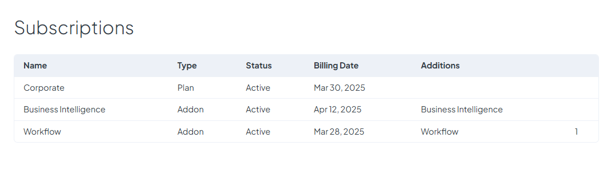

# Subscriptions

The **Subscriptions** page provides an overview of all your active subscriptions, helping you track your current services and upcoming billing cycles.

### **Active Subscriptions Overview**

Each active subscription is displayed in a list, showing:

* **Subscription Name** – The name of the subscribed plan.
* **Type** – Whether the subscription is plan or add-on.
* **Next Billing Date** – The date of the next scheduled payment.
* **Possible Additions -E**xtra features or increased limits that have been applied directly to your plan.

<figure><figcaption></figcaption></figure>

