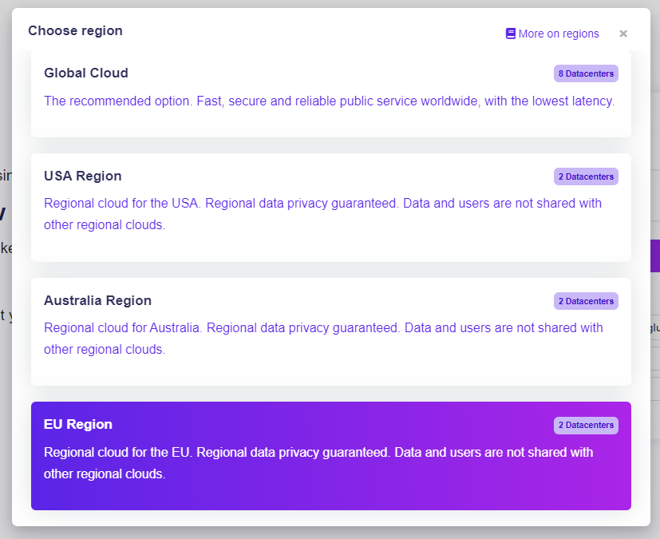

# Regional Cloud

## DecisionRules on a Regional Cloud

When using the Global Cloud version of DecisionRules, your information, rules and variables are stored in datacenters all around the globe. For some bussiness however, this might not be a good fit. Certain jurisdictions or internal company policies forbid having sensitive data stored outside of their respective regional borders.&#x20;

This is where the **Regional Cloud** version of DecisionRules comes in. Choosing this version, your data will only be stored in your selected region's datacenter.

## About Regional Cloud

The Global Cloud and each Regional Cloud versions of DecisionRules have separate databases. This means **region-locked** accounts may not access spaces of Global Cloud accounts and vice-versa.&#x20;

Each locale boasts two separate datacenters containing the same data to ensure it's reliability, accessibility and security.

### How to access&#x20;

Accessing this version of DecisionRules is fairly straightforward. On the login page of DecisionRules, click the region dropdown in the top right. &#x20;

<figure><figcaption></figcaption></figure>

Then just choose a region and select it.

<figure><figcaption></figcaption></figure>


When creating a Regional Cloud account, make sure you've selected the correct region for your organization.

