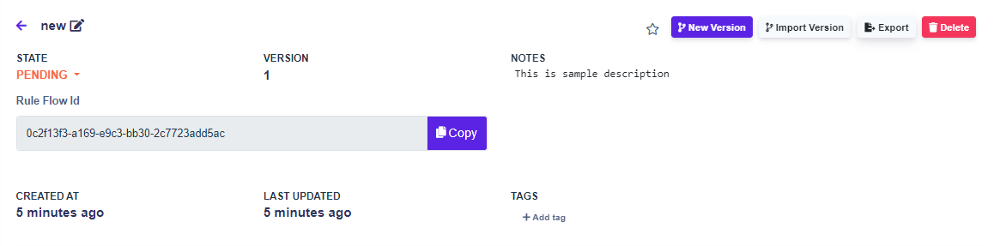
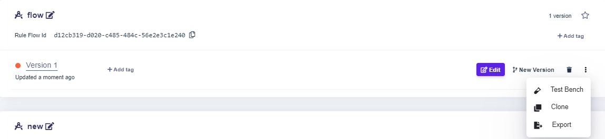
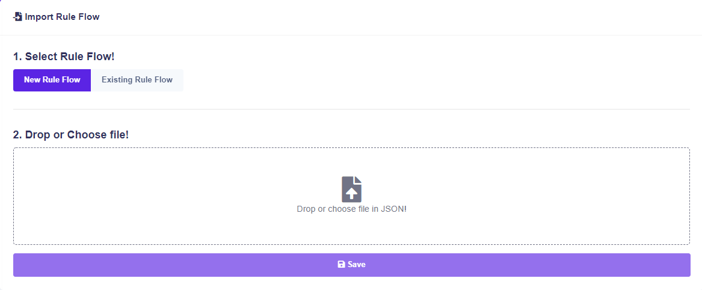

# Import & Export

### Export

You can export the rule flow inside the rule flow setting or in the list of rule flows.

### Import

You can export the rule flow inside the rule flow setting or in the import interface.


Go to [import-decision-table.md](../decision-tables/import-and-export-rule/import-decision-table.md "mention") to learn more about the basics of importing.

The process of importing decision table is very similar to the process of importing a rule flow.


#### How does importing a rule flow affect other rules that are already in space? 

1. If you have never imported a rule with the rule ID that you just imported into your space, it will create it as a completely new rule.
2. If there are any rules that have the same rule ID and also the version as the rule that you just imported through the rule flow, then it will OVERWRITE the all of the rule contents except for the rule ID.
3. If there are any rules with the same rule ID but none of them has the same version as the rule that you just imported through the rule flow, then it will create a rule with the rule ID that it currently has inside the space and it will import it as the version that it has.

