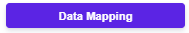
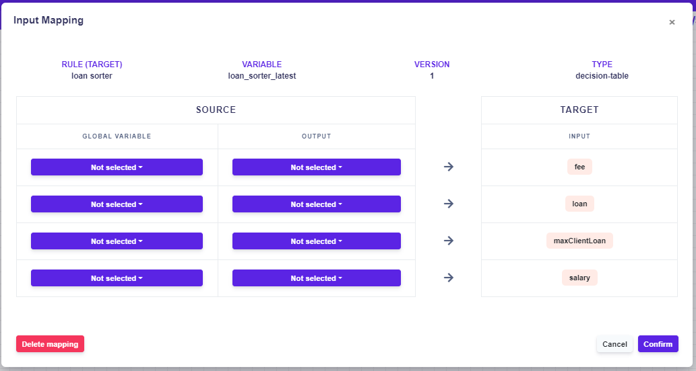
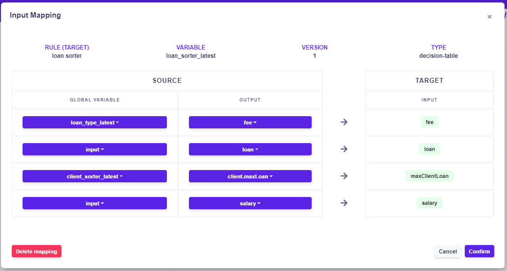

# Mapping

To make fule flow work, the rules must be mapped. By mapping, we decide which inputs should go to which rules.

For an unmapped rule, a yellow border and a yellow exclamation point appear in the right corner, as shown.

In this case, the rule and the **output** box are not mapped. 

#### Let's map the rule

* Open the data mapping by clicking on, the window will appear, where you can start mapping.

* In the **global variable**, select the name of the rule you want to select from the variable, and in the **output**, select it.

#### Example of correct mapping:


Notice that the mapped outputs are from various global variables, even from the input box itself.


