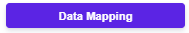
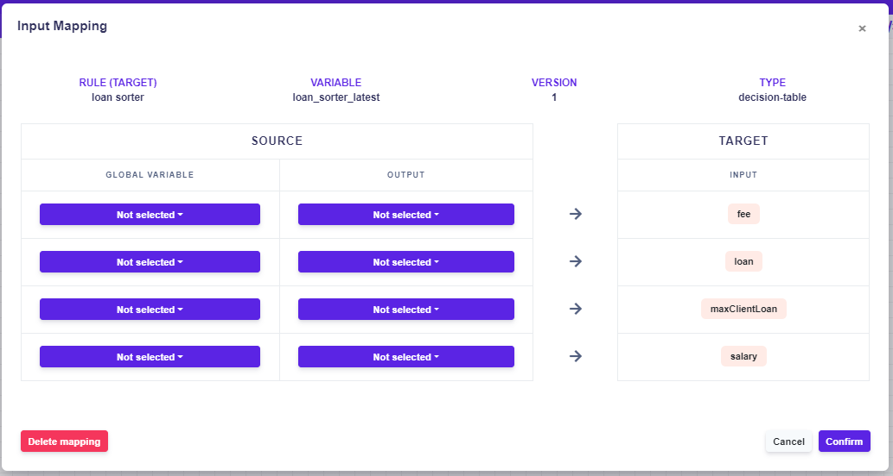
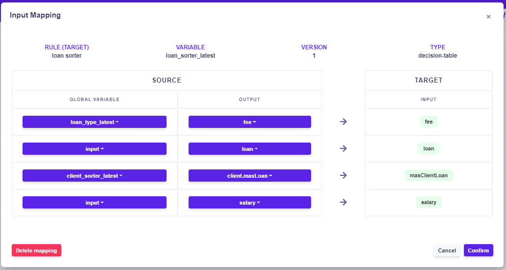

# Rule Flow Mapping

## What is the Rule Flow mapping?

To make the rule flow work, the rules must be mapped. By mapping, we decide which inputs should go to which outputs of the certain rules.

For an unmapped rule, a yellow border and a yellow exclamation mark appear in the right corner, as shown on the picture below:

.PNG>)

In this case, the **rule** and the **output** box are not mapped.

#### Rule mapping

Open the mapping by clicking on, the window will appear, where you can create the mapping.

* In the **global variable**, select the rule you want to map, and in the output select the exact outputs you want to get mapped on the target input.

#### Example of correct mapping:


Notice that the mapped outputs are from various global variables, even from the input box itself. It means you can use any of the rules in the rule flow to be mapped not only the parent/child rules.

