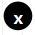

# Rule Flow Designer

### Introduction

In this section, you can easily combine your decision tables or scripting rules and create extensive automatic decisions.


The example shown above is a rule flow that decides whether to lend to a given client and what the tax will be. (bank)


### Rule Sidebar

When a rule is selected, its sidebar is displayed.

.png>)

In the sidebar is displayed:

* **Rule** - the name of the actual rule in the box. By clicking on it you can change the rule in a box
* **Version** - the actual version of the used rule. By default, the latest version is chosen. By clicking on it, you can specify the version, that you want to use
* **Data Mapping** - by clicking on it, it opens [Data Mapping](mapping.md)
* **Rule Detail** - by clicking on it, it opens rule designer (the actual rule) in a new browser tab
* **Global Variable **- it is used for mapping in a Rule Flow. By clicking on it you can rename it
* **Rule model** - displays input and output model. Correct mapped inputs are green and non-mapped or wrongly mapped inputs are red

### Add rule

1. To add a new rule click button. After that empty rule box shows on the canvas.
2. Right-click on the empty rule box to show its bar.
3. Select a rule, that you want on the sidebar.


You can also choose a version of the rule by clickingbutton on properties. By default, the latest version of the rule is used.


### Delete rule

To delete the rule, right-click on them and click or click the **Delete** key on your keyboard.

### Connecting rules

All rules must be connected to the **input **box and **output **box. To connect rules click on the black circle on the box and drag a line to another box's black circle.


You always have to start by dragging the line from the black circle on the right side.


### Debug

Debug mode is used to make it easier to test your Rule Flow when creating it. The debug button  is on the Test Bench shown on the bottom of the Rule Flow designer.  In Rule Flow, debug mode is turned on by default, by clicking on it the user turns it off. 

#### When debug is enabled:

* Information about inputs and outputs is written to the **debug console**.

* An inscriptionappears on each rule. After clicking on it, a window **Evaluation Results** will appear where are all inputs and outputs from the given rule.

### Zoom in and Zoom out

To zoom you can use pair of buttons or a **mouse wheelbarrow.**

****
