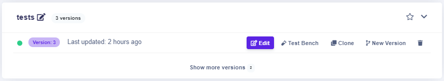

# Versioning

### 1**.** Creating a new version of the Rule Flow list

1. Choose the Rule flow to create a new version.
2. Click on the button.

### 2. Creating a new version of the Rule Flow detail

1. Choose the Rule flow to create a new version.
2. Click on the button.

The button creates a new version of the Rule flow with the same **Rule flow Id** as the selected rule and sets the **version to 1 greater than the maximal version.** The new Rule Flow has the **same structure** as the selected Rule Flow.

## Rule Flow versions

When you are on the  Rule Flow page, you can see all the Rule Flow you have in your space. If your rule has more than one version, the **latest** one is shown. For example, the rule **tests** have 3 versions. That's why version 3 is shown. 

If you want to see all the versions click on the versions of the rules that will show up.

