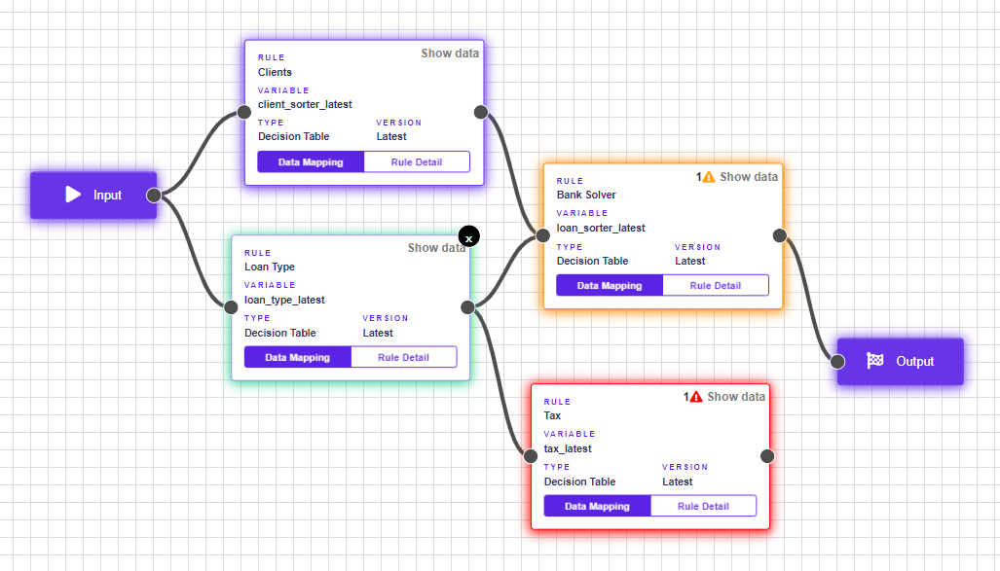

# Warnings & Errors

## Warnings

If the rule is not mapped in the Rule Flow, it will be demarcated by a **yellow border** with an icon. If you save a rule with warnings, the state automatically switches to **pending**.


When you point to the, warning information will be displayed.


### Types of warnings:

* The rule is missing mapping.

To fix this, map the data in a rule. At least one output must always be mapped for the mapping to be valid and no warnings to be displayed.


Rule Flow with warnings is automatically set to pending and cannot be called via Rule Flow Solver API


## Errors

Errors are serious mistakes that prevent Rule Flow from being saved. A **red border** and an iconappear next to a rule that contains errors.


When you point to the, errors information will be displayed.


### Types of errors:

* The rule is not connected with the input
* The rule is not connected with the output

To fix this connect all boxes to the Input box and Output box.

* The rule is not selected.

To fix this choose a rule into the empty box by clickingin the sidebar.

* Cannot find the rule.

The rule is probably deleted and can no longer be used in Rule Flow.

## Others

To make it easier to work with rules in Rule Flow, the rules have the next 2 colors of borders.

## Purple - Neutral state

The purple border has a rule if it is in a neutral state - it has no warnings or errors.

## Green - Active state

If the user works with the rule, ie has it clicked and sees its sidebar, the rule changes color to green.

