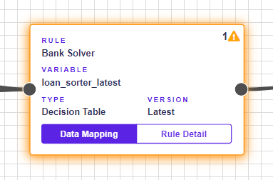
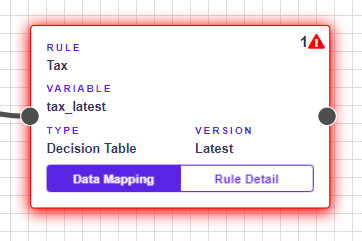

# Warnings & Errors

## Warnings

If the rule is not mapped in the Rule Flow, it will be demarcated by a yellow border with an icon. If you save a rule with warnings, the state automatically switches to **pending**.


When you point to the, warning information will be displayed.


## Errors

Errors are serious mistakes that prevent Rule Flow from being saved. A red border and an iconappear next to a rule that contains errors.


When you point to the, errors information will be displayed.


### All types of errors:

* Rule is not connected with input.
* Rule is not connected with output.

To fix this connect all boxes to Input box and Output box.

* The rule is not selected.

To fix this choose a rule into the empty box by clickingin the sidebar.

* Cannot find rule.

The rule is probably deleted and can no longer be used in Rule Flow.

