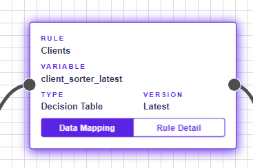
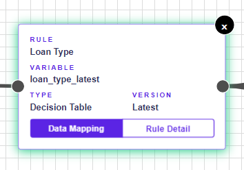

# Rule States in Rule Flow

## Understand rule states in Rule Flow

To make it easier to work with rules in Rule Flow, the rules have colored borders.

### Purple - Neutral state

The purple border has a rule if it is in a neutral state - it has no warnings or errors.

### Green - Active state

If the user works with the rule, ie has it clicked and sees its sidebar, the rule changes color to green.

### Yellow - Warning

If a rule has a warning, it will be demarcated a yellow border and an iconwill appear next to it.


When you point to the, warning information will be displayed.


### Red - Error

Errors are serious mistakes that prevent Rule Flow from being saved. A red border and an iconappear next to a rule that contains errors.


When you point to the, errors information will be displayed.

