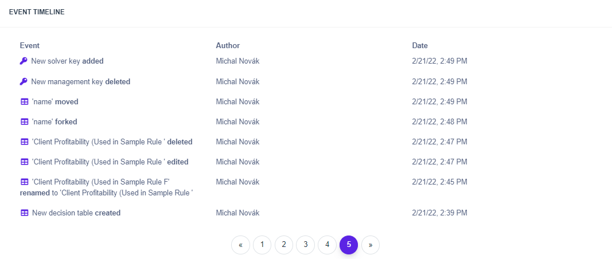
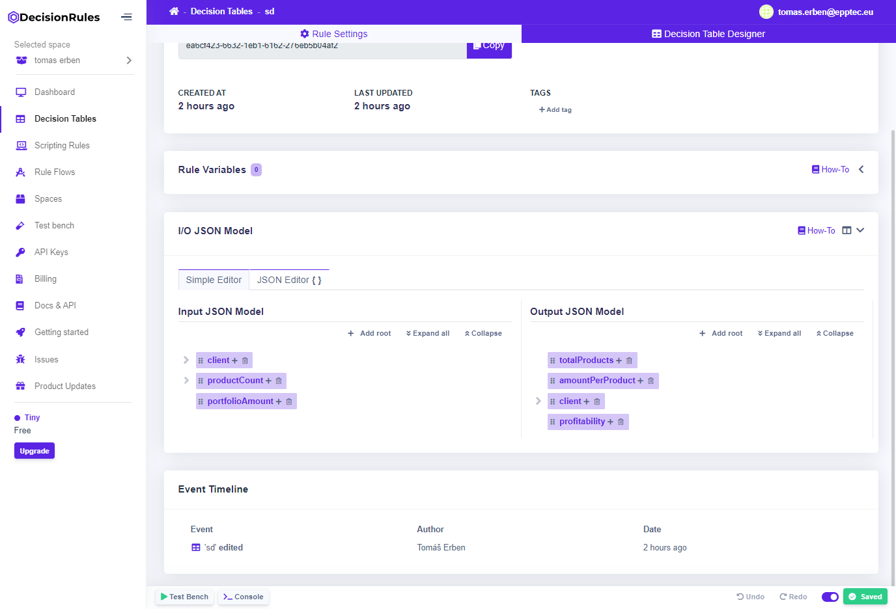

# Event Timeline

#### The event timeline is a widget that enables users to see what was changed, when it was changed and who changed it.&#x20;


Some of the events are clickable. If you hover over the event text and the text gets underlined, it means that you can click on it and it will redirect you directly to what was changed.


### On space

#### The event timeline widget can be found in the dashboard. These events include all the events that happened on the given space. Such events are any changes regarding decision tables, scripting rules and rule flows. Also any changes in the API KEYS section or editing of space are going to be logged here.

### On rule

#### The event timeline widget is also available on a specific version of a rule. The only events logged here at the moment are RULE\_EDITED and RULE\_FORKED.

