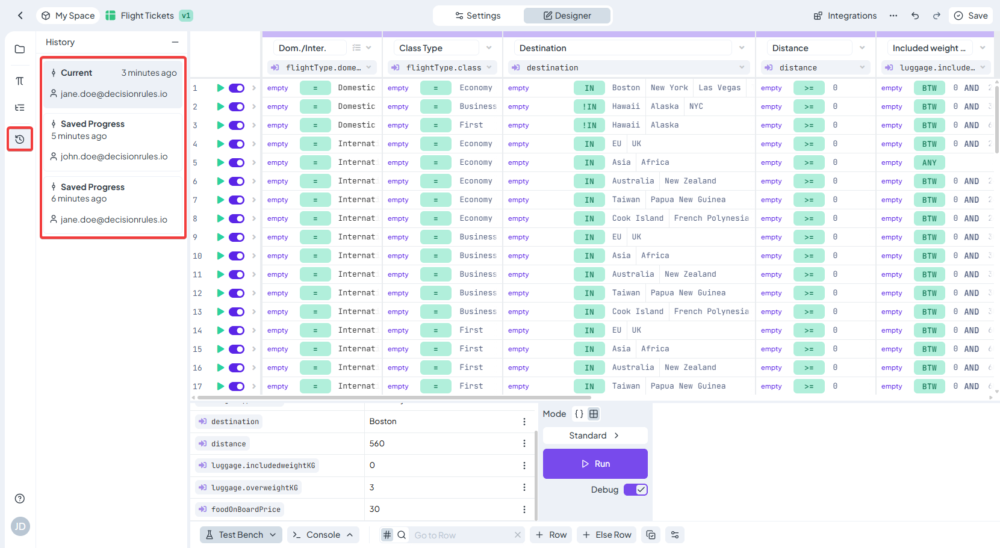
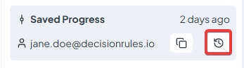
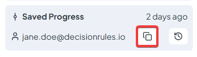

# Rule History


The **Rule History** feature is not available for **Rule Flow**. You can edit and save a Rule Flow as usual, but its previous versions are not stored or displayed in a history panel.


The **History** panel provides a complete overview of all saved versions of a rule.\
Each time you click **Save** in the editor, a new version of the rule is automatically created and recorded here. This allows you to track when and by whom each change was made, and to revisit any previous version when needed.

#### Overview

The **History** panel is located on the left side of the rule editor.\
Each entry in the list shows:

* **Timestamp** – when the rule was saved
* **User email** – who performed the save
* **Current label** – indicates the latest version

The most recent version is always marked as **Current**, while older versions have no label but remain accessible for review.

<figure><figcaption></figcaption></figure>

#### Viewing previous versions

Click any item in the list to open that historical version directly in the rule Designer.\
When selected, the editor will display that version of the rule, allowing you to review its exact configuration at the time of saving.\
To return to your working copy, simply select the **Current** version again.

#### Editing and evaluation rules

Only the **Current** version of a rule is editable and can be executed (tested or run).\
Historical versions are displayed in **read-only mode** — you can view them but not modify or evaluate them.

If you want to bring a historical version back to an editable state, you have two options:

* **Restore historical version** – replaces the current version with the selected historical one. The restored version becomes the new **Current** version and can be edited and evaluated as usual. The previously current version is saved to the history list, ensuring that no data is lost.

<figure><figcaption></figcaption></figure>

* **Clone historical version** – creates a completely new rule based on the selected historical version. The new rule opens immediately in the editor and behaves like any other newly created rule.

<figure><figcaption></figcaption></figure>


Don't forget to change aliase after cloning.


#### How it relates to editing

The **History** panel records only _saved_ versions of a rule.\
Actions performed using **Undo** and **Redo** affect the current unsaved state of the rule and are not stored here until you save the rule again.
