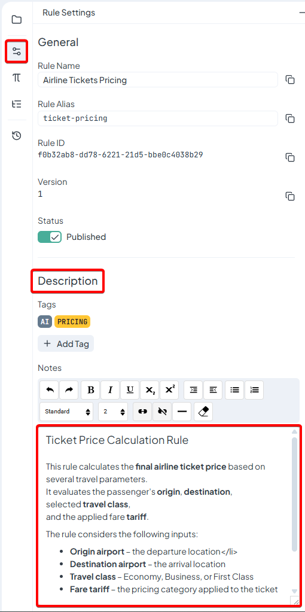

# Rule description

The **Rule Description** provides a space where you can document the purpose and behavior of a rule. Clear descriptions help other users understand what the rule does, what inputs it expects, and how its logic should be interpreted.

<figure><figcaption></figcaption></figure>

#### Location

The **Description** field is located in the **right-side panel of the Rule Editor**, inside **Rule Settings → Description**.

#### Usage

You can enter explanatory text directly into the description field. The editor supports **basic rich text formatting**, which allows you to structure and highlight important information.

This makes it useful for documenting:

* the purpose of the rule
* explanations of input variables
* pricing logic or business conditions
* examples of how the rule behaves

#### Supported Formatting

The editor allows styling such as:

* **Bold text** for highlighting important values
* _Italic text_ for emphasis
* Lists for structured information
* Headings for section separation
* Links to related documentation

#### Example

Below is a simple example of how a rule description can be structured:

**Ticket Price Calculation Rule**

This rule calculates the **final airline ticket price** based on several travel parameters.\
It evaluates the passenger's _origin_, _destination_, selected **travel class**, and the applied **fare tariff**.

The rule considers the following inputs:

* **Origin airport** – the departure location
* **Destination airport** – the arrival location
* **Travel class** – Economy, Business, or First Class
* **Fare tariff** – the pricing category applied to the ticket

Based on the combination of these values, the rule assigns the appropriate **ticket price** according to the configured pricing scenarios.
