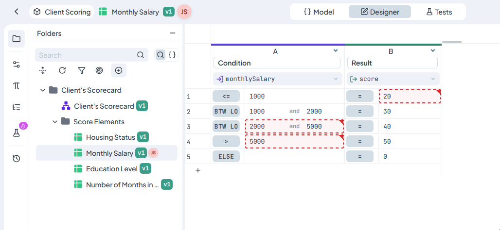
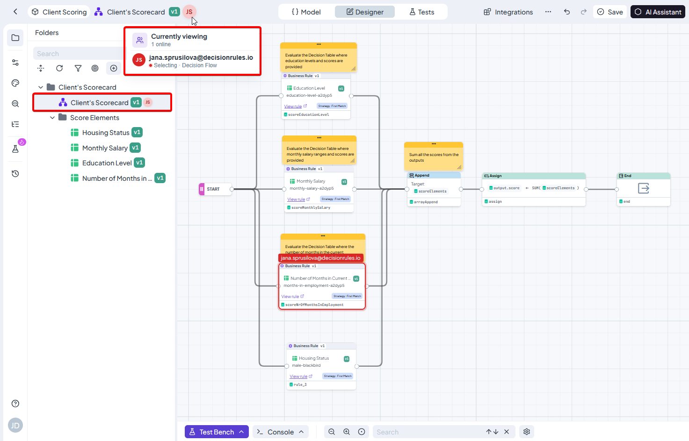

# Teamwork

## Teamwork

### How it works

Teamwork provides real-time information about other users working with the same rule version. It helps users coordinate their work and reduces the risk of accidentally overwriting someone else's changes.


Teamwork **does not** lock the rule or automatically merge changes made by different users.


### See who is viewing a rule

When another user opens the same rule version, a colored avatar appears next to the rule name. The same presence indicator is also displayed next to affected rules in the rule overview.

The indicator displays up to three user avatars. If more users are present, the remaining number is shown as **+N**.

Hover over the indicator to see:

* The number of users currently online.
* Their email addresses.
* Their current activity and editor, when available.
* A summary of their unsaved Decision Table changes.

The tooltip remains open while you interact with it, allowing you to select and copy email addresses.


Presence is tracked for a specific rule version. Users working with another version of the same rule are not displayed.


### Decision Table collaboration

Decision Tables provide detailed real-time activity indicators. Each user is assigned a color that is used consistently throughout the editor.

You can see:

* The cell, range, rows, or columns selected by another user.
* The cell another user is currently editing.
* Cells changed by another user since their last save.
* A preview of an unsaved value by hovering over its change marker.

The Teamwork tooltip contains an **Unsaved changes** section with the number of changes made by each user. Click a user in this section to jump to their first marked change.

<figure><figcaption></figcaption></figure>

#### Saving while another user has unsaved changes

If you try to save a Decision Table while another user is editing it or has unsaved cell changes, DecisionRules displays a warning.

You can:

* Cancel the save and allow the other user to finish.
* Select **Save anyway** and continue, which may overwrite the other user's work.

### Decision Flow and Integration Flow collaboration

Decision Flow and Integration Flow editors display live activity directly on the canvas.

You can see:

* Other users' cursors with their email addresses.
* Nodes currently selected by other users.
* A colored outline identifying which user selected each node.

<figure><figcaption></figcaption></figure>

### When another user saves the rule

When another user saves a Decision Table, Decision Flow, or Integration Flow that you currently have open, DecisionRules displays the **Rule was saved by another user** dialog.

You can:

* Select **Load saved version** to reload the latest version from the server. Your local unsaved changes will be discarded.
* Select **Ignore** to keep your current local state and continue working.

Ignoring the notification does not merge the remote changes into your local version. Saving your local version later may overwrite the changes saved by the other user.

### Supported teamwork features

| Rule type        | Presence indicator | Detailed live activity                                        |
| ---------------- | ------------------ | ------------------------------------------------------------- |
| Decision Table   | Yes                | Selections, editing cells, unsaved changes, and save warnings |
| Decision Flow    | Yes                | Live cursors and selected nodes                               |
| Integration Flow | Yes                | Live cursors and selected nodes                               |
| Other rule types | Yes                | Presence information only                                     |


Sessions signed in with the same account are treated as one user and do not appear to each other. The Teamwork indicator distinguishes between different user accounts.

Teamwork provides awareness and conflict warnings, but it does not lock content or automatically merge concurrent changes. Coordinate with other users before saving when multiple people are editing the same rule version.

