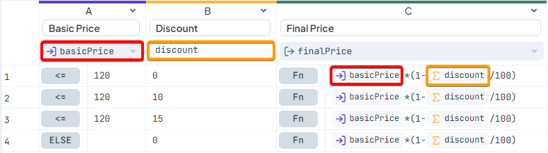
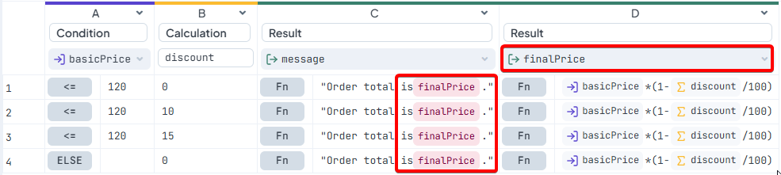
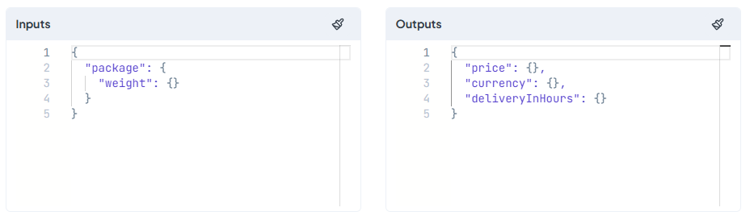
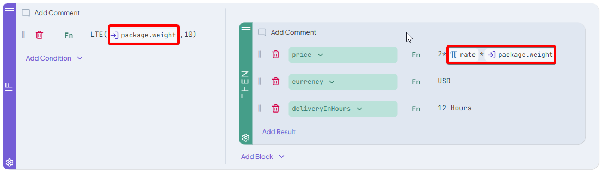
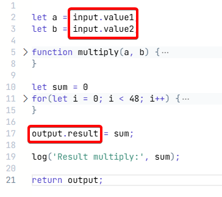
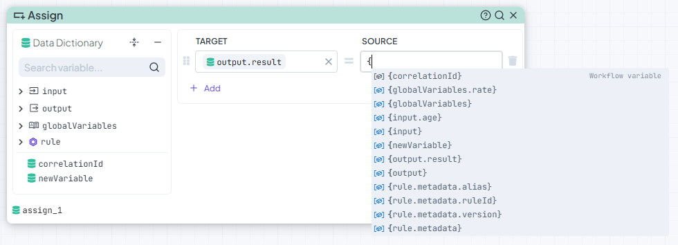
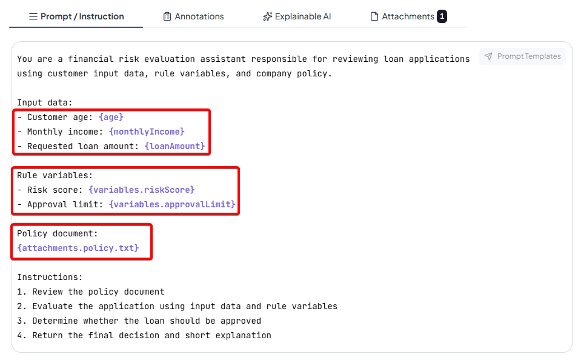

# Variables

Variables represent values used during rule execution. They provide a way to reference and reuse data inside rules instead of working with hardcoded values directly.

A variable can contain data provided to the rule, values created during execution, or results produced by the rule itself. Once available, the value can be reused in other conditions, calculations, expressions, or execution steps.

The available variable types and variable addressing syntax depend on the selected rule type.

***

## Variables by Rule Type

In this section you can find list of variables available for each rule type.

### Decision Tables

Decision Tables support:

* [Input Model Variables](../input-and-output/)
* [Output Model Variables](../input-and-output/)
* [Rule Variables](rule-variables.md)
* Column Variables

#### Column Variables

Columns inside a Decision Table can reference values from previously evaluated columns.

This applies to:

* Condition columns
* Calculation columns
* Result columns

In each Decison Table row scenario columns are evaluated from left to right, therefore a column can only reference columns that were already evaluated earlier in the table.

_If a variable reference is used before the referenced value is created or evaluated, the variable will **not** be recognized._

Example of variables being used correctly in Decision Table:

* Columns are referensed after their declaration/evaluation.

<figure><figcaption></figcaption></figure>

Incorrect use of column references in Decision Tables:

* Column is referensed before its evaluation therefore its not recognized.

<figure><figcaption></figcaption></figure>

```json
{basicPrice}  //variable from input model
{discount}    //created calculation column variable
```

***

### Decision Trees

Decision Trees support:

* [Input Model Variables](../input-and-output/)
* [Output Model Variables](../input-and-output/)
* [Rule Variables](rule-variables.md)

```json
{package.weight}  //variable from input model
{rate}            //created rule variable
```

Variables are commonly used in node conditions and result branches.

<figure><figcaption></figcaption></figure>

Example how to use variables in Decision tree:

<figure><figcaption></figcaption></figure>

***

### Scripting Rules

Scripting Rules support:

* [Input Model Variables](../input-and-output/)
* [Output Model Variables](../input-and-output/)
* [Rule variables](rule-variables.md)

Variables are referenced using dot notation.

Example of variables used in Scripting Rule:

```json
input.customer.country   //variable from IO model
ruleVariables.rate       //created rule variable
output.result            //variable from IO model
```

<figure><figcaption></figcaption></figure>

***

### Decision Flows and Integration Flows

Decision Flows and Integration Flows support:

* [Input Model Variables](../input-and-output/)
* [Output Model Variables](../input-and-output/)
* Variables created in flow and during flow execution

Variables can be reused between nodes and flow steps.

Both curly bracket syntax and dot notation are supported here.

```json
{input.age}             //variable from IO model
{rule.output.pricing}   //variable referencing output of evaluated business rule
{globalVariable.rate}   //created global variable
{newVariable}           //new variable created in flow
{output.result}         //variable from IO model
```

<figure><figcaption></figcaption></figure>

***

### AI Agents

AI Agents support:

* [Input Model Variables](../input-and-output/)
* [Output Model Variables](../input-and-output/)
* Attachments
* [Rule Variables](rule-variables.md)

Attachments and generated values can be reused during execution.

```json
{customer.age}             //variable from input model
{attachement.policies.pdf} //variable referencing attachement added to the ai rule
```

<figure><figcaption></figcaption></figure>

***

### Lookup Tables

[Lookup Tables](../../lookup-table/) **do not** support:

* Model Variables
* Rule Variables

They operate only with values defined directly inside the table.

***

## Rule Variables

Rule Variables are variables created within the context of a specific rule.

They are typically used for:

* Temporary values
* Intermediate calculations
* Shared reusable values inside the rule

Rule Variables exist only during the current rule execution.

Detailed information about Rule Variables is available on the [dedicated Rule Variables documentation page](rule-variables.md).
