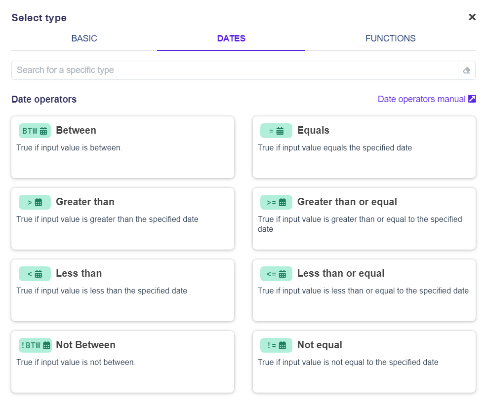

# Operators and Functions

## Operators in Decision Tables

Every condition cell in the decision table can have a different operator. There are three types of operators you can use: [Basic](general-operators.md), [Dates](date-operators.md) and [Functions](functions/).

### Basic Operators

Basic operators can be used for decision rules involving **Strings, Numbers**, or **Booleans**.

.png>)


List of [Basic operators](general-operators.md).


### Date Operators

Date operators are specifically used for comparing dates.


List of [Date operators](date-operators.md).


### Functions

Functions are specifically used to create custom function validations.


List of [Functions](functions/).

