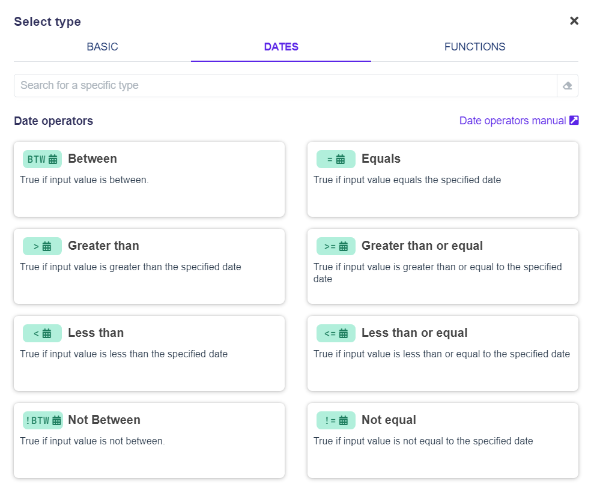

# Date operators

In each condition cell of a decision table, you have the flexibility to apply a variety of operators depending on your needs. These operators enable you to compare and manipulate date and time values effectively, ensuring that your conditions are evaluated accurately. You can choose from a range of operators, whether for simple equality checks or more complex comparisons involving date ranges. The full list of available operators can be found in the operators modal:



## Date Cell Values

When working with date operators in decision tables, using the correct format is crucial for ensuring accurate comparisons. Each condition cell can have a distinct operator for handling dates, but it’s important to understand how dates function within **DecisionRules** and how to correctly enter values into the cell.

You have two ways to input the date:

1. **Manually entering the date directly into the cell (recommended)**
2. **Using the date picker**

&#x20;Let’s explore both methods.

### Writing the Date Directly into the Cell

You can now enter the date directly into the cell (this was previously only possible using the date picker). After selecting the desired date operator, click the cell, which is now set to accept date input with enhanced functionality. When you start typing, a hint will appear displaying the recommended date format:

```json
YYYY-MM-DD HH:MM:ss Z // year-month-day hours:minutes:seconds GMT
```


We highly recommend always including the timezone (GMT) for accurate date interpretation.


<figure><figcaption><p>Date hint</p></figcaption></figure>

The cell will also show how your date is interpreted in real-time through a whisper. For example, if you enter **2024-09-24 09:24 +02:00**, the whisper will display the interpreted date as **"September 24, 2024, at 9:24:00 AM GMT+2."** This allows you to ensure that the date you’ve entered is correct.

<figure><figcaption></figcaption></figure>

#### Date Cell Validation

Date cells provide validation feedback, alerting you to any issues with date interpretation. There are two primary validation messages:

* **Invalid Date**\
  This message indicates that the input value is not recognized as a valid date. The operator will not be able to process the value, and you will need to correct it.

<figure><figcaption><p>Invalid date warning</p></figcaption></figure>

* **Date Doesn't Fit Format**\
  This message means the input does not follow the recommended format (e.g., using slashes like **2024/09/24** or omitting the timezone), however, the system can still interpret the date. The whisper will show how the date is interpreted.

<figure><figcaption><p>Date without timezone</p></figcaption></figure>


We strongly advise sticking to the suggested format to ensure full functionality of the date operators.


### Picking the Date Using the Date Picker

If you prefer to select the date visually, the date picker functionality is still available. To use the date picker, hover over the date cell, and a calendar icon will appear at the end of the cell:

<figure><figcaption></figcaption></figure>

Clicking the icon will open a modal where you can choose the date. By default, both the date and time are set to **None**, and the timezone is pre-set to GMT. You can adjust these settings if needed. Click the desired field, choose the **Select Date** or **Select Time** option, and either enter the date and time manually or click the next calendar icon:

<figure><figcaption></figcaption></figure>

After choosing the date, click the **Submit** button and save the changes by pressing **Save**.

<figure><figcaption></figcaption></figure>

The selected date will be set in the date cell in the recommended format, just as if you had entered it manually.

<figure><figcaption></figcaption></figure>

#### Deleting the Date in the Date Select Modal

If you change your mind while setting the date or time in the modal, you can unselect the **Select Date** or **Select Time** option to clear the value. Alternatively, you can delete the value directly in the date cell.

### Special Case — Variables

In **DecisionRules**, you are not limited to explicitly setting a date in the date cell. Like other cells, date cells also support variables, such as:

* [Rule variables](../../common-rule-features/rule-variables.md)
* Input values
* Calculation column variables


For more information on variables, refer to the [Table Designer](../../decision-table/decision-table-designer/#fill-cell): **Special Case — Variable Values** section


To use a variable, start typing the `"{"` symbol in the date cell, and a dropdown list of available variables will appear. When a variable is used in a date cell, the **Dynamic Date** warning will be visible in the active date cell:

<figure><figcaption></figcaption></figure>


Please note that date cells cannot validate the date passed through a variable. Ensure the date provided in the variable has the correct format.


<figure><figcaption></figcaption></figure>

### Date Format

Dates are now saved as strings. To match a condition like **`2024-09-24 09:27 +02:00`**, the request must contain the same string format: **`"2024-09-24 09:27 +02:00"`**. Additionally, we support the **Extended ISO8601 Date format**, so the condition will also match the string **"`2024-09-24T09:27:00+02:00".`**


The old object format is deprecated but still supported. This means you can still pass a request using the old format, like so:

```json
"date": "2024-09-24",
"time": "09:27",
"timezone": "+02:00"
```

This will still match the **2024-09-24 09:27 +02:00** condition.


## Date Operators

### Equals  (`=` <path d=&#x22;M200-80q-33 0-56.5-23.5T120-160v-560q0-33 23.5-56.5T200-800h40v-80h80v80h320v-80h80v80h40q33 0 56.5 23.5T840-720v560q0 33-23.5 56.5T760-80H200Zm0-80h560v-400H200v400Zm0-480h560v-80H200v80Zm0 0v-80 80Zm280 240q-17 0-28.5-11.5T440-440q0-17 11.5-28.5T480-480q17 0 28.5 11.5T520-440q0 17-11.5 28.5T480-400Zm-160 0q-17 0-28.5-11.5T280-440q0-17 11.5-28.5T320-480q17 0 28.5 11.5T360-440q0 17-11.5 28.5T320-400Zm320 0q-17 0-28.5-11.5T600-440q0-17 11.5-28.5T640-480q17 0 28.5 11.5T680-440q0 17-11.5 28.5T640-400ZM480-240q-17 0-28.5-11.5T440-280q0-17 11.5-28.5T480-320q17 0 28.5 11.5T520-280q0 17-11.5 28.5T480-240Zm-160 0q-17 0-28.5-11.5T280-280q0-17 11.5-28.5T320-320q17 0 28.5 11.5T360-280q0 17-11.5 28.5T320-240Zm320 0q-17 0-28.5-11.5T600-280q0-17 11.5-28.5T640-320q17 0 28.5 11.5T680-280q0 17-11.5 28.5T640-240Z&#x22;/></svg>" data-size="line">)

The equals (`=`) operator compares the request date and time value with the table date value, including the time zone.

```javascript
// [request value] = [table value]

"2024-09-24 09:27 +02:00" = "2024-09-24 09:27 +02:00"  // true
"2024-09-24 +02:00"       = "+02:00"                   // true

"2024-09-24 09:27 +02:00" = "2024-09-24 +02:00"        // false
"2024-09-24 09:27 +02:00" = "2024-09-24 13:27 +02:00"  // false
```

### Not equal (`!=` <path d=&#x22;M200-80q-33 0-56.5-23.5T120-160v-560q0-33 23.5-56.5T200-800h40v-80h80v80h320v-80h80v80h40q33 0 56.5 23.5T840-720v560q0 33-23.5 56.5T760-80H200Zm0-80h560v-400H200v400Zm0-480h560v-80H200v80Zm0 0v-80 80Zm280 240q-17 0-28.5-11.5T440-440q0-17 11.5-28.5T480-480q17 0 28.5 11.5T520-440q0 17-11.5 28.5T480-400Zm-160 0q-17 0-28.5-11.5T280-440q0-17 11.5-28.5T320-480q17 0 28.5 11.5T360-440q0 17-11.5 28.5T320-400Zm320 0q-17 0-28.5-11.5T600-440q0-17 11.5-28.5T640-480q17 0 28.5 11.5T680-440q0 17-11.5 28.5T640-400ZM480-240q-17 0-28.5-11.5T440-280q0-17 11.5-28.5T480-320q17 0 28.5 11.5T520-280q0 17-11.5 28.5T480-240Zm-160 0q-17 0-28.5-11.5T280-280q0-17 11.5-28.5T320-320q17 0 28.5 11.5T360-280q0 17-11.5 28.5T320-240Zm320 0q-17 0-28.5-11.5T600-280q0-17 11.5-28.5T640-320q17 0 28.5 11.5T680-280q0 17-11.5 28.5T640-240Z&#x22;/></svg>" data-size="line">)

The not equal (`!=`) operator returns `true` if the request date string and the table date string differ in any way.

```javascript
// [request value] != [table value]

"2024-09-24 09:27 +02:00" != "2024-09-24 +02:00"         // true 
"2024-09-24 09:27 +02:00" != "09:27 +02:00"              // true
"2024-09-24 09:27 +02:00" != "+02:00"                    // true

"2024-09-24 09:27 +02:00" != "2024-09-24 09:27 +02:00"   // false
"2024-09-24 +02:00"       != "+02:00"                    // false
```

### Greater than (`>` <path d=&#x22;M200-80q-33 0-56.5-23.5T120-160v-560q0-33 23.5-56.5T200-800h40v-80h80v80h320v-80h80v80h40q33 0 56.5 23.5T840-720v560q0 33-23.5 56.5T760-80H200Zm0-80h560v-400H200v400Zm0-480h560v-80H200v80Zm0 0v-80 80Zm280 240q-17 0-28.5-11.5T440-440q0-17 11.5-28.5T480-480q17 0 28.5 11.5T520-440q0 17-11.5 28.5T480-400Zm-160 0q-17 0-28.5-11.5T280-440q0-17 11.5-28.5T320-480q17 0 28.5 11.5T360-440q0 17-11.5 28.5T320-400Zm320 0q-17 0-28.5-11.5T600-440q0-17 11.5-28.5T640-480q17 0 28.5 11.5T680-440q0 17-11.5 28.5T640-400ZM480-240q-17 0-28.5-11.5T440-280q0-17 11.5-28.5T480-320q17 0 28.5 11.5T520-280q0 17-11.5 28.5T480-240Zm-160 0q-17 0-28.5-11.5T280-280q0-17 11.5-28.5T320-320q17 0 28.5 11.5T360-280q0 17-11.5 28.5T320-240Zm320 0q-17 0-28.5-11.5T600-280q0-17 11.5-28.5T640-320q17 0 28.5 11.5T680-280q0 17-11.5 28.5T640-240Z&#x22;/></svg>" data-size="line">)

The greater than (`>`) operator checks if the request date string is later than the table date string.

```javascript
// [request value] > [table value]

"2024-09-24 09:27 +02:00" > "2024-09-23 09:27 +02:00"  // true
"2024-09-24 09:27 +02:00" > "2024-09-24 +02:00"        // true

// assuming "2024-09-24" is in the future:
"2024-09-24 09:27 +02:00" > "09:27 +02:00"             // true
"2024-09-24 09:27 +02:00" > "+02:00"                   // true

// assuming "2024-09-24" is in the past:
"2024-09-24 09:27 +02:00" > "09:27 +02:00"             // false
"2024-09-24 09:27 +02:00" > "+02:00"                   // false

"2024-09-24 09:27 +02:00" > "2024-09-24 09:27 +02:00"  // false
"2024-09-24 09:27 +02:00" > "2024-09-25 09:27 +02:00"  // false
```

### Less than (`<` <path d=&#x22;M200-80q-33 0-56.5-23.5T120-160v-560q0-33 23.5-56.5T200-800h40v-80h80v80h320v-80h80v80h40q33 0 56.5 23.5T840-720v560q0 33-23.5 56.5T760-80H200Zm0-80h560v-400H200v400Zm0-480h560v-80H200v80Zm0 0v-80 80Zm280 240q-17 0-28.5-11.5T440-440q0-17 11.5-28.5T480-480q17 0 28.5 11.5T520-440q0 17-11.5 28.5T480-400Zm-160 0q-17 0-28.5-11.5T280-440q0-17 11.5-28.5T320-480q17 0 28.5 11.5T360-440q0 17-11.5 28.5T320-400Zm320 0q-17 0-28.5-11.5T600-440q0-17 11.5-28.5T640-480q17 0 28.5 11.5T680-440q0 17-11.5 28.5T640-400ZM480-240q-17 0-28.5-11.5T440-280q0-17 11.5-28.5T480-320q17 0 28.5 11.5T520-280q0 17-11.5 28.5T480-240Zm-160 0q-17 0-28.5-11.5T280-280q0-17 11.5-28.5T320-320q17 0 28.5 11.5T360-280q0 17-11.5 28.5T320-240Zm320 0q-17 0-28.5-11.5T600-280q0-17 11.5-28.5T640-320q17 0 28.5 11.5T680-280q0 17-11.5 28.5T640-240Z&#x22;/></svg>" data-size="line">)

The less than (`<`) operator returns `true` if the request date string is earlier than the table date string.

```javascript
// [request value] < [table value]

"2024-09-24 09:27 +02:00" < "2024-09-25 09:27 +02:00"  // true
"2024-09-24 09:27 +02:00" < "2024-09-25 +02:00"        // true

// assuming "2024-09-24" is in the past:
"2024-09-24 09:27 +02:00" < "09:27 +02:00"             // true
"2024-09-24 09:27 +02:00" < "+02:00"                   // true

// assuming "2024-09-24" is in the future or today:
"2024-09-24 09:27 +02:00" < "09:27 +02:00"             // false
"2024-09-24 09:27 +02:00" < "+02:00"                   // false

"2024-09-24 09:27 +02:00" < "2024-09-24 09:27 +02:00"  // false
"2024-09-24 09:27 +02:00" < "2024-09-23 09:27 +02:00"  // false
```

### Greater than or equal (`>=` <path d=&#x22;M200-80q-33 0-56.5-23.5T120-160v-560q0-33 23.5-56.5T200-800h40v-80h80v80h320v-80h80v80h40q33 0 56.5 23.5T840-720v560q0 33-23.5 56.5T760-80H200Zm0-80h560v-400H200v400Zm0-480h560v-80H200v80Zm0 0v-80 80Zm280 240q-17 0-28.5-11.5T440-440q0-17 11.5-28.5T480-480q17 0 28.5 11.5T520-440q0 17-11.5 28.5T480-400Zm-160 0q-17 0-28.5-11.5T280-440q0-17 11.5-28.5T320-480q17 0 28.5 11.5T360-440q0 17-11.5 28.5T320-400Zm320 0q-17 0-28.5-11.5T600-440q0-17 11.5-28.5T640-480q17 0 28.5 11.5T680-440q0 17-11.5 28.5T640-400ZM480-240q-17 0-28.5-11.5T440-280q0-17 11.5-28.5T480-320q17 0 28.5 11.5T520-280q0 17-11.5 28.5T480-240Zm-160 0q-17 0-28.5-11.5T280-280q0-17 11.5-28.5T320-320q17 0 28.5 11.5T360-280q0 17-11.5 28.5T320-240Zm320 0q-17 0-28.5-11.5T600-280q0-17 11.5-28.5T640-320q17 0 28.5 11.5T680-280q0 17-11.5 28.5T640-240Z&#x22;/></svg>" data-size="line">)

The greater than or equal (`>=`) operator checks if the request date string is either later than or exactly the same as the table date string.

```javascript
// [request value] >= [table value]

"2024-09-24 09:27 +02:00" >= "2024-09-24 09:27 +02:00"  // true
"2024-09-24 09:27 +02:00" >= "2024-09-23 09:27 +02:00"  // true
"2024-09-24 09:27 +02:00" >= "2024-09-24 +02:00"        // true

// assuming "2024-09-24" is in the future or today:
"2024-09-24 09:27 +02:00" >= "09:27 +02:00"             // true
"2024-09-24 09:27 +02:00" >= "+02:00"                   // true

// assuming "2024-09-24" is in the past:
"2024-09-24 09:27 +02:00" >= "09:27 +02:00"             // false
"2024-09-24 09:27 +02:00" >= "+02:00"                   // false

"2024-09-24 09:27 +02:00" >= "2024-09-25 09:27 +02:00"  // false
```

### Less than or equal (`<=` <path d=&#x22;M200-80q-33 0-56.5-23.5T120-160v-560q0-33 23.5-56.5T200-800h40v-80h80v80h320v-80h80v80h40q33 0 56.5 23.5T840-720v560q0 33-23.5 56.5T760-80H200Zm0-80h560v-400H200v400Zm0-480h560v-80H200v80Zm0 0v-80 80Zm280 240q-17 0-28.5-11.5T440-440q0-17 11.5-28.5T480-480q17 0 28.5 11.5T520-440q0 17-11.5 28.5T480-400Zm-160 0q-17 0-28.5-11.5T280-440q0-17 11.5-28.5T320-480q17 0 28.5 11.5T360-440q0 17-11.5 28.5T320-400Zm320 0q-17 0-28.5-11.5T600-440q0-17 11.5-28.5T640-480q17 0 28.5 11.5T680-440q0 17-11.5 28.5T640-400ZM480-240q-17 0-28.5-11.5T440-280q0-17 11.5-28.5T480-320q17 0 28.5 11.5T520-280q0 17-11.5 28.5T480-240Zm-160 0q-17 0-28.5-11.5T280-280q0-17 11.5-28.5T320-320q17 0 28.5 11.5T360-280q0 17-11.5 28.5T320-240Zm320 0q-17 0-28.5-11.5T600-280q0-17 11.5-28.5T640-320q17 0 28.5 11.5T680-280q0 17-11.5 28.5T640-240Z&#x22;/></svg>" data-size="line">)

The less than or equal (`<=`) operator returns `true` if the request date string is earlier than or exactly the same as the table date string.

```javascript
// [request value] <= [table value]

"2024-09-24 09:27 +02:00" <= "2024-09-24 09:27 +02:00"  // true
"2024-09-24 09:27 +02:00" <= "2024-09-25 09:27 +02:00"  // true
"2024-09-24 09:27 +02:00" <= "2024-09-25 +02:00"        // true

// assuming "2024-09-24" is in the past:
"2024-09-24 09:27 +02:00" <= "09:27 +02:00"             // true
"2024-09-24 09:27 +02:00" <= "+02:00"                   // true

// assuming "2024-09-24" is in the future:
"2024-09-24 09:27 +02:00" <= "09:27 +02:00"             // false
"2024-09-24 09:27 +02:00" <= "+02:00"                   // false

"2024-09-24 09:27 +02:00" <= "2024-09-23 09:27 +02:00"  // false
```

### **Between** (`BTW` <path d=&#x22;M200-80q-33 0-56.5-23.5T120-160v-560q0-33 23.5-56.5T200-800h40v-80h80v80h320v-80h80v80h40q33 0 56.5 23.5T840-720v560q0 33-23.5 56.5T760-80H200Zm0-80h560v-400H200v400Zm0-480h560v-80H200v80Zm0 0v-80 80Zm280 240q-17 0-28.5-11.5T440-440q0-17 11.5-28.5T480-480q17 0 28.5 11.5T520-440q0 17-11.5 28.5T480-400Zm-160 0q-17 0-28.5-11.5T280-440q0-17 11.5-28.5T320-480q17 0 28.5 11.5T360-440q0 17-11.5 28.5T320-400Zm320 0q-17 0-28.5-11.5T600-440q0-17 11.5-28.5T640-480q17 0 28.5 11.5T680-440q0 17-11.5 28.5T640-400ZM480-240q-17 0-28.5-11.5T440-280q0-17 11.5-28.5T480-320q17 0 28.5 11.5T520-280q0 17-11.5 28.5T480-240Zm-160 0q-17 0-28.5-11.5T280-280q0-17 11.5-28.5T320-320q17 0 28.5 11.5T360-280q0 17-11.5 28.5T320-240Zm320 0q-17 0-28.5-11.5T600-280q0-17 11.5-28.5T640-320q17 0 28.5 11.5T680-280q0 17-11.5 28.5T640-240Z&#x22;/></svg>" data-size="line">)

The between (`BTW`) operator checks if the request date string falls within the range of two table date strings, inclusive of both the start and the end values.


```javascript
// [request value] BTW [table value 1 AND table value 2]

"2024-09-24 09:27 +02:00" BTW "2024-09-24 09:27 +02:00" AND "2024-09-25 09:27 +02:00"  // true
"2024-09-24 09:27 +02:00" BTW "2024-09-23 09:27 +02:00" AND "2024-09-24 09:27 +02:00"  // true
"2024-09-24 09:27 +02:00" BTW "2024-09-24 +02:00"       AND "2024-09-27 +02:00"        // true
"2024-09-24 09:27 +02:00" BTW "2024-09-23 +02:00"       AND "2024-09-24 09:27 +02:00"  // true
"2024-09-24 +02:00"       BTW "2024-09-23 09:27 +02:00" AND "2024-09-25 09:27 +02:00"  // true

"2024-09-24 09:27 +02:00" BTW "2024-09-28 09:27 +02:00" AND "2024-09-29 09:27 +02:00"  // false
"2024-09-24 +02:00"       BTW "2024-09-24 09:27 +02:00" AND "2024-09-25 09:27 +02:00"  // false

// assuming "2024-09-24" is in the future:
"2024-09-24 09:27 +02:00" BTW "2024-09-23 09:27 +02:00" AND "10:27 +02:00"             // false

// assuming "2024-09-24" is today or in the past:
"2024-09-24 09:27 +02:00" BTW "2024-09-23 09:27 +02:00" AND "10:27 +02:00"             // true
```


### Not between (`!BTW` <path d=&#x22;M200-80q-33 0-56.5-23.5T120-160v-560q0-33 23.5-56.5T200-800h40v-80h80v80h320v-80h80v80h40q33 0 56.5 23.5T840-720v560q0 33-23.5 56.5T760-80H200Zm0-80h560v-400H200v400Zm0-480h560v-80H200v80Zm0 0v-80 80Zm280 240q-17 0-28.5-11.5T440-440q0-17 11.5-28.5T480-480q17 0 28.5 11.5T520-440q0 17-11.5 28.5T480-400Zm-160 0q-17 0-28.5-11.5T280-440q0-17 11.5-28.5T320-480q17 0 28.5 11.5T360-440q0 17-11.5 28.5T320-400Zm320 0q-17 0-28.5-11.5T600-440q0-17 11.5-28.5T640-480q17 0 28.5 11.5T680-440q0 17-11.5 28.5T640-400ZM480-240q-17 0-28.5-11.5T440-280q0-17 11.5-28.5T480-320q17 0 28.5 11.5T520-280q0 17-11.5 28.5T480-240Zm-160 0q-17 0-28.5-11.5T280-280q0-17 11.5-28.5T320-320q17 0 28.5 11.5T360-280q0 17-11.5 28.5T320-240Zm320 0q-17 0-28.5-11.5T600-280q0-17 11.5-28.5T640-320q17 0 28.5 11.5T680-280q0 17-11.5 28.5T640-240Z&#x22;/></svg>" data-size="line">)

The not between (`!BTW`) operator checks if the request date string falls outside the range of two table date strings, returning `true` if the value is not within the range.

```javascript
// [request value] !BTW [table value 1 AND table value 2]

"2024-09-24 09:27 +02:00" !BTW "2024-09-28 09:27 +02:00" AND "2024-09-29 09:27 +02:00"  // true
"2024-09-24 +02:00"       !BTW "2024-09-24 09:27 +02:00" AND "2024-09-25 09:27 +02:00"  // true

"2024-09-24 09:27 +02:00" !BTW "2024-09-24 09:27 +02:00" AND "2024-09-25 09:27 +02:00"  // false
"2024-09-24 09:27 +02:00" !BTW "2024-09-23 09:27 +02:00" AND "2024-09-25 09:27 +02:00"  // false
"2024-09-24 09:27 +02:00" !BTW "2024-09-24 +02:00"       AND "2024-09-27 +02:00"        // false
"2024-09-24 09:27 +02:00" !BTW "2024-09-23 +02:00"       AND "2024-09-24 09:27 +02:00"  // false
"2024-09-24 +02:00"       !BTW "2024-09-23 09:27 +02:00" AND "2024-09-25 09:27 +02:00"  // false

// assuming "2024-09-24" is in the future:
"2024-09-24 09:27 +02:00" !BTW "2024-09-23 09:27 +02:00" AND "10:27 +02:00"             // true

// assuming "2024-09-24" is in the past or today:
"2024-09-24 09:27 +02:00" !BTW "2024-09-23 09:27 +02:00" AND "10:27 +02:00"             // false
```
