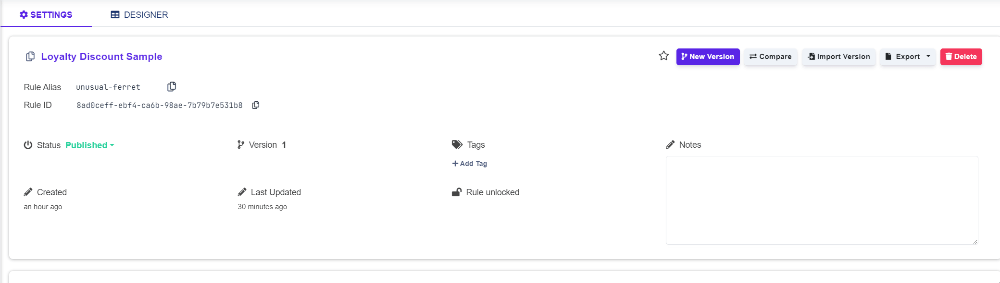

# Binding to Model

### Setting Up Binding to the Input & Output Model

After creating the [input and output model](../common-rule-features/input-and-output/), you need to bind these models to the conditions and results in the Decision Table Designer:

* **Input Model**: Bound to condition columns.
* **Output Model**: Bound to result columns.

You can select any leaf from the input/output model as a condition or result variable.


Note that you cannot select a root that contains any child as a condition/result variable.


#### Example of binding (Input Model):

<pre class="language-javascript"><code class="lang-javascript"><strong>// JSON Editor
</strong><strong>
</strong><strong>{
</strong>  "delivery": {
    "distance": {
      "car": {},
      "ship": {},
      "plane": {}
    },
    "tariff": {}
  },
  "package": {
    "weight": {},
    "longestSide": {}
  }
}
</code></pre>

**Simple Editor:**

<figure><figcaption></figcaption></figure>

From this Input Model, the following values can be selected as condition values:

* `delivery.distance.car`
* `delivery.distance.ship`
* `delivery.distance.plane`
* `delivery.tariff`
* `package.weight`
* `package.longestSide`

### Binding Models to Conditions and Results

1. Navigate to the **Decision Table Designer** section.
2.  To bind the **Input Model** to **Conditions**:

    * Create a new condition column.
    * Select the condition variable in the column header.

    To bind the **Output Model** to **Results**:

    * Create a new result column.
    * Select the result variable in the column header.


It is also possible to bind the condition columns to[ rule variables](../common-rule-features/rule-variables.md) or [calculation column variables](decision-table-designer/#select-column-value). More information is in [Table Designer](decision-table-designer/#select-value-from-input-model).


<figure><figcaption></figcaption></figure>
