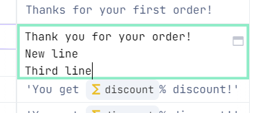
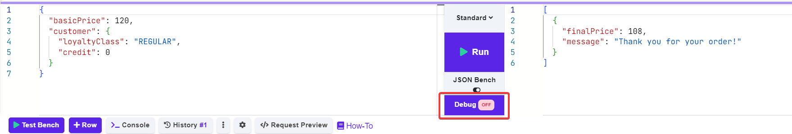
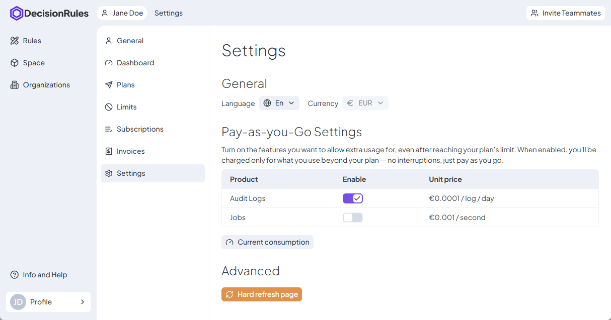

# Table Designer

In this section, you can easily create your decision tables, then link them to input and output data. Business rules are created to easily design or change the rules and deploy them quickly.

<figure><figcaption></figcaption></figure>

## Applying changes

After each change, press the  button in the bottom right corner to save your progress.


All the changes are made to the current table version.


## Column Types and Table Structure

A Decision Table consists of three types of columns:

* **Condition**: Defines input values. As the name suggests, these are the conditions that determine whether a table row matches the input data.
* **Calculation**: Used to perform various calculations. These calculations are not initially bound to an input or output model, but they can be mapped to an input or output value if needed.
* **Result**: Specifies the output values.

Every Decision Table requires **at least two columns:** a condition or calculation column and a result column. Condition columns must be placed on the left side of the table, while result columns are on the right. Calculation columns can be positioned anywhere within the table.

## Column Operations and Settings

### Add Column

To add a new column, hover over an existing column header and click the plus symbol that appears on either side of the column.

<figure><figcaption></figcaption></figure>

Next, select the column type (e.g., "Add Calculation").&#x20;

As noted in the previous section, there are specific restrictions on where certain types of columns can be placed:

* A condition column can be added between existing condition columns or at the start of the table as the first column.
* A result column can be added between existing result columns or as the last column, after any result or calculation columns.
* Any type of column can be added between condition and result columns.
* Calculation columns can be placed anywhere in the table.

### Rename Column

New columns are initially named according to their type. You can rename a column for better clarity and organization within the table. To do this, click on the existing name (e.g., "Condition") and type the new name. Then, click anywhere outside the field or press the Enter key to confirm.

### Select Column Value

Next, select a value for the column. To do this, click the input field under the column name. This will expand a list of all possible values, allowing you to choose one.

<figure><figcaption></figcaption></figure>

#### There are different types of values that you can map a column to, depending on the column type:

* **Condition Columns**: Can be mapped to an input value from the I/O Model, rule variables, or a calculation column variable (only in columns that are to the right of the specified calculation column).
* **Calculation Columns**: Are not mapped to an existing value. Instead, a new calculation variable is created. See the detailed explanation below.
* **Result Columns**: Can only be mapped to output values from the I/O Model.


More information is in the [Binding To Model](../binding-to-model.md).


#### Special Case: Calculation Column

Calculation columns are not bound to any existing value. When creating a calculation column, the result is assigned to a variable, which is defined in the calculation column header.

By default, the column is assigned a variable name like `varX` (where X is a natural number). You can change this name by clicking on it. To confirm the new name, click anywhere outside the field or press the Enter key.

<figure><figcaption></figcaption></figure>

Once defined, these variables can be used elsewhere in the table in the same way as rule variables or input and output values.

<figure><figcaption>
Calculation variables
</figcaption></figure>

### Set Column Alias

Each column has a column alias, a unique identifier within the scope of the table. You can use the alias to reference the column when using the [included/excluded condition column](../../../api/rule-solver-api.md#included-condition-cols) feature or when binding column [valid values](table-operations/valid-values.md) in an [XLSX file](../../common-rule-features/rule-export-and-import/managing-decision-table-in-excel-google-sheets.md#valid-values).

Aliases are automatically generated for each column, but you can set your own, more descriptive alias. To set a column alias, click the arrow icon in the column header and select the "Set Column Alias" option. The new alias must be unique within the table and can only contain English letters, numbers, and dashes, with a maximum length of 30 characters. To confirm the new alias, click anywhere outside the field or press the Enter key.

<figure><figcaption>
Column alias
</figcaption></figure>

### Delete Column

To delete a column from the Designer, click an arrow icon near the column name in the header of the condition, then click the remove button in the dropdown menu.

<figure><figcaption></figcaption></figure>


For more information about other column dropdown options, refer to the [Table Operations](table-operations/) section.


## Row

A row represents one rule for specified data. If it's called, the [Rule Solver](../../../api/rule-solver-api.md) or the [Test Bench](../../common-rule-features/test-bench.md) with Input Data corresponding to **conditions** in a row, the[ Rule Solver](../../../api/rule-solver-api.md) or the [Test Bench](../../common-rule-features/test-bench.md) response will have the same data specified in **results** in the corresponding row.

### Add Row

To add a new row, click the   button in the bottom panel. This will create a new row at the end of the table with `ANY` condition operators.

### Fill Cell

The basic structure for every cell is **operator + value**.

#### Operators


Possible operators are specified in [Operators](../../data-types-and-functions/operators/) section


To change the operator in a **Condition** column, click the operator label, and an operator selection modal will open. Select the desired operator to apply it to the cell.


**Note:** For function operators, selecting a new function operator will not overwrite the existing one in the cell, as function operators can be nested. This ensures that your existing functions are preserved.


For **Calculation** columns, the operator is predefined as a function; therefore, the operator label is not visible in the cell.

For **Result** columns, there are two types of operators:

* **Simple Value** (`Equal`): Used for strings and simple math operations like addition (`+`), subtraction (`-`), multiplication (`*`), etc.
* **Function**: Used for advanced operations, including logical functions (e.g., AND, OR), mathematical functions (e.g., `ABS`, `MAX`) and others, see the whole list in [Functions section](../../data-types-and-functions/operators/functions/). The function operator can handle everything the Simple Value operator can, but also allows the use of more complex functions.&#x20;

To switch between Simple Value and Function operators, click the operator badge and choose from the dropdown:

<figure><figcaption></figcaption></figure>


#### **Warning: Operator Precedence and Brackets**

When using function operators in **Result** and **Calculation** columns, be mindful of operator precedence. In some cases, the solver evaluates subtraction and other operations from **right to left**. For example, if you write an expression like `10 - 5 - 2`, the solver will first calculate `5 - 2`, resulting in `3`, and then subtract that from `10`, returning `7` instead of the expected `3`.

To avoid unexpected results, always use brackets to clarify the order of operations. For example, to get the correct result of `3`, you should write the expression as `(10 - 5) - 2`.

This behavior applies to both **Result** and **Calculation** columns when using function operators.\

Read more in [Math function](../../data-types-and-functions/operators/functions/math.md#minus) section.


#### Values


Possible values for data types are specified in [Data Types](../../data-types-and-functions/data-types.md) section.


To change the cell value, click on the cell and start typing. To confirm the value, click elsewhere or press the **Esc** key. You can also enter multiline values by pressing **Enter**. When the cell is closed, only the first line is visible.

<figure><figcaption></figcaption></figure>

For longer values, you can use the maximize mode. To do this, hover over the cell and click   icon. This will open the maximized mode:

<figure><figcaption></figcaption></figure>

To confirm the new value and exit maximized mode, click the cross icon in the top-right corner, press **Esc**, or click elsewhere.

#### Special Case — Variable Values

In addition to classic values, you can also use variables such as input & output values, rule variables, and calculation column variables. To do this, start typing `{` in the cell, and a dropdown with all available variables will appear.

<figure><figcaption></figcaption></figure>


* **Output values** are available only in result columns.&#x20;
* **Calculation variables** are available only after they are declared — i.e., in columns to its right.


Once added, each variable is displayed with its own badge based on its type for better orientation within the table:

* Input variable  (1).png>)
* Output variable  (1).png>)
* Rule variable  (1).png>)
* Calculation variable  (1).png>)

If a variable is deleted, it will appear with a red badge in the cells, indicating that the reference is now broken.

### Copy Row

To copy a row, click the  (1).png>) button at the beginning of the row. Then, select the "**Copy**" option. The row will be duplicated with the same set of rules as the original.


To copy multiple rows at once, hold the **Ctrl** key and click on the rows you want to copy. Then, right-click anywhere in the rows settings area. When the context menu opens, select the "**Copy to**" option and choose where you want the rows to be copied: either the start or end of the table.


### Clear Row

To clear all sets of conditions and result values, click the  (1).png>) button at the beginning of the row. Then, select the "**Clear row**" option. This will remove all values from the row.


To clear multiple rows at once, hold the **Ctrl** key and click on the rows you want to delete. Then, right-click anywhere in the rows settings area. When the context menu opens, select the "**Clear rows**" option.


### Deactivate and Activate Row

To Inactive the row, toggle the  (1).png>) switch at the beginning of the row.&#x20;

By default, all rows in the table are **ACTIVE**. You can use this functionality when you don’t want to use a specific row in the rule for validation, but might need it in the future.

If a row is set to **INACTIVE**, it behaves as if it does not exist.


To activate or deactivate multiple rows at once, hold the **Ctrl** key and click on the rows you want to delete. Then, right-click anywhere in the rows settings area. When the context menu opens, select the "**Activate rows**" or "**Deactivate rows**" option.


### Delete Row

To delete a row, click the  (1).png>) icon at the beginning of the row and select the "**Delete Row**" option.


To delete multiple rows at once, hold the **Ctrl** key and click on the rows you want to delete. Then, right-click anywhere in the rows settings area. When the context menu opens, select the "**Delete Rows**" option.


### Use Row in Test Bench

To use a row in the **Test Bench c**lick the .png>) button. Then, the row's condition columns values are copied to the Test Bench input at the bottom of the page, and the solution is evaluated as if you had clicked the **Run** button.

### Change the Order of Rows

To change the position of the row, click the  (1).png>) button. Then, select **Move** optio&#x6E;**.** This will open a modal, where you can specify the new position of selected row.

 (1).png>)


To move multiple rows at once, hold the **Ctrl** key and click on the rows you want to delete. Then, right-click anywhere in the rows settings area. When the context menu opens, select the **Move** option.


### Time Row Validation

You can specify in which time period the row will be active. To set the time validation, click the  icon and then choose the **Time validation** option. A modal will appear, allowing you to select a **From** and **To** time range.

 (1).png>)


The **Date** and **GMT** must be set; **Time** is optional. You do not need to set both limits — you can specify only the end date until which the row will be valid or only the start date from which it will be valid.


By default, all rows are not time-limited and will always be evaluated. If time validation is set, the row will only be evaluated within the specified period.


Once time validation is set for one row, the icon  will appear next to the other rows. You can then click this icon to set time validation for another row directly, without needing to go through the context menu.


## Debug

The **Debug** button  is located on the [Test Bench](../../common-rule-features/test-bench.md) at the bottom of the table designer. By default, debug mode is turned off. Clicking this button enables debug mode.

<figure><figcaption></figcaption></figure>

Debug mode is used to highlight the rows in the table that match the input. Rows that pass are displayed with a bolder border. Additionally, operators are highlighted in green if they match the input, or red if they do not. The input value for each condition column is also shown to the left of the operator, making it easy to see which conditions have passed or failed and why.

## Additional Options

Additional functionality can be accessed by clicking the  icon on the bottom bar. Here are the available options:

<figure><figcaption></figcaption></figure>

### Default Row

This option adds a default row with `ELSE` conditions at the end of the table. This row is evaluated if no other rows match the input.

<figure><figcaption></figcaption></figure>

### Check Table for Duplicates

To check the table for duplicate rows, click the .png>) button in the bottom panel, then choose the option. This action compares the **input** values in the table. If any duplicate rows are found, they will be highlighted.

.png>)


This feature only works on the **input** values, as the output values can be identical.


### Search

The **Search** option in the Settings menu allows you to search through the entire table and highlights the cells that match your input. To use this feature, select the **Search** option, and a search bar will appear:

<figure><figcaption></figcaption></figure>

Start typing the value you want to find. The cells that match will be highlighted in green. The search bar will display the number of **rows** that contain matches (not the number of matched **cells**). You can navigate between the matched rows using the arrow buttons.

<figure><figcaption></figcaption></figure>

### Go to Row

In large tables, scrolling to a specific row can be challenging. The **Go to Row** option helps you quickly navigate to the desired row. Click this option, and a bar will appear where you can type the number of the row you want to go to, then press Enter. The table will scroll to that row, and the row settings area will be highlighted in green.

<figure><figcaption></figcaption></figure>

## AutoSave Button

The AutoSave button  is located at the bottom of the Decision Tables page, next to the  /  button. When the AutoSave button is active, the table is automatically saved after each solve in the Test Bench.

## Highlight Active Columns and Rows

If you find it difficult to navigate between columns and rows, you can use the option to highlight active rows and columns. This function is available under the  button in the navigation toolbar at the bottom of the Decision Tables page.

<figure><figcaption></figcaption></figure>

Choose whether you want to highlight rows, columns, or both, and activate the option. The selected row or column will be highlighted in light green, as demonstrated in the picture below.

<figure><figcaption></figcaption></figure>

## Rule History & Undo/Redo

Every change made in this designer is recorded in a local history. You can undo or redo changes by clicking the  or  buttons.

To view the rule history, click the  button located on the bottom bar. This opens a side menu with all available versions, where a new version is created every time you save the rule.

<figure><figcaption></figcaption></figure>

By clicking on a version tile, you can preview that version.


This action does not overwrite your current version; it is only a preview. If you want to restore an older version, click the  icon on the top-right corner of the version tile.

Restoring a version creates a new version — **you will not lose your current version when restoring an older one.**

