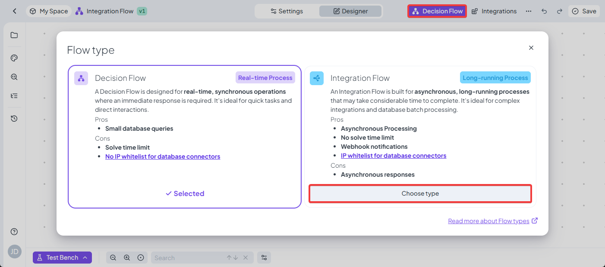

# Decision Flow vs. Integration Flow

### **Introduction**

In DecisionRules, there are two main ways to execute a flow of rules: **Decision Flow** and **Integration Flow**.\
Both are used to link and evaluate multiple rules together, but they differ in execution, time limits, and how results are returned.

The **Decision Flow** is intended for quick, real-time decisions, while the **Integration Flow** was created for cases where the evaluation might take longer than the standard execution time limit.\
This article provides a comparison of the two, explains why Integration Flow was introduced, and shows when to use each.

### **Why Integration Flow Was Created**

The Decision Flow can handle most use cases where decisions need to be made quickly, within the allowed execution time (typically 1–8 seconds depending on your plan or environment settings for on-premise).\
However, for example **long-running processes retrieving a large number of database rows**, or **very large bulk input processing** can exceed this limit and cause timeouts.

Integration Flow was created to solve this problem. It uses a background job infrastructure that has **24 hours for process**, allowing the evaluation to run until completion or until it is cancelled.

### **Key Differences**

<table data-full-width="false"><thead><tr><th width="118"></th><th>Decision Flow</th><th>Integration Flow</th></tr></thead><tbody><tr><td><strong>Evaluation</strong></td><td>Uses <code>api.decisionrules.io/rule/solve/</code> endpoint and any Decision Table, Decision Tree, or Scripting rule.</td><td>Uses <code>api.decisionrules.io/job/start/</code> endpoint to trigger a background job.</td></tr><tr><td><strong>Execution</strong></td><td>Synchronous — you wait for the evaluation to finish and receive output in the same API response.</td><td>Asynchronous — starts a job, returns a <code>jobId</code>, and the results are retrieved later.</td></tr><tr><td><strong>Time Limit</strong></td><td>1–8 seconds for Decision Flow execution, API calls, and rule solve limit.</td><td>Job execution limit of 24 hours, 1–8 seconds API call and rule solve limit, and 5 minutes inactivity limit for database node queries.</td></tr><tr><td><strong>Output Data</strong></td><td>Returned directly in the same API response; the connection must remain open until it finishes.</td><td>Returned after job completion — either automatically via <a href="../../space/webhooks.md">Webhook</a> or by checking the job status using <a href="../../api/jobs-api.md">API</a> with the <code>jobId</code>.</td></tr><tr><td><strong>Best for</strong></td><td>Quick decisions, small to medium complexity, smaller datasets.</td><td>Long-running processes, large datasets, complex decisions.</td></tr></tbody></table>

### **Use Cases**

#### **Decision Flow**

* **Typical decision-making with one input set** – most cases where only one set of input data is evaluated.
* **Linking results of multiple partial rules** such as Decision Tables and Decision Trees.
* **Multiple inputs of medium complexity** – can use the Bulk input approach unless the time limit is exceeded.
* **External REST API calls** – possible, but must be tested to ensure they won’t cause timeouts.
* **Databases** – suitable for smaller queries or single row lookups; larger queries may exceed time limits.

#### **Integration Flow**

* **Long-running REST API calls** – avoids timeouts from slow responses.
* **Database queries returning large numbers of rows** – can process each row without time limits.
* **Large bulk inputs / highly complex flows** – handles large datasets and complex logic where Decision Flow might time out.

### **Switching Between the Two**

If you design a Decision Flow and find it cannot complete within the allotted time, you can **switch it to an Integration Flow** without losing your work.\
This allows you to start simple and then adapt to more demanding workloads when necessary.

<figure><figcaption>
Change Flow type
</figcaption></figure>

### **Combining Decision Flow and Integration Flow**

Sometimes, you need **both immediate decisions and large-scale processing**. For example:

* **Immediate**: A frontend application needs to validate one record instantly.
* **Batch**: A backend process needs to evaluate an entire database table.

**Recommended approach:**

1. **Create a Decision Flow** for real-time evaluations of single inputs.
2. **Create an Integration Flow** that:
   * Retrieves bulk data from the database.
   * Sends each record to the Decision Flow for evaluation.
   * Stores the results back in the database.

This way, you maintain **one central logic** in the Decision Flow, while also supporting both **fast** and **long-running** execution with Integration Flow.
