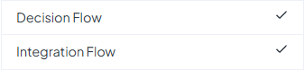

# Flow Limits

On our public cloud, Decision Flow is subjected to a couple of plan-related limits. These limits are described below. In particular, you will learn how to enable Decision Flow for your account and how the number of Decision Flow nodes will be limited.


This page applies primarily to public cloud. To find out about Decision Flow limits in on-premise deployments, please contact our Sales team.


## Decision Flow Enabler

The most important limit related to Decision Flow is the so-called Decision Flow enabler. This limit determines whether you can use Decision Flow at all. The easiest way to find out abut this is to go to Plans (clicking the account icon in the top right corner and choosing Current plan) -> Account Limits and find the Decision Flow item at the bottom of the table.

<figure><figcaption>
This is how it looks when Decision Flow is enabled
</figcaption></figure>

Decision Flow is enabled in one of two ways. First, it is enabled in the free trial period. Therefore, if you have registered recently, you will have Decision Flow enabled out of the box. Second, Decision Flow is included by default in some of the plans. In particular, if you have Business plan or higher, you will have Decision Flow enabled free of any additional charge.

## Nodes Limit

The number of Decision Flow nodes is limited in 2 ways.

First, there is a limit on the number of nodes in a single Decision Flow. It is currently set to 150 nodes. This is a merely technical limit, ensuring that the Decision Flow does not exceed the size supported by the platform.

The second way is putting an upper bound on Decision Flow nodes as well. Notably, it works a little differently for new plans and old plans. For the new plans, the number of Decision Flow nodes is limited by the shared Rule/Node limit. This limit can be found in Plans -> Account Limits. It works as follows. Consider all rules (including rule flows) and all Decision Flows in all spaces owned by the account (including organization spaces). For each of the Decision Flows, count all nodes except Business Rules, Start, End and Note. Then add up all the rules (including rule flows) and found Decision Flow nodes. Compare this number to the Rule/Node limit. If the number is smaller then the limit, then you can create more nodes (otherwise not).

For older plans, the mechanism is similar but the role of the Rule/Node limit is here taken by the Rules and Rule Flows limits, in particular their sum. Also, the counting of rules, rule flows and Decision Flow nodes is not done over the whole account, bot over individual spaces.


If you need more information on the particular Decision Flow node limit on your account, feel free to contact us through our [support portal](https://support.decisionrules.io/).

