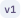

# Flow Nodes Overview

For better navigation, the nodes are divided into logical sections and listed in the same order as they appear in the Decision Flow palette. You can also find a description of each node by clicking on the node in the palette or by clicking the  (How-To) icon in the node modal.

## Node versions

Nodes can exist in multiple versions.

* The **palette always displays the latest version** of each node.
* **Older versions** can be recognized by a badge with the format **(e.g.,**  **)**.
* Some older versions can be **automatically converted** to the latest version, but this does not apply to all.

In the following documentation for each node:

* The **current version** of the node is always indicated. If no version is shown, the node is in **version 1**.
* For each **feature** of a node, if it is only supported from a certain version onward, a **version badge (e.g.,**  **)** is displayed.
* If no version badge is shown, the feature is supported starting from **version 1**.

## Basic

### &#x20;<path d=&#x22;M540-288H144v-384h672v108h-72.33v-36H216v240h324v72Zm-324-72v-240 240Zm528 204v-132H612v-72h132v-132h72v132h132v72H816v132h-72Z&#x22;/></svg>" data-size="line">  Assign&#x20;

The **Assign** node is essential in Decision Flow for managing data transformations and storage. It allows users to assign fixed values or the results of expressions to outputs or variables, streamlining data flow and facilitating dynamic decision-making within Decision Flows.

#### Key Features

* **Assign Fixed Values:** Directly set specific values to variables or output fields.
* **Map Data Between Variables:** Transfer or transform data from one variable to another using simple assignments or complex mappings.
* **Expression Evaluation:** Evaluate expressions and assign the result to variables, enabling dynamic and conditional data handling.

#### Use Cases

* **Data Initialization:** Initialize variables with specific values at the start of a Decision Flow to ensure they are ready for use.
* **Dynamic Calculations:** Use expressions to perform calculations and assign the result to a variable for later use in the Decision Flow.
* **Data Synchronization:** Map data from inputs to internal Decision Flow variables to maintain consistency and integrity across different Decision Flow stages.

### <path d=&#x22;M444-192v-273.24L264-645v117h-72v-240h240v72H315l201 201v303h-72Zm138-339-51-51 114-114H528v-72h240v240h-72v-117L582-531Z&#x22;/></svg>" data-size="line">  Switch

The **Switch** node is designed to direct the Decision Flow based on conditional logic, allowing for branching based on case evaluations. This node evaluates a series of cases, each defined by a specific set of conditions, and branches the Decision Flow accordingly.

#### Functionality

* **Case Evaluation:** Each case within the node has a set of conditions. The Decision Flow branches off when these conditions are met.
* **Default Case:** If no conditions are met for any case, the Decision Flow defaults to a predefined path, ensuring that the Decision Flow  continues smoothly.
* **Visibility of Case Fulfillment:** It is possible to track whether each case's conditions have been met, providing clarity and transparency in Decision Flow execution.

#### Evaluation Strategies

* **All Winning Cases:** This strategy evaluates all cases that meet their conditions. If no cases are deemed profitable, the default case is executed.
* **First Winning Case:** This strategy identifies and executes the first case that meets its conditions. If no cases qualify, the default case is executed.

#### Use Cases

* **Complex Decision Making:** Ideal for scenarios requiring multiple conditions to determine the Decision Flow path.
* **Error Handling:** Can be used to manage different error conditions and direct to appropriate recovery paths.
* **User Input Handling:** Direct Decision Flow based on various user inputs or actions within a system.

This node is crucial for implementing complex decision-making capabilities within Decision Flows, allowing for dynamic and condition-based Decision Flow branching.

### <path d=&#x22;M360-528h72v-144h-72v144Zm120 0h72v-144h-72v144Zm120 0h72v-144h-72v144ZM263.72-96Q234-96 213-117.15T192-168v-504l192-192h312q29.7 0 50.85 21.15Q768-821.7 768-792v624q0 29.7-21.16 50.85Q725.68-96 695.96-96H263.72Zm.28-72h432v-624H414L264-642v474Zm0 0h432-432Z&#x22;/></svg>" data-size="line">  Declare

The **Declare** node plays a critical role in managing data within Decision Flows. It allows for the creation of runtime variables that can be modified during the execution of a Decision Flow. All variables established by this node are accessible in the data dictionary, providing a centralized view of Decision Flow data.

#### Key Features

* **Runtime Variable Creation:** Enables the dynamic creation of variables that can be adjusted as the Decision Flow progresses.
* **Data Dictionary Integration:** All variables are listed in a data dictionary, making them easily accessible and manageable throughout the Decision Flow.
* **Encapsulation:** Variables are grouped under the name of the node, which helps in organizing and isolating data within complex Decision Flows.
* **Flexible Variable Definition:** Supports defining both entities (complex data structures) and inline variables (simple data types), providing versatility in data handling.

#### Use Cases

* **Data Handling:** Ideal for scenarios where data needs to be initialized and potentially modified based on Decision Flow conditions or user inputs.
* **State Management:** Useful in long-running Decision Flows where state needs to be tracked and manipulated across different stages of the Decision Flow.

This node is essential for Decision Flows that require a high degree of data flexibility and accessibility, ensuring efficient management and manipulation of variables during runtime.

###   Global Variables

The **Global Variables** node is essential for establishing a set of global variables accessible throughout the entire Decision Flow. This node is typically configured at the start of the Decision Flow to ensure that all variables are defined and available for use from the beginning.

#### Key Features

* **Global Scope:** Variables defined in this node are available throughout the entire duration of the Decision Flow, across all nodes.
* **Initial Configuration:** Placed right at the start of the Decision Flow, this node sets up essential variables that are critical for the entire process.
* **Easy Access:** All global variables are readily accessible and modifiable by any part of the Decision Flow, enhancing data sharing and manipulation.

#### Benefits

* **Consistency:** Ensures that all parts of the Decision Flow have consistent access to the same set of variables.
* **Simplicity:** Simplifies the management of data that needs to be shared across multiple parts of the Decision Flow.
* **Efficiency:** Reduces the need to repeatedly define the same variables in different nodes, thus optimizing Decision Flow performance.

#### Use Cases

* **Configuration Data:** Ideal for storing configuration settings that need to be accessed by multiple nodes throughout the Decision Flow.
* **Shared Resources:** Useful for scenarios where data needs to be shared or visible across various stages of the Decision Flow, such as user permissions, environmental settings, or operational parameters.

This node provides foundational support for Decision Flows that require global data accessibility, ensuring that critical information is uniformly available across all stages of the process.

###   Foreach

The **Foreach** node is used for iterating over arrays within a Decision Flow, making it essential for processing collections of data. This node utilizes a "Loop Connector" to iterate through each item in the input array, providing powerful functionality for data manipulation and analysis.

#### Key Features

* **Loop Connector** iterates over every item in the specified input array, ensuring that each element is processed sequentially.
* Access to **Current Item**: during each iteration, the current item is accessible via the `[foreach node name].currentItem` attribute, allowing for direct manipulation of each array element as an object.

Iteration Context provides additional iteration parameters such as:

* `index`: Indicates the number of the current iteration.
* `length`: Indicates the total length of the input array.

#### Advanced Usage

Nested Loops

* For nested arrays, multiple Foreach nodes can be nested within each other. This allows for the handling of complex data structures and multi-dimensional arrays with ease.

Parallel Loops

* When **Parallel Loop** is enabled on a node, the output data from that node is automatically segmented into smaller portions. Each of these segments is then evaluated in **parallel** rather than sequentially. This is especially useful when working with arrays or batch data, allowing for faster execution by running multiple evaluations simultaneously. When the toggle is off, the entire output is processed as a single unit in a sequential manner.

#### Use Cases

* **Data Processing**: Ideal for scenarios requiring detailed processing or transformation of each item within an array.
* **Batch Operations**: Efficient for performing operations on batches of data, such as calculations, filtering, or aggregation.
* **Complex Data Structures**: Useful in Decision Flow that need to navigate and manipulate nested or hierarchical data structures.

This node is crucial for Decision Flow that involve array processing, providing robust tools for iterating over data and applying specific operations to each element effectively.

### <path d=&#x22;M216-216h336v-192h192v-336H216v528Zm0 72q-29.7 0-50.85-21.15Q144-186.3 144-216v-528q0-29.7 21.15-50.85Q186.3-816 216-816h528q29.7 0 50.85 21.15Q816-773.7 816-744v360L576-144H216Zm72-264v-72h192v72H288Zm0-144v-72h384v72H288Zm-72 336v-528 528Z&#x22;/></svg>" data-size="line">  Sticky Note

The **Sticky Note** node is used to create notes within the Decision Flow. This node serves as a simple yet effective way to add annotations, comments, or reminders directly in the Decision Flow, enhancing clarity and communication among team members.&#x20;

#### Key Features

* **Annotation**: Add textual notes to any part of the Decision Flow to explain the purpose of nodes, document decisions, or provide additional information.
* **Visibility**: Notes are visible within the Decision Flow interface, making it easy for anyone reviewing the Decision Flow to understand the context and reasoning behind specific nodes.
* **Non-Functional**: This node does not affect the Decision Flow's execution; it is purely for documentation and informational purposes.

#### Use Cases

* **Documentation**: Use Sticky Notes to document the logic and reasoning behind complex Decision Flow sections.
* **Collaboration**: Facilitate better communication among team members by adding notes that explain specific parts of the Decision Flow.
* **Reminders**: Add reminders for future modifications or considerations that need to be addressed.

This node is essential for maintaining clear and comprehensive documentation within your Decision Flow, ensuring that all stakeholders understand the Decision Flow's structure and intent.

### <path d=&#x22;M216-144q-29.7 0-50.85-21.15Q144-186.3 144-216v-528q0-29.7 21.15-50.85Q186.3-816 216-816h528q29.7 0 50.85 21.15Q816-773.7 816-744v72h-72v-72H216v528h528v-72h72v72.21Q816-186 794.85-165T744-144H216Zm456-144-51-51 105-105H384v-72h342L621-621l51-51 192 192-192 192Z&#x22;/></svg>" data-size="line">  End

The **End** node serves as a visual indicator for the termination of a Decision Flow branch and provides insight into the final data state of that branch. While not mandatory, as output mapping can be achieved with the [Assign ](flow-nodes-overview.md#assign)node, the End Node adds value by enhancing Decision Flow clarity and inspection.

#### Key Features

* **Decision Flow** **Inspection:** Displays the data associated with the relevant Decision Flow path in the inspector, offering a clear view of the output data and making it easier to debug and verify the Decision Flow's final state.
* **Optional Use:** The End node is optional and is primarily used to provide a clear endpoint for Decision Flow branches. This helps in enhancing organization and readability but does not replace nodes like the [Assign ](flow-nodes-overview.md#assign)node for output mapping.

The End node is beneficial for Decision Flows that require distinct termination points and a way to easily inspect final data states, ensuring both ease of use and enhanced Decision Flow clarity.

## DecisionRules

###   Business Rule 

The **Business Rule** node allows you to connect and execute different types of business rules, including decision tables, decision trees, rule flows, and entire Decision Flows.

With this node, you **statically select** a specific business rule and a particular version of that rule:

* the user can either select a specific version or choose the option to execute the **latest version** of the rule. 

This node is intended for scenarios where the rule and version are **pre-defined** and do not change dynamically at runtime.

#### Solving Strategies

Each rule type provides a set of solving strategies that define how the rule is evaluated and how the results are returned. The strategies available depend on the selected rule type.

#### Strategies for Decision Tables

* **Standard**\
  Returns an array of results from the evaluated rule.\
  A Loop connector is automatically attached to the node, allowing iteration over the results.\
  The current item is accessible via `[node name].currentItem`, the iteration index via `index`, and all data via `[node name].output`.
* **Evaluates All**\
  Similar to Standard but ensures that all rows in the decision table are evaluated.\
  Returns an array of results with iteration support as in Standard.
* **First Match**\
  Returns a single output object with the first matching result.\
  Does not return an array.
* **Array** \
  Returns the evaluation results in array format.

#### Other Rules

For Decision Trees, Rule Flows, Scripting Rules, and Decision Flows, the **Standard** strategy is always applied.\
These rules always return a single output object from the evaluation (not an array).

#### Use Cases

* **Decision Automation:** Ideal for scenarios where complex business logic needs to be automated through decision tables or trees.
* **Batch Processing:** Employ the Standard or Evaluates All strategies to handle multiple results from business rules, enabling batch processing and comprehensive evaluations.

This node is pivotal for integrating complex business logic into your Decision Flows, ensuring that decisions are made based on the latest rules and data.

#### Versions

*  -> 
  * When converting version 1 of Business Rule node that calls a Scripting Rule, it is necessary to update mapping whenever any other node uses outputs from this node, based on how it was referenced:
    1. node.currentItem → change to node.output
    2. node.currentItem.attribute → change to node.output.attribute
    3. node.output - mapping can be kept, however it will no longer contain an array but an object, so its usage has to be adjusted

###   Dynamic Business Rule 

The **Dynamic Business Rule** node allows you to **dynamically connect and execute** different types of business rules, including decision tables, decision trees, rule flows, and entire Decision Flows.

Using this node, both the **rule** and its **version** can be selected **at runtime** based on Decision Flow variables:

* If a specific version is provided, that version of the rule will be executed.
* If no version is specified, the **latest published version** of the rule is executed by default.

This dynamic behavior enables flexible rule execution that adapts to the current context of the flow.

#### Solving Strategies

Each rule type provides a set of solving strategies that define how the rule is evaluated and how the results are returned. The strategies available depend on the selected rule type.

#### Strategies for Decision Tables

* **Standard**\
  Returns an array of results from the evaluated rule.\
  A Loop connector is automatically attached to the node, allowing iteration over the results.\
  The current item is accessible via `[node name].currentItem`, the iteration index via `index`, and all data via `[node name].output`.
* **Evaluates All**\
  Similar to Standard but ensures that all rows in the decision table are evaluated.\
  Returns an array of results with iteration support as in Standard.
* **First Match**\
  Returns a single output object with the first matching result.\
  Does not return an array.
* **Array** \
  Returns the evaluation results in array format.

#### Other Rules

For Decision Trees, Rule Flows, Scripting Rules, and Decision Flows, the **Standard** strategy is always applied.\
These rules always return a single output object from the evaluation (not an array).

#### Use Cases

* Dynamically choosing the rule to be executed via the input.
* Triggering a rule for all of the rule aliases retrieved from a table. This allows you to filter the list of rules based on any conditions you might want to set up without having to use switches in the flow itself.

This node is pivotal for integrating complex business logic into your Decision Flows, ensuring that decisions are made based on the latest rules and data.

#### Versions

*  -> 
  * When converting version 1 of a Dynamic Business Rule node that does not use latest version of executed rule but the version specified by a mapped attribute, please make sure that such an attribute contains number (in version 1, if the version attribute does not contain a number, latest version is used automatically, while in higher versions such situation causes an error)

## Array Functions

### <path d=&#x22;M216-216v-144 16-4 132Zm-.3 72q-32.7 0-52.2-19.5T144-216v-144q0-33 19.5-52.5T216-432h528q33 0 52.5 19.5T816-360H216v144h396v72H215.7Zm.3-384q-33 0-52.5-19.5T144-600v-144q0-33 19.5-52.5T216-816h528q33 0 52.5 19.5T816-744v144q0 33-19.5 52.5T744-528H216Zm0-72h528v-144H216v144Zm0 0v-144 144ZM744-84v-60h-60v-72h60v-60h72v60h60v72h-60v60h-72Z&#x22;/></svg>" data-size="line">  Append

Array append involves adding elements to an existing array. Unlike merging, where elements are combined from two different arrays, appending adds new elements to the end of an array.

Let's say you have an existing JSON array:

```javascript
// Original Array:

[
    { "id": 1, "name": "John" },
    { "id": 2, "name": "Alice" }
]
```

Now, you want to append a new element to this array:

```javascript
// Element to Append:

{ "id": 3, "name": "Bob" }
```

After appending, the resulting array would be:

```javascript
// Appended Array:

[
    { "id": 1, "name": "John" },
    { "id": 2, "name": "Alice" },
    { "id": 3, "name": "Bob" }
]
```


**In this appended array:**

* The original elements remain unchanged.
* The new element `{ "id": 3, "name": "Bob" }` is added to the end of the array.

### <path d=&#x22;M144-144v-240h72v168h168v72H144Zm432 0v-72h168v-168h72v240H576ZM288-336l-51-51 57-57H96v-72h198l-57-57 51-51 144 144-144 144Zm384 0L528-480l144-144 51 51-57 57h198v72H666l57 57-51 51ZM144-576v-240h240v72H216v168h-72Zm600 0v-168H576v-72h240v240h-72Z&#x22;/></svg>" data-size="line">  Join

Joining two JSON arrays by a key involves combining the arrays based on a common identifier or key within the JSON objects.

Let's say you have two JSON arrays:

```javascript
// Array 1:

[
    {"id": 1, "name": "John"},
    {"id": 2,"name": "Alice"}
]

// Array 2:

[
    {"id": 1, "age": 30},
    {"id": 3, "age": 25}
]
```

You want to join these arrays based on the "id" key. After merging, the resulting array should contain all unique elements from both arrays, with matching elements combined based on the "id" key. If an element exists in one array but not the other, it should still be included in the merged array.

```javascript
// Merged Array:

[
    {"id": 1, "name": "John", "age": 30},
    {"id": 2, "name": "Alice"},
    {"id": 3, "age": 25}
]
```


**In this join array:**

* The object with `id` equal to 1 exists in both arrays, so their properties are joined into one object.
* The object with `id` equal to 2 only exists in the first array, so it's included as is.
* The object with `id` equal to 3 only exists in the second array, so it's included as is.&#x20;

### <path d=&#x22;M669-144 444-369v-261L339-525l-51-51 192-192 192 192-51 51-105-105v231l204 204-51 51Zm-378 0-51-51 138-138 51 51-138 138Z&#x22;/></svg>" data-size="line">  Combine

The **Array Combine** node is used to combine multiple values and nodes into a single array. This node consolidates various data inputs and returns the combined array, making it a valuable tool for data aggregation withinDecision Flows.

#### Key Features

* **Combining Values:** Allows the inclusion of multiple values from different nodes or direct inputs into a single array.
* **Output:** The combined data is returned as `[node name].value`, providing a straightforward way to access the aggregated array.

#### Use Cases

* **Data Aggregation:** Useful for scenarios where data from multiple sources or nodes needs to be combined into one array for further processing.
* **Batch Processing:** Ideal for Decision Flows that require the consolidation of data points before applying batch operations or transformations.
* **Simplifying Outputs:** Helps in organizing and simplifying outputs by combining related data into a single array structure.

This node is essential forDecision Flows that involve combining and organizing data from various sources into a single array, facilitating efficient data handling and processing.

#### Example

If you have several nodes generating different pieces of data, you can use the Array Combine node to gather all these pieces into one array:

**Input Nodes:**

* Node A: Generates value `1`
* Node B: Generates value `2`
* Node C: Generates value `3`

**Array Combine Node Configuration:**

* Combines values from Node A, Node B, and Node C

**Output:**

* `[node name].value` will be `[1, 2, 3]`

### <path d=&#x22;M684-48v-108H576v-72h108v-108h72v108h108v72H756v108h-72ZM216-216v-528 528Zm.37 72Q186-144 165-165.15 144-186.3 144-216v-528q0-29.7 21.15-50.85Q186.3-816 216-816h528q29.7 0 50.85 21.15Q816-773.7 816-744v333q-17-8-35-12.5t-37-6.5v-314H216v528h266q-2 18-1 36t5 36H216.37Zm107.42-144q15.21 0 25.71-10.29t10.5-25.5q0-15.21-10.29-25.71t-25.5-10.5q-15.21 0-25.71 10.29t-10.5 25.5q0 15.21 10.29 25.71t25.5 10.5Zm0-156q15.21 0 25.71-10.29t10.5-25.5q0-15.21-10.29-25.71t-25.5-10.5q-15.21 0-25.71 10.29t-10.5 25.5q0 15.21 10.29 25.71t25.5 10.5Zm0-156q15.21 0 25.71-10.29t10.5-25.5q0-15.21-10.29-25.71t-25.5-10.5q-15.21 0-25.71 10.29t-10.5 25.5q0 15.21 10.29 25.71t25.5 10.5ZM432-444h240v-72H432v72Zm0-156h240v-72H432v72Zm0 312h68q9-20 21.5-38t27.5-34H432v72Z&#x22;/></svg>" data-size="line">  Collect

The **Collect** node is used to create an object by collecting multiple values and nodes into a single object. This node aggregates data inputs and adds them to a specified target, making it a valuable tool for data consolidation within Decision Flows. **This node is designed to be used at the of the loop only.** &#x20;

#### Key Features

* **Creating Objects:** Allows the inclusion of multiple values from different nodes or direct inputs into a single object.
* **Target Addition:** Adds the collected data to a specified target object, providing an organized way to manage aggregated data.

#### Use Cases

* **Post-Loop Data Consolidation:** Useful for scenarios where data from multiple sources or nodes needs to be combined into one object for further processing.
* **Final Structured Outputs:** Ideal for Decision Flows that require the aggregation of data points into a structured object before applying further operations or transformations.
* **Organizing Final Data:** Helps in organizing and simplifying outputs by combining related data into a single object structure.

This node is essential for Decision Flows that involve combining and organizing data from various sources into a single object, facilitating efficient data handling and processing.

#### Example

If you have several nodes generating different pieces of data, you can use the Collect Outputs node to gather all these pieces into one object `newTarget`

**Input Nodes:**

* **Node A:** Generates value `1` with key `a`
* **Node B:** Generates value `2` with key `b`
* **Node C:** Generates value `3` with key `c`

**Configuration**

* **Select or Create Target:** Choose or create the target object where the collected data will be added.
* **Object Mapping:** Map the attributes from each input node to the corresponding keys in the target object.

**Output**

* `newTarget` will contain `{a: 1, b: 2, c: 3}`. This reflects the newly created or updated object with the collected data in the specified target.

## Data & Integrations

### <path d=&#x22;M144-384v-192h48v72h48v-72h48v192h-48v-72h-48v72h-48Zm240 0v-144h-48v-48h144v48h-48v144h-48Zm192 0v-144h-48v-48h144v48h-48v144h-48Zm144 0v-192h120q9.6 0 16.8 7.2 7.2 7.2 7.2 16.8v72q0 9.6-7.2 16.8-7.2 7.2-16.8 7.2h-72v72h-48Zm48-120h48v-24h-48v24Z&#x22;/></svg>" data-size="line">  REST API Client

The **REST API Client** node is used to request data from an external API. This node facilitates communication with external services, making it a valuable tool for integrating third-party data into your Decision Flows.

#### Key Features

* **Request Type:** Supports various HTTP request types such as GET, POST, PUT, DELETE, etc.
* **Enter URL:** Allows the user to specify the URL of the external API endpoint.
* **Connector:** Select an existing connector or create a new one. (Optional)
* **Headers:** Enables the inclusion of custom headers for authentication and other purposes. Headers defined in the Headers section take priority over headers defined via the connector.
* **Body:** Allows the user to define the body of the request.

#### Use Cases

* **Data Retrieval:** Useful for scenarios where data needs to be fetched from external APIs for processing within the Decision Flow.
* **Data Submission:** Ideal for Decision Flows that require sending data to external services.
* **Integration:** Helps in integrating third-party services by facilitating API communication.

This node is essential for Decision Flows that involve requesting data from or sending data to external APIs, facilitating seamless integration with third-party services.

#### Example

If you need to request data from an external API, you can use the REST API Client node to set up and send the request:

**Configuration**

* **Request Type:** Select the type of HTTP request (e.g., GET, POST).
* **Enter URL:** Specify the URL of the API endpoint (e.g., `https://api.example.com/data`).
* **Connector:** Choose a connector to safely provide Authorization headers (optional).
* **Headers:** Add any necessary headers (e.g., `Content-Type: application/json`).
* **Body:** Define the body of the request if needed, with the option to use formats like JSON, plain text, or HTML (e.g., `{ "key1": "value1", "key2": "value2" }` for a JSON POST request).

**Output**

The response from the API will be accessible via the following properties:

* `[node name].data`**:** The main data returned from the API.
* `[node name].status`**:** The HTTP status code of the response.
* `[node name].responseOk`**:** A boolean indicating whether the request was successful (status in the 200-299 range).
* `[node name].responseHeaders`**:** The headers returned by the API response.
* `[node name].state`**:** The state of the request, which can be used for handling different stages of the API call.

### **Relational Database Query Nodes**

**Supported Databases:**

* PostgreSQL
* Oracle DB
* MySQL
* MSSQL

The Relational Database Query nodes allow you to connect to and query SQL databases. They provide functionality to:

* Create or select an existing database connector
* Write SQL queries with dynamic variable support
* Test queries with sample values before execution

**Key Properties**

* **Connector** – Select an existing connector or create a new one to your database.
* **Query** – Input the SQL query to be executed during runtime.
* **Test Query** – Use a sandbox to test your query with sample variable values.
* **Loop Connector** – Iterates over every item returned by the query. The current row is accessible via `[databaseNode].currentRow` during each iteration, allowing direct manipulation of returned data.

**Examples**\
&#xNAN;_&#x45;xample 1 – Basic SQL Query_

```sql
SELECT * FROM customers LIMIT 10
```

Retrieves the first 10 records from the `customers` table.

_Example 2 – Query with Variables_

```sql
SELECT * FROM orders 
WHERE customer_id = {input.customerId} 
AND order_date > TO_DATE({input.startDate})
```

Variables in curly braces (`{input.variableName}`) are replaced with actual values at runtime. You can test your query by entering sample values in the **Variables** tab and clicking **Test**.

### **Relational Database Single Row Nodes**

**Supported Databases:**

* PostgreSQL
* Oracle DB
* MySQL
* MSSQL

Single Row database nodes work the same way as their standard counterparts, with one important difference: **only the first row returned by the query is passed forward** in the workflow.

These nodes are useful when you expect a single result (for example, fetching one specific record by ID). Unlike multi-row nodes, they do not loop through multiple results — the returned row is available directly via `[databaseNode].currentRow`.

The rest of the functionality — connectors, queries, variables, and testing — remains identical to the standard Relational Database Query nodes.

## Advanced

###  Debug

The Debug node is used for inspecting data at specific points in a Decision Flow. It allows users to view the output of preceding nodes, helping with troubleshooting and validation during development.

#### Features

* **Data Inspection**: Displays the data from preceding nodes in the inspector, making it easier to debug and understand the flow of information.
* **Development Use Only**: The Debug node is useful for testing and validation but is not recommended for production Decision Flows, as it may slow down solve time.
* **Non-Disruptive**: It does not alter the Decision Flow execution but simply provides visibility into the data being processed.

The Debug node is an essential tool for Decision Flow development, aiding in diagnosing issues and refining logic before deployment. However, for optimal performance, it should be removed or disabled in production environments.

### <path d=&#x22;M312-384q-10 0-17-7t-7-17v-72h48v48h48v-144h48v168q0 10-7 17t-17 7h-96Zm216 0q-10.2 0-17.1-6.9-6.9-6.9-6.9-17.1v-36h48v12h48v-36h-72q-10.2 0-17.1-6.9-6.9-6.9-6.9-17.1v-60q0-10.2 6.9-17.1 6.9-6.9 17.1-6.9h96q10.2 0 17.1 6.9 6.9 6.9 6.9 17.1v36h-48v-12h-48v36h72q10.2 0 17.1 6.9 6.9 6.9 6.9 17.1v60q0 10.2-6.9 17.1-6.9 6.9-17.1 6.9h-96Z&#x22;/></svg>" data-size="line">  Custom Code

The **Custom Code** node is used to execute custom JavaScript code within your Decision Flow. This node provides a flexible way to perform operations or transformations that are not covered by standard nodes.

#### Key Features

* **JavaScript Execution:** Allows you to write and execute custom JavaScript code.
* **Custom Logic:** Enables the implementation of bespoke logic and algorithms tailored to your specific needs.
* **Input Access:** Provides access to inputs from other nodes, allowing for dynamic and context-aware code execution.
* **Output:** Returns the result of the JavaScript code execution, which can be used for further processing in the Decision Flow.

#### Use Cases

* **Custom Transformations:** Ideal for scenarios where standard nodes do not meet your requirements, and custom logic is needed.
* **Data Processing:** Useful for performing complex data manipulations or calculations.
* **Integration:** Helps in integrating with other systems or APIs that require specific JavaScript code execution.

#### Example

If you need to perform a custom calculation or data transformation, you can use the Custom Code node to run JavaScript code:

**Configuration**

* **JavaScript Code:** Write the JavaScript code to be executed. For example, you can perform a calculation or transform input data:

```javascript
// Example JavaScript code

let inputData = items[0].json; // Access input data
let result = inputData.value * 2; // Perform a calculation
return { result: result }; // Return the result
```

## Conclusion

With the new Decision Flow feature, you have access to a variety of nodes that allow you to create powerful, automated processes without needing extensive coding knowledge. Each node type serves a specific purpose, and by combining them, you can easily build Decision Flows tailored to your needs.

Our intuitive interface is designed to make it easy to get started: experiment with different nodes, explore their functionalities, and see how they can simplify your tasks and processes.&#x20;
