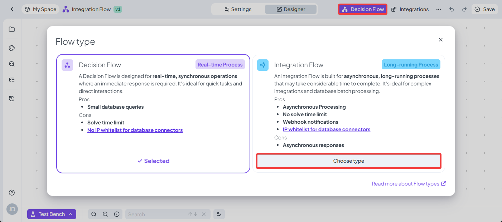

# Integration Flow

Integration Flow uses mostly the same designer options as the Decision Flow (formerly Workflow), the main difference is that it is intended to be used for long running execution mainly for example while evaluating larger batches of data from databases.

### Creating an Integration Flow

The Integration Flow can be created anywhere where other rules are created, so using the Create button, both while right clicking in the Rules view (or right clicking on a folder) and using the create button on top of the folder structure.

<figure><figcaption></figcaption></figure>

Additionally you can freely change any Decision Flow into an Integration Flow and vice versa using the Integration/Decision Flow switch in the top right of the designer <mark style="background-color:$warning;">**please note that both rule type use a different API endpoint and therefore the call to trigger them will be different**</mark><mark style="background-color:$warning;">,</mark> however this will allow you to not lose on any work if you start creating a Decision Flow, that runs too long and the switch to Integration Flow has to be made.

<figure><figcaption></figcaption></figure>

### Using test bench

The test bench for Integration Flow has slight differences to the normal Test Bench you might be used to. The Input data panel works exactly the same as it does normally, but the Run button is replaced by Start a new Job button which will create a new background job that you will see in the job menus, after triggering the job you will also see additional information about the state (waiting, running, completed etc.) in the middle panel. After the job is completed, you will see the output data in the right panel as in the case of regular test bench.

During execution in the middle panel you will have information about how long is the job executing for, and after the completion you will be shown exact execution time.

<figure><figcaption></figcaption></figure>

You can select any job in the Jobs panel and you will see this information for the chosen job, **you don't need to keep the page open to not lose the information.**

<figure><figcaption></figcaption></figure>

#### Executing an Integration Flow

Please note that the Integration Flow and the subsequent job, can only be triggered via the specific endpoint by REST API, it cannot be triggered using the SOLVE function of via a regular Decision Flow.
