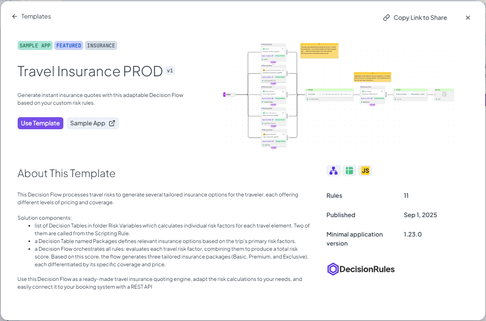
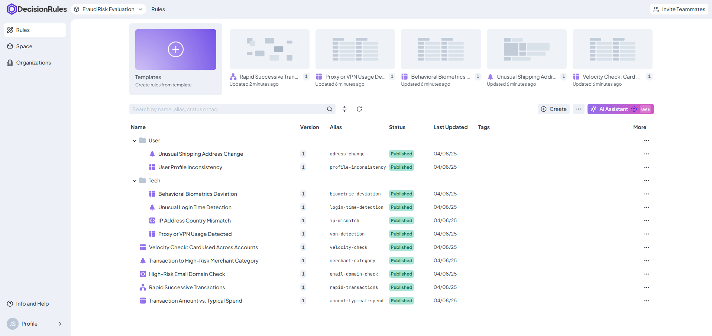

# Rule List

## Rule Panel

At the top of the main page, you'll find a compact panel designed to help you get started quickly or jump back into recent work.

This panel displays a list of your **recently updated rules**, so you can easily continue working on something without searching through the full rule list. Clicking on a rule opens it directly in the editor.

Next to your recent rules, the panel also provides quick access to **rule templates**. By selecting a template, you can instantly create a new rule based on predefined logic.

<figure><figcaption>
Rule Panel Overview
</figcaption></figure>

## Templates

Templates in DecisionRules are pre-created rules with ready-to-use logic. They’re designed to help users get started quickly by providing common decision-making patterns that can be customized as needed.

These templates are built around common use cases - such as discount calculations, risk scoring, eligibility checks, and routing logic - so instead of starting from scratch, you can begin with a functional rule and simply adjust it to fit your needs.

To access templates, click the **“Templates”** from upper panel. This opens the **Templates Modal**, where you can browse a selection of predefined rules and preview their logic before creating a new instance in your workspace. It is possible to search and filter templates and also view a detail by clicking **"Explore"** button.

<figure><figcaption>
Available Templates
</figcaption></figure>

In template detail you can get more info like detailed description, images and statistics. Template can be shared by **"Copy Link to Share"** button.

<figure><figcaption>
Template detail
</figcaption></figure>

## Rule List

The **Rule List** displays all the rules that exist within the currently viewed space. This list is the main way to explore, access, and manage the rules available in your workspace.

The list supports both **rules and folders**, making it easy to organize complex logic into categories or projects. You can expand and collapse folders to keep the view tidy or focus on specific parts of your rule library.

At the top of the list, a **search bar** lets you quickly find any rule by name or keyword. The search works across the entire structure—inside and outside folders—so you can locate what you need without scrolling manually.

Each rule in the list is represented by a record that shows key information at a glance, including:

* Rule name
* Version
* Alias
* State (e.g. Published, Pending)
* And more (e.g. tags, last update date, indications)

<figure><figcaption>
Rule List Overview
</figcaption></figure>

To perform actions on a rule, a **context menu** is available. You can open it by **right-clicking** on a rule row or by clicking the **three-dot button** at the end of the row. This menu includes options like renaming, duplicating, exporting, or deleting the rule—making it easy to manage rules directly from the list without opening them.
