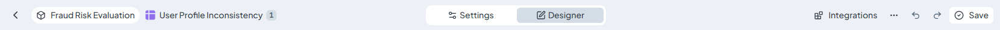
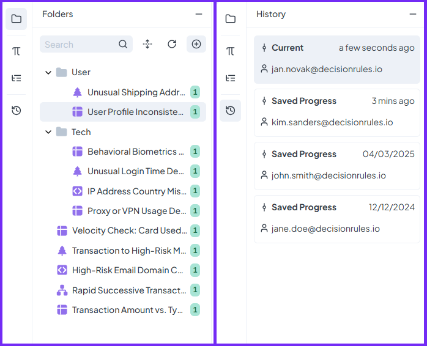

# Rule Mode

**Rule Mode** is where you edit and configure individual rules. When you open a rule from the Rule List, it loads into Rule Mode an interactive editor that gives you all the tools you need to build, adjust, and test your decision logic in one place.

<figure><figcaption></figcaption></figure>

## Main Layout

The central part of Rule Mode is the **Designer**. This is where the rule body lives. It's the core space where you define overall logic. The layout and available tools in the Designer vary depending on the rule type.

At the **top of the screen**, you'll find a control panel with several key sections:

* **Tabs**:
  * **Designer** – The default view for building and editing the rule.
  * **Settings** – Used to configure rule Alias, State, Input and Output Model.
* **Integration** – Shows integration code options.
* **Action Buttons**:
  * **Undo / Redo** – Navigate changes while editing the rule.
  * **Save** – Save your progress manually.
* **Rule Context Menu**:\
  This dropdown includes additional rule-specific actions such as exporting, duplicating, deleting, or accessing advanced features.

<figure><figcaption>
Rule Mode Top Panel
</figcaption></figure>

## Side Panel Tools

On the **left side**, you’ll find a dynamic panel with tools that support rule editing and navigation:

* **Folders** – A quick view of the Rule List, allowing you to jump to another rule without leaving Rule Mode.
* **Rule Dependencies** – Shows any relationships the rule has with others (e.g., if it's used in Rule Flows).
* **History** – Displays all saved versions of the rule so you can view or revert previous states.

Depending on the rule type, additional panels may appear:

* **Rule Variables** – Lets you define and manage custom variables used in the rule logic. Available for Decision Table, Decision Tree and Scripting Rule.&#x20;
* **Palette** – Available in Decision Flow and Integration Flow rules, used to drag and drop rule blocks into flows.

<figure><figcaption></figcaption></figure>

## Test Bench

At the **bottom of the page**, you'll find the **Test Bench**. This built-in testing area allows you to try out your rule in real-time while you're editing. You can input sample data, run the rule, and instantly see the output, making it easier to fine-tune logic as you go.

You can find information about test bench in dedicated section [here](common-rule-features/test-bench.md).&#x20;
