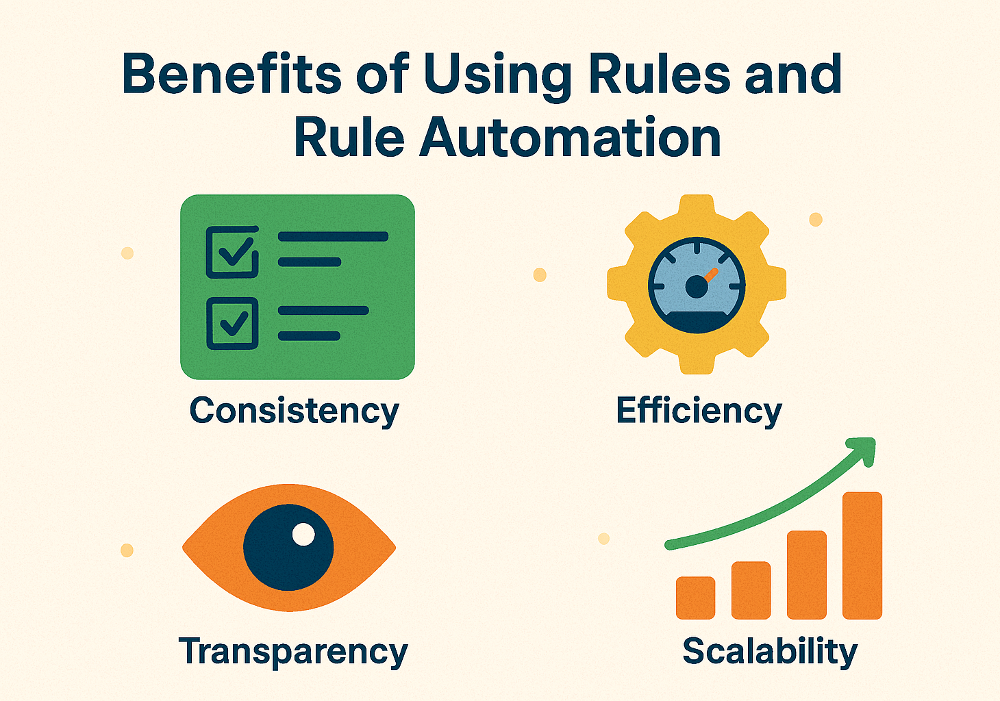

# Rules Introduction

### What Is a Rule?

A **rule** is a basic logic statement that defines **when something should happen** and **what should be done**. It usually follows this structure:

> **If** a certain condition is true, **then** perform a specific action.

For example:

* **If** a customer is a VIP, **then** apply a 20% discount.
* **If** a loan applicant's credit score is below 600, **then** reject the application.
* **If** the delivery address is international, **then** add a shipping fee.

This kind of logic is everywhere—in forms, spreadsheets, approval workflows, pricing policies, customer segmentation, and more. Rules make that logic **explicit** and **reusable**.

<figure><figcaption>
What Is a Rule?
</figcaption></figure>

***

### Why Rules Matter

Rules help automate decision-making by removing the need for someone to manually apply logic every time. Instead of writing code or doing repetitive checks, you define the rule once—and the system applies it instantly, as many times as needed.

#### The benefits of using rules:

* ✅ **Faster updates**\
  Need to change a discount or threshold? Just edit the rule—no need to change or redeploy code.
* ✅ **Fewer mistakes**\
  Rules are clearly defined and consistently applied, so there's less chance of errors or forgetfulness.
* ✅ **Better clarity**\
  Everyone can see the logic. No more guessing what the system “really” does.
* ✅ **Easier testing and maintenance**\
  You can test individual rules without needing to retest an entire application.

<figure><figcaption>
Rule Automation Benefits
</figcaption></figure>

***

### Where Rules Fit in a Rule Engine

In a rule engine like **DecisionRules**, rules are the core units of logic. You can create, manage, and run them independently—or combine them into more advanced logic flows.

Here’s how different rule types work:

* **Decision Tables**\
  Great for working with structured data—like mapping ranges or looking up values in a grid.
* **Scripting Rules**\
  When you need more flexibility, like mathematical formulas or custom logic.
* **Decision Trees**\
  Visual, easy-to-follow branching logic, great for step-by-step decisions.
* **Rule Flows**\
  Link several rules together into a full decision-making process.
* **Workflows**\
  Automate full business processes by combining rules with actions like calling APIs, transforming data, or triggering custom logic—all in a visual, step-by-step flow.

In the next sections, you'll find detailed descriptions of the different rule types available in DecisionRules—such as Decision Tables, Trees, Scripts, and Rule Flows. We'll also cover common rule features and settings to help you configure, test, and manage your rules effectively.

