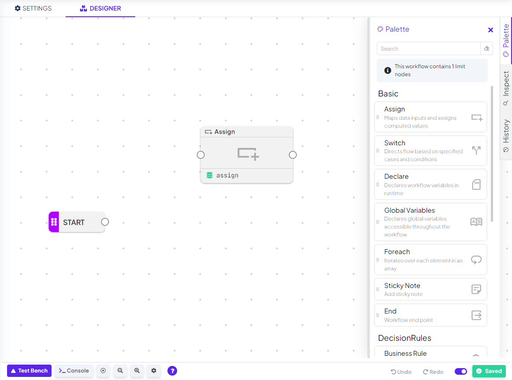
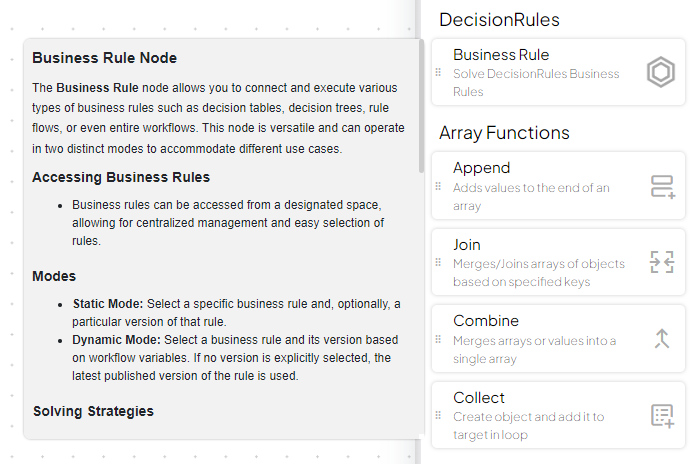
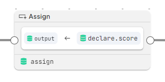

# Workflow Designer


See our Workflow tutorial available in [DecisionRules Academy](https://app.gitbook.com/s/2kePaAlhzmPFZTjuxdCY/rule-types/workflow/create-a-workflow).


Accessing Workflow

Let us create the first workflow. Click the Create button in the main menu and switch to the Workflow tab. Here you can choose to create a blank workflow (if you do not seem to have access to it, please see the [Workflow Limits](workflow-limits.md#workflow-enabler) page).

<figure><figcaption>
The create dialog
</figcaption></figure>

Upon creating a blank workflow, you will be taken to the workflow detail. Note the Settings and the Designer tab. You can review the settings, which should not surprise any DecisionRules user. As mentioned above, the settings are (almost) the same as for regular business rules. In particular, pay attention to the input/output models. As usual, these models define the format of the input and output data of the workflow at question. We can leave all the defaults here and turn our attention to the Designer tab.

The blank designer features the canvas with a single node: the Start. The designer window features the usual bottom bar, where we can open the test bench. Next, on the right hand side, there are several additional tabs. For now, we will focus to the most important one: the Palette.


You can try one of our workflow samples. Simply select one of those in _Create Rule wizard_ instead of the _Blank_ one.


<figure><figcaption>
The workflow designer
</figcaption></figure>

## Workflow Designer

### Canvas

You can think of the workflow canvas as a real canvas where you can place nodes, connect them to create from simple to complex workflows. On the canvas there is a enough space for all your nodes and workflow branches.

#### Navigation

Navigation through the canvas is intuitive - move around by dragging your mouse, zoom in and out scrolling the mouse wheel.

### Sidebar

#### Palette

The palette has a simple purpose. It lists all the available node types with brief description. If you want to use any of the nodes in your workflow, just drag it from the palette and drop it on the canvas.


The maximum number of nodes you can add to a workflow is determined by your plan, ensuring optimal performance tailored to your subscription level. To discover how Workflow limits works, please refer to [page](workflow-limits.md#nodes-limit) dedicated to it.

In the Palette you can see how many nodes are in the workflow.&#x20;


By clicking on the node in the list node description opened. You can find the functionality of such node there, along with common use cases.

<figure><figcaption>
Node description in the Palette
</figcaption></figure>

#### Inspect

On the Inspect tab you will find details of node evaluation once you run the workflow in the Test Bench.


See more information about Workflow Evaluation in the [section](workflow-designer.md#workflow-evaluation) below.


<figure><figcaption>
Inspect tab detail
</figcaption></figure>

#### Rule History & Undo/Redo

Changes made in the designer are recorded to a local history. You can undo or redo changes by clicking the  or  buttons.

To view the Workflow history, click History tab located on the right sidebar. This opens a list with all available versions, where a new version is created every time you save the rule.

By clicking on a version tile, you can preview that version. This action does not overwrite your current version, it is only a preview.

<figure><figcaption>
List of Workflow history versions
</figcaption></figure>


If you want to restore an older version, click the  icon on the top-right corner of the version tile.

Restoring a version creates a new version — **you will not lose your current version when restoring an older one.**


### Nodes

Nodes in the workflow act as containers for specific actions or steps. Each node represents a task, such as declaring and assigning values, processing data, evaluate other business rules or run custom code. These nodes help structure and visualize the workflow.

Once present on the canvas, the node can be clicked in order to open its detail. Each node type has different configuration options, depending on its functionality. If you want to read more about individual node types and their configuration options, check out the [Workflow Nodes Overview](workflow-nodes-overview.md).

#### Node modal

As mentioned node represents a task. Such task can be set in the modal opened by clicking on the node on canvas. Depending on the node type in the modal, you can define new data sources and targets, along with their corresponding values, or utilize the existing ones.

In every open node modal you can find _Data Dictionary_, a collapsible section holding workflow variables already declared. Their values can be used by simple dragging to desired field.


_Please note that by design some types of declared workflow variables cannot be used as a target to be overwritten._


You can also find a description of each node by clicking the  (How-To) icon in the node modal.


Multiple node modals can be opened at the same time.



Once the workflow node is set in the modal, node on canvas shows details about the content and setting.



#### Node Interaction

Nodes can be moved around the canvas dragging them by their headers.&#x20;

Hovering or right-clicking on node shows context menu containing three options: Inpect, Clone and Delete.

* Inspect: Opens Inspect tab of selected node on the right side of the Designer.
* Clone: Creates a clone of selected node. Creating a clone will duplicate the content within the modal.
* Delete: Selected node is removed from the Workflow. Can be undone using Undo/Redo buttons.

#### Naming Nodes

To better fit you process, you can name your nodes on canvas. Node name have to be unique in your workflow and only English letters, numbers and underscores are allowed to use.

### Connections

In your workflow, connecting nodes together is essential for creating a logical flow of operations. By linking nodes, you enable the transfer of data and outcomes from one step to the next, allowing the Workflow to process complex conditions and make decisions based on prior results.

#### Connecting Nodes

To connect nodes in the workflow, simply click and drag a connection from the right connector of one node to the left connector of another. This establishes a link between the two nodes, allowing them to interact and pass data.

<figure><figcaption>
Creating node connections
</figcaption></figure>

### Rule Bottom Bar

Located at the bottom of the rule designer, you'll find a set of additional tools:

* Test Bench: Here you can test your workflow. Simply enter input data and click **Run**. More about Test Bench can be found [here](../common-rule-features/test-bench.md).
* Console: Here you can find all workflow process data.
* Center: Allows you to quickly return to the starting point of the workflow, making it easy to navigate back to the beginning
* Zoom: Use zoom buttons the adjust the view of your Workflow.

## Simple Workflow Example

Let us consider a simple example. Among other things, workflows can do everything that rule flows can do, that is, call other rules. We can thus build a simple workflow which calls a decision table and sends its results to the output. This should be easy enough.

First we need a decision rule to start with. Create a blank new table, call it Segment and go to its settings. We shall adjust the input/output models. Let us assume that this decision table will get client segment on the input and will return the segment name. The input model will thus have a single `segmentCode` attribute, while the output will have the `segmentName`.


Segment decision table


<figure><figcaption>
The Segment decision table I/O model
</figcaption></figure>

As for the table itself, let us keep things simple and just add a couple of rows. Based on the matched segment code, we will return the corresponding segment name. The table can look e.g. as follows.

<figure><figcaption>
The Segment decision table
</figcaption></figure>

Try to solve the table from the Test Bench to be sure it works as expected.&#x20;

We can now return to our workflow. Assuming that we just want to call the Segment decision table and return its results, the input/output model of the workflow can be exactly the same as that of the table. Open the workflow settings and edit the models to have `segmentCode` in the input and `segmentName` in the output.

We are ready to return to the workflow designer. Upon opening the Designer tab of our blank workflow, we see just empty canvas with the Start node. Open the palette on the right hand side menu, find the Business Rule node and drag it to the canvas.

<figure><figcaption>
Workflow designer with the Business Rule node
</figcaption></figure>

The purpose of Business Rule is, well, to call a business rule. To make sure this actually happens, we have to connect the Start with the Business Rule. Notice the small circles on the side of the nodes: these are connectors. Dragging a line from one connector to another, create a so-called connection. Next thing, notice the little `rule` label at the bottom left corner of the Business Rule. This is the _node alias_. It is a unique name used for referencing this node elsewhere in the workflow. To satisfy the best practices, edit the node alias to be more descriptive, rewriting it e.g. to `segments`. We will later use this keyword to map results of the table to output.

We have created the Business Rule node, now we have some configurations to do. Click the inside of the Business Rule box, opening its detail window.

<figure><figcaption></figcaption></figure>

The detail of Business Rule has two main parts. In the first part one chooses the business rule to call. Open the dropdown and find the Segment decision table prepared beforehand. We can leave the default Standard strategy and skip to the second part. Here we have to define the rule input mapping, telling which data will be sent to the input of the decision table.

At this point, it is suitable to pay some attention to the Data Dictionary section on the left hand side of the window. Upon expanding the items, we shall see the predefined input and output attributes. Since we want to send the inputted `segmentCode` to the input of the decision table, we just drag and drop the `input.segmentCode` from the Data Dictionary next to the `segmentCode` item in the rule input mapping. Click the Save button and we are done! We have just configured our first Business Rule workflow node.

Our workflow will now be able to call the Segments table and get its results. However, we have not yet specified what to do with them. To actually get something useful in the workflow output, we have to assign the result of the Business Rule node to the output of the workflow. For this we can use the Assign node. Drag it to the canvas from the palette and connect it after the Business Rule. Then click in the middle of the node in order to review its configuration.

<figure><figcaption>
The desired Assig configuration
</figcaption></figure>

The node detail window is already familiar to us. We just need to add a single assignment. See that the Assign configuration contains target and source. Under target, we will put `output.segment`, and in source we enter the result from our Business Rule. It can be found in the Data Dictionary by its node alias segments, and we are interested in its output, therefore using `segments.output`. Both these variables can be simply dragged and dropped from the Data Dictionary. Our Assign is complete.

Finally let us test the resulting workflow. Open Test Bench, enter a `segmentCode` matching some segment code from the Segments decision table and click Run. If the configuration was done correctly, you should get the corresponding segmentName on the output.

<figure><figcaption>
Testing our workflow
</figcaption></figure>

Note that the `segment` attribute on the output actually contains an array `[]` with a single object `{}`, which in turn contains the `segmentName`. This rather complex data structure follows from how we set up our Assign. Under `segment`, we have mapped the whole output of the Segment table. Later we will see how the result can be simplified or transformed to any form you like.

This is it, you have your own first functioning workflow! Of course, there is much more to workflow: the inspect, the variables, the distinct nodes, loops, etc. Nevertheless, this example brought to light the most important principles, and showed the usual ways of work. You can use following workflow as a reference.



In the next section, we shall dive more deeply in how workflow is evaluated.

## Workflow Evaluation

Although workflow looks similarly to rule flow, it is fundamentally different. Workflow has the ability of running only some of its branches (sets of connected nodes) while leaving other branches to sleep. We call this ability _branching_. But before we show branching in action, we need to take a deeper dive into how workflow is evaluated.

It is clear that each node has some specific functionality. One can imagine it as a black box that consumes some data, performs calculations, and returns some other data data on the output. It can also have side effects (like setting variables elsewhere in the workflow), but about this later. Naturally, each node takes some time to evaluate. But what determines which nodes will run and when? Of course, it is the connections.

As we mentioned earlier, the connections in workflow have a slightly different meaning than those in rule flow. A priori, they do not say much about how data are flowing through the graph. Instead, the connections in workflow determine chronology. When node A is connected to node B (in that very order), it means that node B is supposed to run as soon as node A is finished. Moreover, when we add node A' and also connect it to B, then B will wait for signals from both nodes A and A', and will run as soon when both A and A' are finished.

There are four states in which node can be during the evaluation (solve) of a workflow:

* Ready = waiting for signal(s) to run
* Done = finished successfully and sent a run signal to its successors
* Error = finished with an error and sent a cancel signal to its successors
* Canceled = got a cancel signal and resent it to its successors without running

Once you run the solve of the workflow, the Start node sends a signal to run, and the workflow evaluates along the connections of the graph according to this principle. Some branches might run successfully, some may get canceled (due to an error or intentionally). When all branches reach their last node, the workflow evaluation ends and workflow returns its outputs.


The End node can be used at the end of a branch for clarity. However, it has no effect on the evaluation. The branch finishes with or without it.


When running a workflow solve from the Test Bench, it is automatically evaluated in the so-called debug mode. Thanks to that, the application gets detailed data about the run and shows the final node states (as described above) in the top right corner of each node box on the canvas. To review details about the node evaluation, you can use the Inspect tool (click the icon of magnifying glass emerging above the top right corner of the node box). It shows relevant data from the node evaluation. The workflow must be solved successfully at least once in order to use the Inspect.

We have described how the workflow is evaluated and what can happen along the way. Of course, there are several special cases which make things more complicated, but the reader now has a good overall idea about the process.
