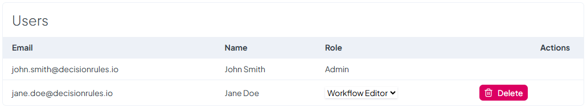
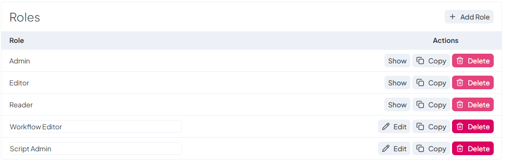

# Access

The **Access** page allows you to manage user permissions within a space by inviting new users, modifying roles, and configuring custom access settings. This ensures that the right users have the appropriate level of control over the space.

### **Inviting Users**

New users can be **invited** to the space, granting them access based on assigned roles. Invitations ensure that only authorized users can interact with the space and its resources.

### **Managing Users**

The **Users** section displays a list of all users who currently have access to the space. From this section, you can:

* **Change User Roles** – Adjust a user’s role to modify their level of access.
* **Remove Users** – Revoke a user’s access to the space when necessary.

<figure><figcaption></figcaption></figure>

### **Roles & Permissions**

The **Roles** section defines how access is granted within the space. It includes both **default roles** and **custom roles**:

* **Default Roles** – The system provides three built-in roles:
  * **Admin** – Full access to manage the space, users, and settings.
  * **Editor** – Can modify rules and settings but cannot manage users.
  * **Reader** – Has read-only access to view space contents.\
    Default roles **cannot be altered or removed**.
* **Custom Roles** – Users can create **custom roles** with granular permission settings to tailor access control based on specific needs. Custom roles can be **created, modified, and removed** as needed.

<figure><figcaption></figcaption></figure>
