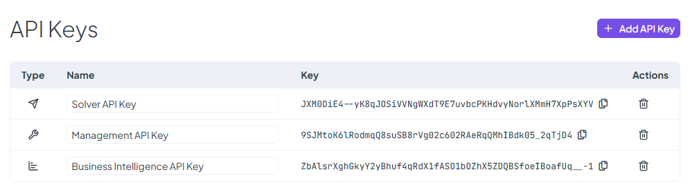

# API Keys

The **API Keys** page provides an overview of all API keys created for accessing the selected space. API keys allow secure interaction with the system, granting different levels of access based on their type.

### **Managing API Keys**

A list of existing API keys is displayed, showing:

* **Key Type** – Specifies the purpose of the key:
  * **Solver API** – Used for rule execution.
  * **Management API** – Allows administrative actions within the space.
  * **Business Intelligence API** – Grants access to analytical and reporting data.
* **Key Name** – A user-defined identifier for easier reference.
* **API Key String** – The unique key value, which can be **easily copied** for use in integrations.
* **Remove Key** – Each key has a **removal button**, allowing you to delete keys that are no longer needed.

### **Creating a New API Key**

To generate a new API key, click the **Add API Key** button. This will display a list of available key types to choose from. Once a key type is selected, the new key is automatically generated and added to the list.

The **API Keys** page helps you securely manage access to the space, ensuring that only authorized systems and users can interact with its resources.

<figure><figcaption></figcaption></figure>
