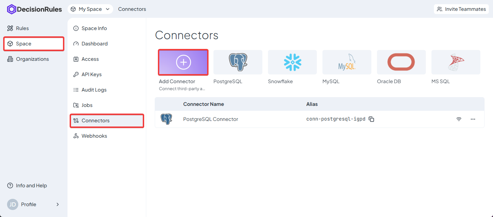
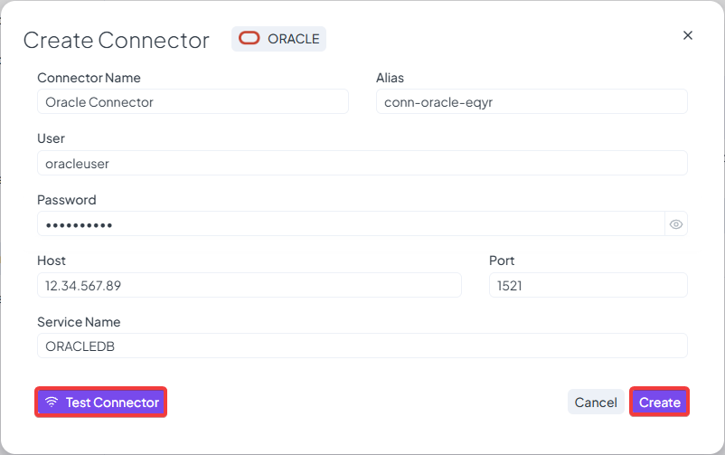
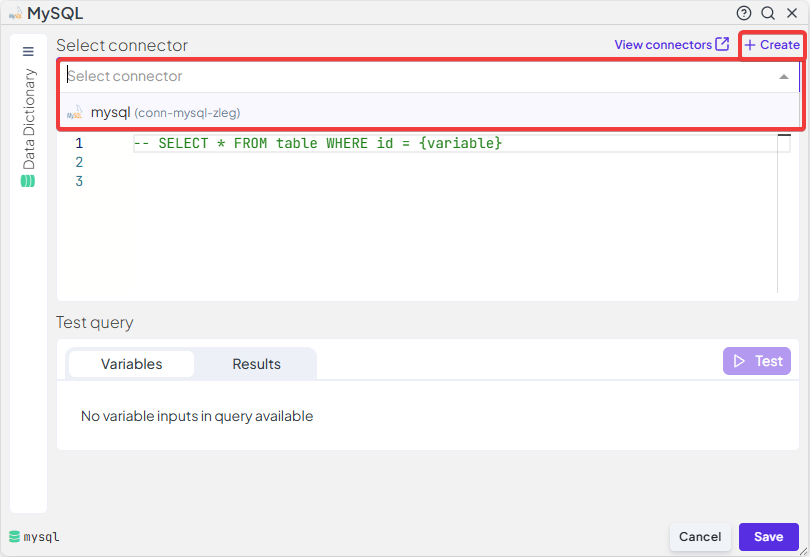
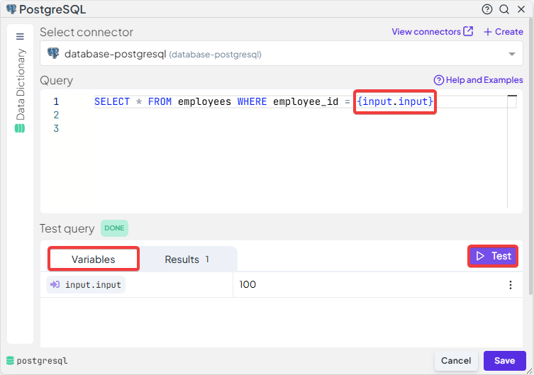
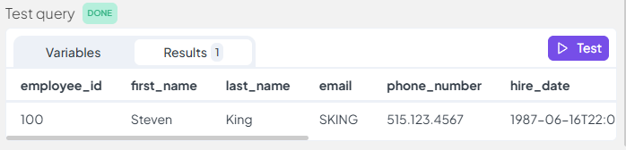

# Connectors

Defining connectors allows you to communicate with your database straight from Decision or Integration Flow allowing for both getting data from the database and then storing in back, updating data or making DDL operations.

### Supported Connectors

Several different database connectors are supported, namely

* Oracle
* Microsoft SQL Server
* Postgres
* MySQL
* Snowflake

### Setting up a connector

Connectors can be setup either via the Space → Connectors → Add Connector menu or when using a specific database block in Flow rules then above the connector selection you have the option to create a new connector without having to leave the flow.

<figure><figcaption></figcaption></figure>

Each connector might have slightly different setup but generally you will need to input

* Connector Name
  * This the visible name for the connector
* Connector Alias
  * Descriptive shortform name
* Host
  * Typically the IP address of the database
* Port
  * Which port is the database using
* User and Password
  * Credentials for login
* Database
  * specific name for the database to connect to

<figure><figcaption></figcaption></figure>

### Using connectors in Decision Flow and Integration Flow

To connect to a database in the flow rule, choose a block for your specific database type from the Palette. Each database provides 2 blocks

* General block
  * Use this block for Select statements that return multiple rows that you need to iterate through one by one
* Single Row
  * Use this block either for queries that do not return rows (UPDATE,INSERT, CREATE …)
  * Use for SELECT statements that return only one row, the response is then stored in a result object and easily accessible


More information about Database Flow nodes can be found [here](../rules/flow/flow-nodes-overview.md#relational-database-query-nodes).


#### Setting up the block

1. Select your connector at the top of the block definition
   1. Potentially you can create a new connector from this menu if needed

<figure><figcaption></figcaption></figure>

2. Input your query into the query window
3. **Variables** are referenced via **{var\_name}** notation
   1.  For example

       `select * from drInput LIMIT {input.input}`
4. You can test your query
   1. First fill in the input variables with relevant data
   2. Click the test button

<figure><figcaption></figcaption></figure>

2. The query is executed and sample of the response data is shown **(the rows shown are limited to 25)**

<figure><figcaption></figcaption></figure>

### Exporting rules using connectors

If you export a rule using connector, the connector is not exported with the rule, this is mainly to make sure that your credential do not get leaked.

The connector used in the evaluation of the database blocks is identified by the **Alias**, so it is recommended when migrating between two different space, to have a connector already prepared with the same alias, so that when the rule is imported an executed it can already take advantage of the connector and not throw an error

### IP whitelist

One of the differences between the Decision Flow and Integration Flow is the availability of the IP whitelist (this is used to identify DecisionRules while making connections to databases).\
The Decision Flow does not offer a specific list of addresses since, the rule execution can be distributed around a large number of dynamically created servers used for scaling purposes, therefore in the case of Decision Flow, we are not able to provide you with a list of addresses from which the connections might originate.

For integration Flow the Jobs are being evaluated by a specific infrastructure with a specific IP address, therefore IP Whitelist is available and should be easy to setup specific whitelisting on your side of the database. IP addresses are as follows:

* 18.153.146.109
* 3.126.127.6

